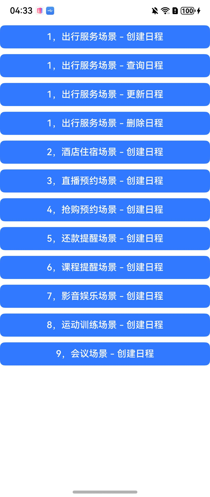

# CalendarEventPractice

### 介绍

通过日历服务，开发者可将带有时间属性的事件作为日程写入，并支持通过“[一键服务](https://developer.huawei.com/consumer/cn/doc/harmonyos-guides/calendar-service)”功能快速跳转，帮助用户快速直达对应服务，并完成各类信息的归一化管理。各典型场景选择适用的模板，并按照模板格式填写各个字段信息，确保用户体验完整、一致。

### 效果预览



### 使用说明

1. 出行服务场景 - 创建日程、查询日程、更新日程、删除日程。
2. 酒店住宿场景 - 创建日程。
3. 直播预约场景 - 创建日程。
4. 抢购预约场景 - 创建日程。
5. 还款提醒场景 - 创建日程。
6. 课程提醒场景 - 创建日程。
7. 影音娱乐场景 - 创建日程。
8. 运动训练场景 - 创建日程
9. 会议场景 - 创建日程

### 工程目录

```
entry/src/
|---main
|   |---ets
|   |   |---pages
|   |   |   |---Index.ets                          // 首页
|---ohosTest               
|   |---ets
|   |   |---tests
|   |   |   |---Ability.test.ets                   // 自动化测试用例
```

### 相关权限

[ohos.permission.READ_CALENDAR](https://developer.huawei.com/consumer/cn/doc/harmonyos-guides/permissions-for-all-user#ohospermissionread_calendar)

[ohos.permission.WRITE_CALENDAR](https://developer.huawei.com/consumer/cn/doc/harmonyos-guides/permissions-for-all-user#ohospermissionwrite_calendar)

### 依赖

不涉及。

### 约束与限制

1.本示例仅支持标准系统上运行, 支持设备：RK3568、PHONE、Tablet。

2.本示例仅支持API20版本SDK，镜像版本号：OpenHarmony 6.0.0.x及之后的版本。

3.本示例需要使用DevEco Studio 6.0.0 release (Build Version: 6.0.0.858)才可编译运行。

### 下载

如需单独下载本工程，执行如下命令：

````
git init
git config core.sparsecheckout true
echo code/DocsSample/Calendar/CalendarEventPractice > .git/info/sparse-checkout
git remote add origin https://gitee.com/openharmony/applications_app_samples.git
git pull origin master
````