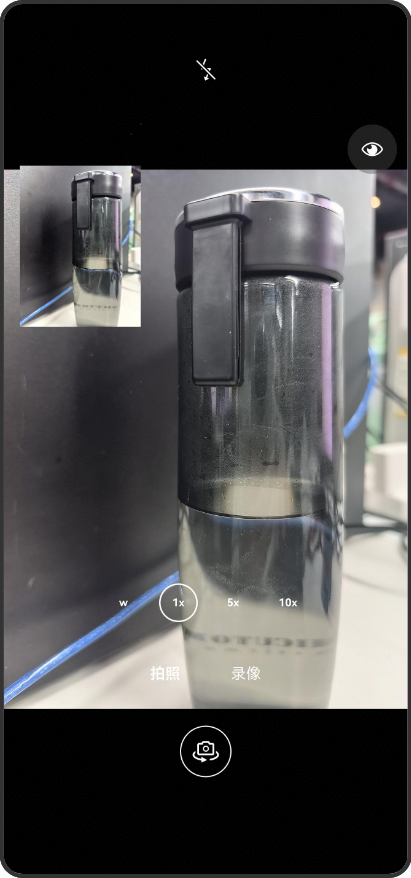

## 实现自定义相机功能

### 介绍

本示例调用CameraKit组件提供的接口能力，提供双路预览功能，包含：
 - 前后置双路预览
 - 设置闪光灯
 - 镜头翻转

### 效果预览



使用说明：
1. 打开应用，授权后展示预览界面。
2. 上方从左至右按钮功能依次为：闪光灯设置、双路预览设置。
3. 下方按钮切换前后置摄像头。


### 工程目录

```
├──camera/src                                       // 相机服务模块
│  └──main/ets
│     └──cameramanagers
│        └──CameraManager.ets                       // 相机管理类
├──entry/src/                                       // demo 业务代码
│  └──main/ets/  
│     ├──constants
│     │  └──CameraConstants.ets                     // 常量文件
│     ├──enteryability                              
│     │  └──EnteryAbility.ets                       // 应用状态检测
│     ├──page              
│     │  └──Index.ets                               // 应用的入口页面，相机APP首页 
│     ├──utiles                                
│     │  └──PermissionManager.ets                   // 权限申请
│     └──viewmodels                               
│        └──PreviewViewModel.ets                    // 预览视图模块        
└──entry/src/main/resources                         // 应用静态资源目录
```

### 具体实现

1. 使用Camera Kit相关能力。

### 相关权限

- ohos.permission.CAMERA：用于相机操作
- ohos.permission.MICROPHONE：麦克风权限，用于录像
- ohos.permission.MEDIA_LOCATION: 用于获取地理信息
- ohos.permission.WRITE_IMAGEVIDEO：用于写入媒体文件
- hos.permission.READ_IMAGEVIDEO：用于读取媒体文件
- ohos.permission.APPROXIMATELY_LOCATION：用于获取当前位置


### 约束与限制

1. 本示例仅支持标准系统上运行，支持设备：华为手机。 

2. 本示例支持API20版本SDK，版本号：6.0.0.47。

3. 本示例已支持使DevEco Studio 6.0.0 Release(构建版本：6.0.0.858，构建 2025年9月25日)编译运行。

