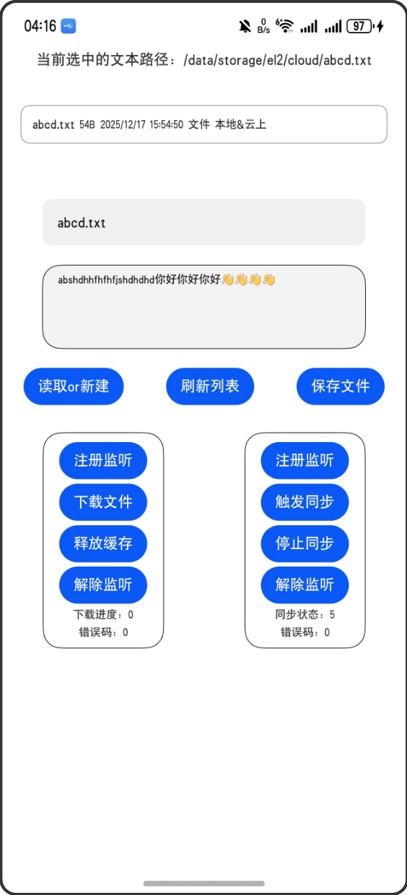

# 应用及文件系统空间统计

### 介绍

本示例主要展示了端云文件协同的同步、下载相关接口；端云文件协同给应用提供了文件上云的能力，在多设备上，数据可以通过云进行跨设备流转，同时开发者也可以根据下载、释放缓存等接口，高效管理应用中的数据。具体可参考[端云文件协同概述]()。

### 效果预览

|主页|
|--------------------------------|


使用说明:

1. 在主界面，点击第一个文本输入框，可用于定义需要创建文件的文件名，推荐使用txt格式。
2. 点击读取or新建按钮，可以创建一个空文件，在第二个文本输入框输入内容后，点击保存文件按钮，可以保存文件。
3. 点击上方文件列表，可以自动填充至第一个文本输入框。
4. 左侧列表对应下载、释放缓存功能，所选文件在主页顶部展示。
5. 右侧列表对应文件同步，应用可主动触发同步，观察同步状态变化。


### 工程目录

```
├──entry/src/main
|	├──ets
|	|	├──entryability
|	|	|	└──EntryAbility.ets 		// 程序入口类
|	|	├──entrybackupability
|	|	|	└──EntryBackupAbility.ets   
|	|	└──pages   						// 页面文件
|	|		└──Index.ets 				// 主界面
|	├──resources						// 资源文件目录
```

### 具体实现

- 使用[端云文件协同]()提供三方应用接入云的能力，完成文件的同步、下载等功能。

### 相关权限

- [ohos.permission.CLOUDFILE_SYNC](https://gitcode.com/openharmony/docs/blob/master/zh-cn/application-dev/security/AccessToken/permissions-for-system-apps.md#ohospermissioncloudfile_sync)
- [ohos.permission.CLOUDFILE_SYNC_MANAGER](https://gitcode.com/openharmony/docs/blob/master/zh-cn/application-dev/security/AccessToken/permissions-for-system-apps.md#ohospermissioncloudfile_sync_manager)

## 依赖

不涉及

## 约束与限制

1.本示例仅支持HarmonyOS 6.0及以上版本运行，云空间版本在6.0.0.300及以上，支持设备：PC/2in1。

2.本示例为Stage模型，支持API23版本SDK，版本号：6.0.0。

3.本示例需要使用DevEco Studio 6.0.1 Release (构建版本：6.0.1.251，构建 2025年11月22日)及以上版本才可编译运行。

## 下载

```
git init
git config core.sparsecheckout true
echo code/DocsSample/CoreFile/NDKEnvironmentSample > .git/info/sparse-checkout
git remote add origin https://gitee.com/openharmony/applications_app_samples.git
git pull origin master
```