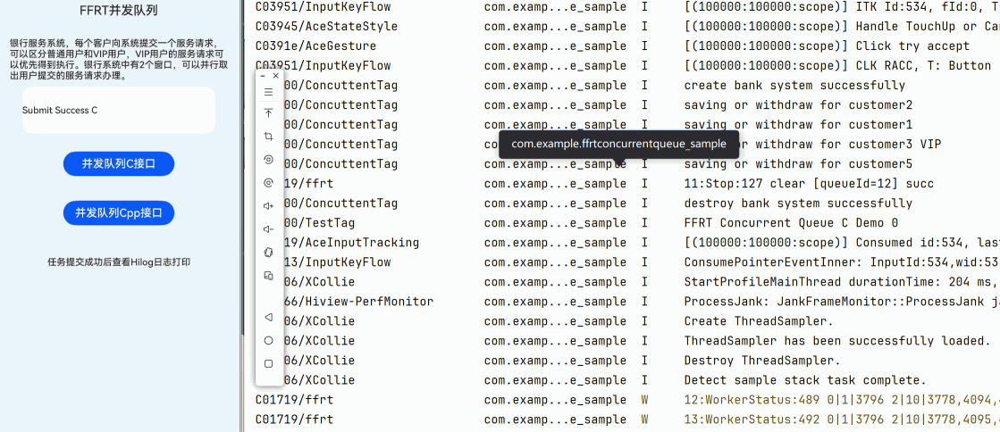

# FFRT Concurrent Queue Paradigm

## Project Overview

This sample demonstrates an application that implemented using the Concurrent Queue paradigm provided by **FFRT**, through a simple implementation of a bank service system example, developers are shown how to use specific features.

## Preview
|             Application Effect (Image)             |
|:--------------------------------:|
|  |

_The interface displays the task execution by using Concurrent Queue C and C++ api. Click the buttons to trigger task execution._
## Key Features
The FFRT concurrent queue provides the capability of setting the priority and queue concurrency. Tasks in the queue can be executed on multiple threads at the same time, achieving better effects.

* **Queue concurrency**: You can set the maximum concurrency of a queue to control the number of tasks that can be executed at the same time. This avoids system resource impact caused by excessive concurrent tasks, ensuring system stability and performance.
* **Task priority**: You can set a priority for each task. Different tasks are scheduled and executed strictly based on the priority. Tasks with the same priority are executed in sequence. Tasks with higher priorities are executed prior to those with lower priorities to ensure that key tasks can be processed in a timely manner.

## Example: Bank Service System
For example, each customer (common customer or VIP customer) submits a service request to the bank service system. The service request of the VIP customer can be processed first. The bank system has two windows for handling service requests submitted by customers.

You can use the FFRT paradigm to perform the following modeling:

* **Queuing logic**: concurrent queue.
* **Service window**: concurrency of the concurrent queue, which also equals the number of FFRT Worker threads.
* **Customer level**: priority of concurrent queue tasks.

## Usage Instructions

1. Open the application, two test blocks (C interface and C++ interface implementations) are shown in the middle.
2. Click the **Concurrent Queue C Interface”** bottom.
    - Call the C interface.
    - Display the task results in hilog.
3. Click the **Concurrent Queue Cpp Interface”** bottom.
    - Call the C++ interface.
    - Display the task results in hilog.

## Project Structure

```plain
├──entry/src
├──common
│  └──CommonConstants.ets         // Constant definitions
├──cpp
│  ├──types/libentry
│  │  ├──index.d.ts               // NAPI interface declarations
│  │  └──oh-package.json5         // Interface registration configuration
│  ├──CMakeLists.txt              // CMake configuration
│  ├──napi_init.cpp               // NAPI interface implementation
│  ├──concurrent_queue.cpp        // Concurrent Queue task C API implementation
│  ├──concurrent_queue_cpp.cpp    // Concurrent Queue task C++ API implementation
├──ets
│  ├──entryability
│  │  └──EntryAbility.ets         // Application entry point
│  └──pages
│     └──Index.ets                // Main UI interface
└──resources                      // Resource files
```
## Implementation Details

### 1. Concurrent Task Scheduling

Use **FFRT Concurrent Queue** mode to execute specified concurrency and priority tasks.

### 2. NAPI Module Encapsulation

NAPI interface registration is implemented in `napi_init.cpp`. When ArkTS calls `testNapi.ConcurrentQueueExec(true|false)`, it submits concurrent queue task, input true to submit with C interface, false with C++ interface.

### 3. HarmonyOS UI

Uses ArkTS + Declarative UI components for layout. `CommonConstants` manages style constants. Buttons trigger task execution, and results are updated in the Hilog in real time.

### 4. Project Engineering and Portability

Uses CMake to build the C++ module. Employs OpenHarmony third-party library dependency management (`@ppd/ffrt` v1.1.0+). The clear directory structure facilitates extensibility.

## Required Permissions

None involved.

## Constraints and Limitations

1.  This sample only runs on standard systems. Supported devices: Huawei phones and tablets.
2.  HarmonyOS version: HarmonyOS 6.0.0 Release or later.
3.  DevEco Studio version: DevEco Studio 6.0.0 Release or later.
4.  HarmonyOS SDK version: HarmonyOS 6.0.0 Release SDK or later.

## Dependencies

1.  OpenHarmony third-party library `@ppd/ffrt` version: 1.1.0 or later.