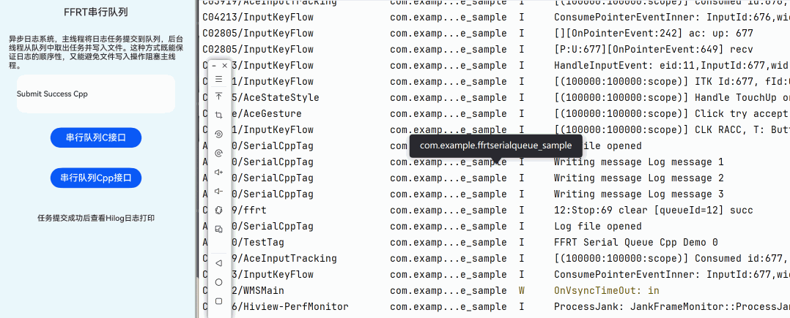

# FFRT Serial Queue Paradigm

## Project Overview

This sample demonstrates an application that implemented using the Serial Queue paradigm provided by **FFRT**, through a simple implementation of an asynchronous log system example, developers are shown how to use specific features.

## Preview
|             Application Effect (Image)             |
|:--------------------------------:|
|  |

_The interface displays the task execution by using Serial Queue C and C++ api. Click the buttons to trigger task execution._
## Key Features
The FFRT serial queue is implemented based on the coroutine scheduling model. It provides efficient message queue functions and supports multiple service scenarios, such as asynchronous communication, mobile data peak clipping, lock-free status and resource management, and architecture decoupling. The following functions are supported:

* **Queue creation and destruction**: The queue name and priority can be specified during creation. Each queue is equivalent to an independent thread. Tasks in the queue are executed asynchronously compared with user threads.
* **Task delay**: The delay can be set when a task is submitted. The unit is μs. The delayed task will be scheduled and executed after uptime (submission time + delay time).
* **Serial scheduling**: Tasks in the same queue are sorted in ascending order of uptime and executed in serial mode. Ensure that the next task starts to be executed only after the previous task in the queue is complete.
* **Task canceling**: You can cancel a task that is not dequeued based on the task handle. The task cannot be canceled if it has been started or completed.
* **Task waiting**: You can wait for a task to complete based on the task handle. When a specified task is complete, all tasks whose uptime is earlier than the specified task in the queue have been executed.
* **Task priority**: You can set the priority of a single task when submitting the task. Priorities take effect only after a task is dequeued relative to other system loads, and do not affect the serial task order in the same queue. If the task priority is not set, the priority of the queue is inherited by default.

## Example: Asynchronous Log System
The following is an example of implementing an asynchronous log system. The main thread submits the log task to the queue, and the background thread obtains the task from the queue and writes the task to the file. It ensures the log sequence and prevents the main thread from being blocked by the file write operation.

With FFRT APIs, you only need to focus on service logic implementation and do not need to pay attention to asynchronous thread management, thread security, and scheduling efficiency.

* **Queuing logic**: serial queue.
* **Service window**: concurrency of the serial queue, which also equals the number of FFRT Worker threads.
* **Customer level**: priority of serial queue tasks.

## Usage Instructions

1. Open the application, two test blocks (C interface and C++ interface implementations) are shown in the middle.
2. Click the **Serial Queue C Interface”** bottom.
    - Call the C interface.
    - Display the task results in hilog.
3. Click the **Serial Queue Cpp Interface”** bottom.
    - Call the C++ interface.
    - Display the task results in hilog.

## Project Structure

```plain
├──entry/src
├──common
│  └──CommonConstants.ets         // Constant definitions
├──cpp
│  ├──types/libentry
│  │  ├──index.d.ts               // NAPI interface declarations
│  │  └──oh-package.json5         // Interface registration configuration
│  ├──CMakeLists.txt              // CMake configuration
│  ├──napi_init.cpp               // NAPI interface implementation
│  ├──serial_queue.cpp            // Serial Queue task C API implementation
│  ├──serial_queue_cpp.cpp        // Serial Queue task C++ API implementation
├──ets
│  ├──entryability
│  │  └──EntryAbility.ets         // Application entry point
│  └──pages
│     └──Index.ets                // Main UI interface
└──resources                      // Resource files
```
## Implementation Details

### 1. Serial Task Scheduling

Use **FFRT Serial Queue** mode to execute serial tasks.

### 2. NAPI Module Encapsulation

NAPI interface registration is implemented in `napi_init.cpp`. When ArkTS calls `testNapi.SerialQueueExec(true|false)`, it submits serial queue task, input true to submit with C interface, false with C++ interface.

### 3. HarmonyOS UI

Uses ArkTS + Declarative UI components for layout. `CommonConstants` manages style constants. Buttons trigger task execution, and results are updated in the Hilog in real time.

### 4. Project Engineering and Portability

Uses CMake to build the C++ module. Employs OpenHarmony third-party library dependency management (`@ppd/ffrt` v1.1.0+). The clear directory structure facilitates extensibility.

## Required Permissions

None involved.

## Constraints and Limitations

1.  This sample only runs on standard systems. Supported devices: Huawei phones and tablets.
2.  HarmonyOS version: HarmonyOS 6.0.0 Release or later.
3.  DevEco Studio version: DevEco Studio 6.0.0 Release or later.
4.  HarmonyOS SDK version: HarmonyOS 6.0.0 Release SDK or later.

## Dependencies

1.  OpenHarmony third-party library `@ppd/ffrt` version: 1.1.0 or later.