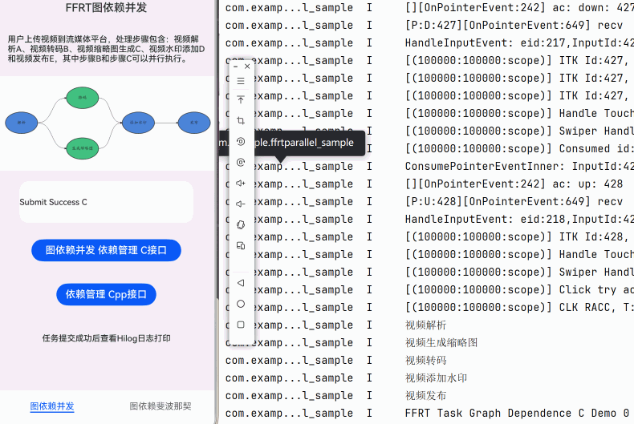

# FFRT 图依赖并发范式示例

## 项目简介

本示例基于**FFRT**提供的图依赖并发范式，通过斐波那契与流媒体视频处理的简易样例实现向开发者展示具体的特性使用方式。

## 效果预览
|             应用效果（图片）             |
|:--------------------------------:|
|  |

_界面展示C接口与C++接口并行执行图依赖并发任务。点击按钮即可触发任务执行。_
## 功能特性
FFRT图依赖并发范式支持任务依赖和数据依赖两种方式构建任务依赖图。任务依赖图中每个节点表示一个任务，边表示任务之间的依赖关系。任务依赖分为输入依赖in_deps和输出依赖out_deps。

构建任务依赖图的两种不同方式：

* 当使用任务依赖方式构建任务依赖图时，使用任务句柄handle来对应一个任务对象。
* 当使用数据依赖方式构建任务依赖图时，数据对象表达抽象为数据签名，每个数据签名唯一对应一个数据对象。

## 示例：流媒体视频处理
用户上传视频到流媒体平台，处理步骤包含：视频解析A、视频转码B、视频缩略图生成C、视频水印添加D和视频发布E，其中步骤B和步骤C可以并行执行。

## 示例：斐波那契数列
斐波那契数列中每个数字是前两个数字之和，计算斐波那契数的过程可以很好地通过数据对象来表达任务依赖关系。

## 使用说明

1. 打开应用，页面底部显示两个示例，中部显示两个测试区块（C接口与C++接口实现）
2. 点击**“图依赖并发 依赖管理 C接口”**按钮
    - 调用 C 接口
    - 在hilog中显示任务结果
3. 点击**“依赖管理 Cpp接口”**按钮
    - 调用 C++ 接口
    - 在hilog中显示任务结果

## 工程目录

```plain
├──entry/src
├──common
│  └──CommonConstants.ets         // 常量定义
├──cpp
│  ├──types/libentry
│  │  ├──index.d.ts               // NAPI 接口声明
│  │  └──oh-package.json5         // 接口注册配置
│  ├──CMakeLists.txt              // CMake 配置
│  ├──napi_init.cpp               // NAPI 接口实现
│  ├──parallel.cpp                // 并行任务C接口实现
│  ├──parallel_cpp.cpp            // 并行任务C++接口实现
├──ets
│  ├──entryability
│  │  └──EntryAbility.ets         // 程序入口
│  └──pages
│     └──Index.ets                // UI 主界面
└──resources                      // 资源文件
```
## 具体实现

### 1. 并行任务调度

使用 **FFRT图依赖并发** 模式执行依赖任务，支持顺序执行的任务、逻辑流程控制、多级任务链等特性。

### 2. NAPI 模块封装

`napi_init.cpp` 中实现 NAPI 接口注册，ArkTS 调用 `testNapi.ParallelDepExec(true|false)` 时触发图依赖并发任务。

### 3. HarmonyOS UI

使用 ArkTS + Declarative UI 组件布局，`CommonConstants` 管理样式常量，按钮触发任务执行，结果显示于Hilog中。

### 4. 工程化与可移植性

采用 CMake 构建 C++ 模块，OpenHarmony 三方库依赖管理 (`@ppd/ffrt` v1.1.0+)，清晰的目录结构便于扩展。

## 相关权限

不涉及。

## 约束与限制

1. 本示例仅支持标准系统上运行，支持设备：华为手机、平板。
2. HarmonyOS系统：HarmonyOS 6.0.0 Release及以上。
3. DevEco Studio版本：DevEco Studio 6.0.0 Release及以上。
4. HarmonyOS SDK版本：HarmonyOS 6.0.0 Release SDK及以上。

## 依赖

1. OpenHarmony三方库`@ppd/ffrt`版本：1.1.0及以上。