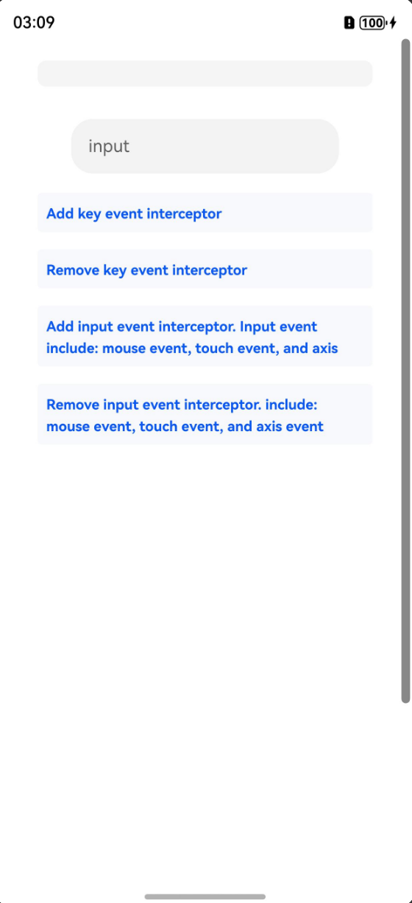

# 输入事件拦截（C/C++）

## 介绍

本工程主要实现了对以下指南文档[事件拦截开发指导](https://gitcode.com/openharmony/docs/blob/master/zh-cn/application-dev/device/input/interceptor-guidelines.md)
中示例代码片段的工程化，通过该工程可以添加和移除对按键、输入事件（鼠标、触屏和轴事件）的拦截。

## 效果预览

|  |
|-------------------------------------------|

使用说明：

1. 安装编译生成的hap包,打开应用。
2. 点击对应按键添加和移除按键事件拦截，添加后使用键盘在输入框输入文本，输入被拦截并在页面实时显示拦截到的按键事件。
3. 点击对应按键添加和移除输入事件拦截，添加后使用鼠标、使用触屏功能、在触摸板进行捏合操作和使用鼠标滚轮时，输入被拦截并在页面实时显示监听到的输入事件。
4. 30秒后自动取消输入事件拦截。
5. 进入"DocsSample/input/NDKInputEventInterceptor/entry/src/ohosTest/ets/test/Ability.test.ets"文件，可以对本项目进行UI的自动化测试。

## 工程目录

```
NDKInputEventInterceptor
├──entry/src/main
│  ├──cpp                           // C++代码区
│  │  ├──CMakeLists.txt             // CMake配置文件
│  │  ├──napi_init.cpp              // 示例代码
|  |  ├──types
|  |  |  ├──libentry
|  |  |  |  ├──Index.d.ts
|  |  |  |  ├──oh-package.json5
│  ├──ets                           // ets代码区
│  │  ├──entryability
│  │  │  ├──EntryAbility.ts
|  |  ├──entrybackupability
|  |  |  ├──EntryBackupAbility.ets
│  │  ├──pages                      
│  │     ├──Index.ets               // 主界面
```

## 相关权限

ohos.permission.INTERCEPT_INPUT_EVENT

## 依赖

不涉及。

## 约束和限制

1. 本示例支持标准系统上运行，支持设备：Phone、Tablet。
2. 本示例支持API20版本SDK，版本号：6.0.0.36。
3. 本示例已支持使DevEco Studio 5.1.1 Release (构建版本：5.1.1.840，构建 2025年9月20日)编译运行。

## 下载

如需单独下载本工程，执行如下命令：

```
git init
git config core.sparsecheckout true
echo InputKit/NDKInputEventInterceptor > .git/info/sparse-checkout
git remote add origin https://gitee.com/harmonyos_samples/guide-snippets.git
git pull origin master
```

