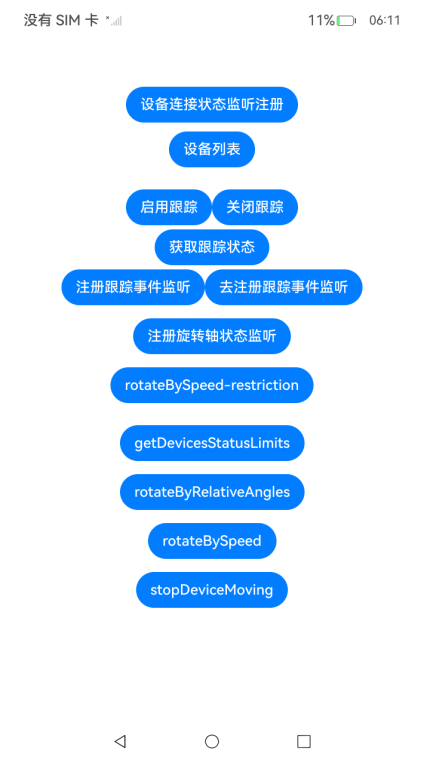

# 机械体设备控制开发

### 介绍

本示例主要展示了通过Mechanic Kit开发，支持使用机械体设备控制器，提供更丰富的拍摄体验，如人脸智能跟踪和自动构图等专业功能。使用[@ohos.distributedHardware.mechanicManager](https://gitcode.com/openharmony/docs/blob/master/zh-cn/application-dev/reference/apis-mechanic-kit/js-apis-mechanicManager.md)等接口，智能拍摄跟踪功能通过机械体设备可实现人脸和物体的自动化跟踪，提升拍摄质量和用户体验，助力开发者构建更智能、高效的拍摄解决方案。使用手机作为控制终端，可以通过精确的参数设置调整云台或机械臂等设备的角度和运动轨迹，帮助快速构建控制机械体设备的应用。

### 效果预览

| 主页                                    |
|---------------------------------------|
|  |

使用说明

1. 启动应用，进入主页，点击设备连接状态监听注册按钮，可以跳转至注册以及去注册界面，进行注册以及去注册；
2. 进入主页，连接设备后，点击设备列表按钮，可查看已连接设备；
3. 进入主页，点击注册跟踪事件监听以及去注册跟踪事件监听按钮，可以分别实现注册跟踪事件监听以及去注册跟踪事件监听；
4. 进入主页，点击启用&关闭跟踪按钮，可以实现启用关闭跟踪功能，以及验证跟踪事件监听；
5. 进入主页，点击注册旋转轴状态监听，当点击rotateBySpeed-restriction时，可以验证旋转轴状态事件监听；
6. 进入主页，点击getDevicesStatusLimits，可以查询设备当前状态及其限制条件。
7. 进入主页，点击rotateByRelativeAngles，可以执行相对角度的旋转控制。
8. 进入主页，点击rotateBySpeed，可以使设备以指定速度持续转动。
9. 进入主页，点击stopDeviceMoving，可以停止设备运动。


### 工程目录

给出项目中关键的目录结构并描述它们的作用，示例如下：

```
entry/src/main/ets
|---entryability
|   |---EntryAbility.ets                       //UIAbility
|---pages
|   |---ApiTestPage.ets                        //应用首页主要逻辑，包含了点击按钮触发与相关控制功能
|   |---AttachStateChangeCallbackRegister.ets  //设备连接状态监听注册界面
```

### 具体实现

* 主页功能包括设备连接状态监听注册、查询已连接设备，启用关闭跟踪，查询设备当前状态及其限制条件，执行相对角度的旋转控制，以指定速度持续转动，停止设备运动等，源码参考：[ApiTestPage.ets](code/DocsSample/MechanicManagerSample/entry/src/main/ets/pages/ApiTestPage.ets)
    * 使用mechanicManager.on('attachStateChange', attachStateChangeCallback)实现设备连接状态监听注册;
    * 使用mechanicManager.getAttachedMechDevices()来获取已连接设备列表;
    * 使用mechanicManager.setCameraTrackingEnabled(true)来实现启用跟踪;
    * 通过mechanicManager.getCurrentAngles、mechanicManager.getRotationLimits、mechanicManager.getMaxRotationSpeed、mechanicManager.getMaxRotationTime来查询设备当前状态及其限制条件;
    * 通过mechanicManager.rotate，来实现相对角度的旋转控制;
    * 通过mechanicManager.rotateBySpeed，来实现以指定速度持续转动;
    * 通过mechanicManager.stopMoving，来实现停止设备运动。
    

### 相关权限

ohos.permission.CONNECT_MECHANIC_HARDWARE

### 约束与限制

1. 本示例仅支持标准系统上运行，支持设备：RK3568;
2. 本示例为Stage模型，仅支持API11版本SDK，SDK版本号(API Version 20),镜像版本号(6.0Release)
3. 本示例需要使用DevEco Studio 版本号(6.0Release)版本才可编译运行。

### 下载

如需单独下载本工程，执行如下命令：

```
git init
git config core.sparsecheckout true
echo code/DocsSample/MechanicManagerSample > .git/info/sparse-checkout
git remote add origin https://gitee.com/openharmony/applications_app_samples.git
git pull origin master
```