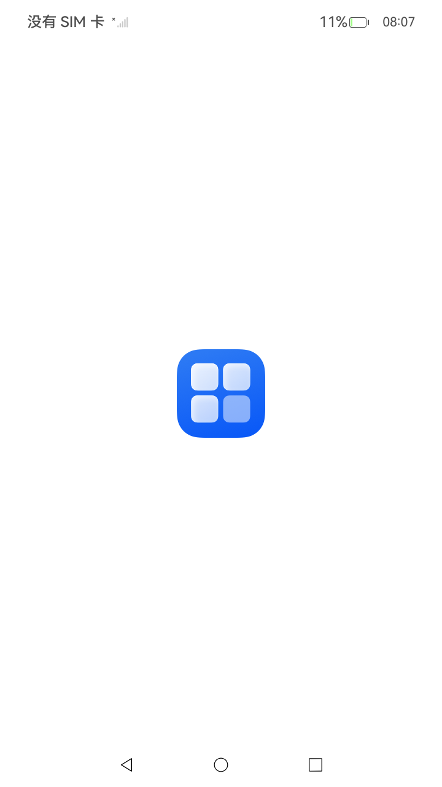
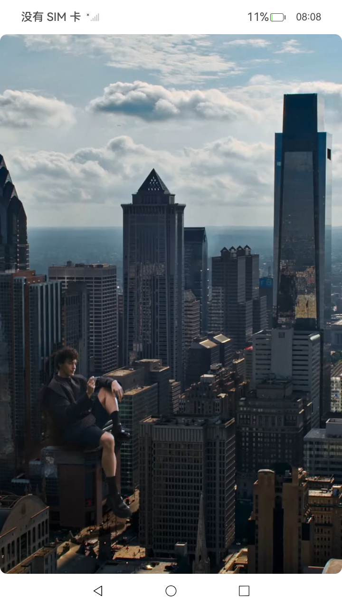

# 扩展屏投播

### 介绍

本文主要介绍如何在系统镜像投屏后，获取投屏设备信息，实现扩展屏模式的投播，实现双屏协作的能力。

### 效果预览

| AbilityA                          | AbilityB                                |
|-----------------------------------|-----------------------------------------|
|  |  |

### 使用说明

设备限制
本地设备：手机设备。 
远程设备：支持Cast+或Miracast标准协议的设备。

使用限制
需要系统发起无线/有线投屏后才可通过接口获取有效的扩展投屏设备。

在建立连接后，运行demo，将./entry/src/main/ets/CastPage.ets中的内容投播到扩展屏上。

### 工程目录

项目中关键的目录结构如下：

```
entry/src/main/ets/
|---abilityb
|---|---AbilityB.ets // 构建扩展屏显示内容绘制以及响应退出处理的能力。
|---entryability
|---|---AbilityA.ets // 构建扩展屏启动和退出能力。
|---entrybackupability
|---|---EntryBackupAbility.ets
|---pages
|---|---CastPage.ets // 扩展屏显示内容。
|---|---Index.ets
```

### 具体实现

#### UIAbilityA实现

  UIAbilityA创建AVSession, 获取可用扩展屏投播设备并注册监听。源码参考：[entryability/AbilityA.ets](./entry/src/main/ets/entryability/AbilityA.ets)。

  * 创建AVSession, 获取可用扩展屏投播设备并注册监听。
    ```ets
    // 创建AVSession, 获取可用扩展屏投播设备并注册监听
    initAVSession(context: Context) {
      avSession.createAVSession(context, 'CastDisplay', 'video').then((session: avSession.AVSession) => {
      this.session = session;
      this.session?.on('castDisplayChange', this.onCastDisplayChangedCallback);

      // 获取当前系统可用的扩展屏显示设备
      session.getAllCastDisplays().then((infoArr: avSession.CastDisplayInfo[]) => {
        // 有多个扩展屏时可以提供用户选择，也可使用其中任一个作为扩展屏使用。
        if (infoArr.length > 0) {
          this.extCastDisplayInfo = infoArr[0];
          this.startExternalDisplay();
        }
      }).catch((err: BusinessError<void>) => {
         console.error(`Failed to get all CastDisplay. Code: ${err.code}, message: ${err.message}`);
        });
      });
    }
    ```
  * 在UIAbilityA中构建扩展屏启动和退出能力。
    ```ets
    // 扩展屏启动UIAbilityB
    startExternalDisplay() {
      if (this.extCastDisplayInfo !== undefined &&
        this.extCastDisplayInfo.id !== 0 &&
        this.extCastDisplayInfo.state === avSession.CastDisplayState.STATE_ON) {
        let id = this.extCastDisplayInfo?.id;
        console.info(`Succeeded in starting ability and the id of display is ${id}`);
        this.context.startAbility({
          bundleName: 'com.example.myapplication', // 应用自有包名
          abilityName: 'AbilityB'
        }, {
          displayId: id // 扩展屏ID
        });
        AppStorage.setOrCreate('CastDisplayState', 1);
      }
    }
    
    // 停止使用扩展屏
    stopExternalDisplay() {
      AppStorage.setOrCreate('CastDisplayState', 0);
      // 更新本页面显示。
    }
    ```
#### UIAbilityB实现

  UIAbilityB扩展屏显示内容绘制，需响应退出处理。源码参考：[abilityb/AbilityB.ets](./entry/src/main/ets/abilityb/AbilityB.ets)。

  * UIAbilityB扩展屏显示内容绘制。

    ```ets
    onWindowStageCreate(windowStage: window.WindowStage): void {
      // Main window is created, set main page for this ability
      windowStage.getMainWindowSync().setWindowLayoutFullScreen(true); // 设置为全屏
      windowStage.loadContent('pages/CastPage', (err: BusinessError) => {
        if (err.code) {
          console.error(`Failed to load the content. Code: ${err.code}, message: ${err.message}`);
          return;
        }
        console.info('Succeeded in loading the content. ');
      });
    }
    ```

  * CastPage响应退出处理。

    ```ets
    private onDestroyExtend() {
      if (this.displayState === 1) return;
      this.context.terminateSelf().then(() => {
        console.info('CastPage finished');
      }).catch((err: BusinessError) => {
        console.error(`Failed to destroying CastPage. Code: ${err.code}, message: ${err.message}`);
      });
    }
    ```
    
### 相关权限

不涉及

### 依赖

不涉及

### 约束与限制

1. 本示例仅支持标准系统上运行。

2. 本示例为Stage模型，支持API20版本及以上版本的Sdk。

3. 本示例需要使用DevEco Studio 版本号(5.0 Release)及以上版本才可编译运行。

4. 本示例手机设备支持，RK暂不支持。

### 下载

如需单独下载本工程，执行如下命令：

```shell
git init
git config core.sparsecheckout true
echo Media/AVSession/ExtendedScreenCasting> .git/info/sparse-checkout
git remote add origin OpenHarmony/applications_app_samples
git pull origin master
```