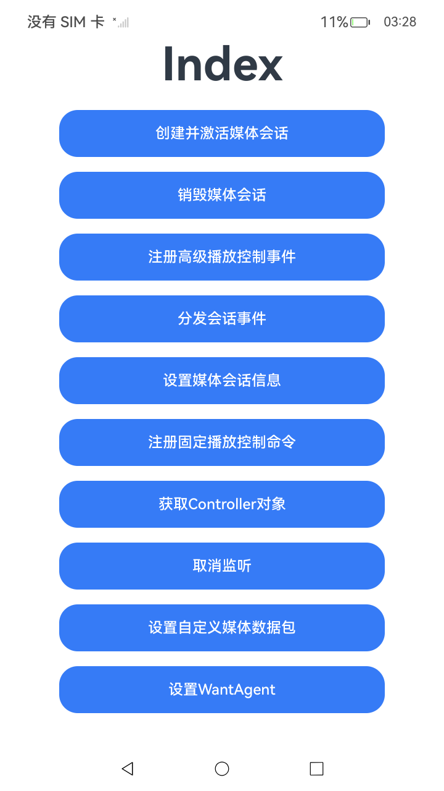

# 媒体会话提供方

## 介绍

本示例主要展示了音视频应用在实现音视频功能的同时，需要作为媒体会话提供方接入媒体会话，在媒体会话控制方（例如播控中心）中展示媒体相关信息，并响应媒体会话控制方下发的播控命令。

## 效果预览

| 主页面                               | 创建并激活媒体会话页                                  |
|-----------------------------------|---------------------------------------------|
|  |  |

## 使用说明

1. 启动应用后显示主页面，列出所有功能入口。
2. 点击对应按钮进入功能页面，点击页面中的'hello world'文本触发相应功能。
3. 主要功能包括：
    - 创建并激活媒体会话：创建AVSession实例并激活。
    - 销毁媒体会话：销毁已创建的AVSession。
    - 注册高级播放控制事件：注册skipToQueueItem、handleKeyEvent等高级事件监听。
    - 分发会话事件：分发自定义会话事件。
    - 设置媒体会话信息：设置metadata、playbackState、queueItems等信息。
    - 注册固定播放控制命令：注册play、pause、stop、next、previous等基础播放控制。
    - 获取Controller对象：通过sessionId获取AVSessionController。
    - 取消监听：取消已注册的事件监听。
    - 设置自定义媒体数据包：设置extras自定义数据。
    - 设置WantAgent：设置启动ability的WantAgent。

## 工程目录

```
entry/src/main/ets/
└── pages
    ├── Index.ets                              // 主页面，提供所有功能入口。
    ├── CreateAVSession.ets                    // 创建并激活媒体会话。
    ├── Destroy.ets                            // 销毁媒体会话。
    ├── AdvancedPlaybackControlEvents.ets      // 注册高级播放控制事件。
    ├── DispatchSessionEvent.ets               // 分发会话事件。
    ├── SetAVSessionInformation.ets            // 设置媒体会话信息。
    ├── FixedPlaybackControlCommands.ets       // 注册固定播放控制命令。
    ├── GetController.ets                      // 获取Controller对象。
    ├── Off.ets                                // 取消监听。
    ├── SetExtras.ets                          // 设置自定义媒体数据包。
    └── WantAgent.ets                          // 设置WantAgent。
entry/src/ohosTest/
└── ets
    └── test
        └── AVSessionProvider.test.ets         // UI自动化测试用例。
```

## 具体实现

* 各功能页面均通过点击'hello world'文本触发异步操作，主要实现如下：
    - **创建会话**：调用`AVSessionManager.createAVSession()`创建音频会话并激活，页面显示会话ID和操作日志。
    - **销毁会话**：调用`session.destroy()`销毁已创建的会话实例。
    - **注册监听**：通过`session.on()`注册各类播放控制事件监听器（如play、pause、skipToQueueItem等）。
    - **设置信息**：通过`session.setAVMetadata()`、`session.setAVPlaybackState()`等方法设置媒体会话相关信息。
    - **分发事件**：调用`session.dispatchSessionEvent()`向控制方分发自定义事件。
    - **获取控制器**：通过`AVSessionManager.createController(sessionId)`获取会话控制器对象。
    - **取消监听**：调用`session.off()`取消已注册的事件监听。
    - **设置扩展数据**：通过`session.setExtras()`设置自定义媒体数据包。
    - **设置WantAgent**：通过`session.setLaunchAbility()`设置启动ability的WantAgent。

## 依赖

无。

## 相关权限

无。

## 约束与限制

1.  本示例支持标准系统上运行，支持设备：RK3568；

2.  本示例支持API23版本的SDK，版本号：6.1.0.25；

3.  本示例已支持使用Build Version: 6.0.1.251, built on November 22, 2025；

4.  高等级APL特殊签名说明：无；

## 下载

如需单独下载本工程，执行如下命令：

```git	 
git init	 
git config core.sparsecheckout true
echo Media/AVSession/LocalAVSession/LocalAVSessionOverview > .git/info/sparse-checkout
git remote add origin https://gitcode.com/HarmonyOS_Samples/guide-snippets.git
git pull origin master
 ```
