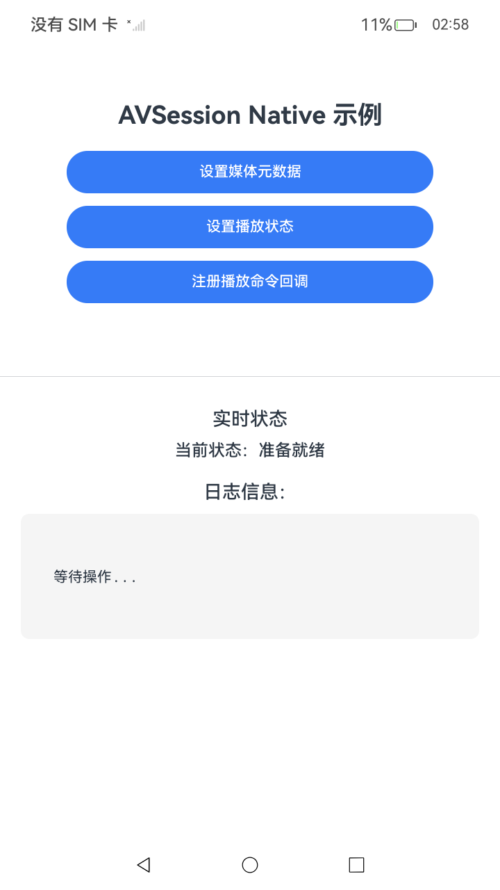

# 媒体会话提供方(C/C++)

## 介绍

本示例展示了如何通过使用C API实现媒体会话提供方。应用通过NAPI调用Native层的AVSession接口，实现媒体元数据设置、播放状态设置以及播放命令回调注册等功能。

## 效果预览

| 主页面                               |
|-----------------------------------|
|  |

## 使用说明

1. 启动应用后显示主页面，包含三个功能按钮和实时状态显示区域。
2. 点击对应按钮触发Native接口调用，主要功能包括：
    - **设置媒体元数据**：通过Native接口设置AVSession的媒体元数据（标题、艺术家、专辑等信息）。
    - **设置播放状态**：通过Native接口设置AVSession的播放状态（播放/暂停/停止等状态）。
    - **注册播放命令回调**：通过Native接口注册播放命令回调函数，响应播控中心的播放控制命令。
3. 页面实时显示当前操作状态和日志信息，便于调试和验证功能。

## 工程目录

```
entry/src/main/
├── ets/
│   └── pages/
│       └── Index.ets                              // 主页面
├── cpp/
│   ├── types/
│   │   └── libentry/
│   │       └── index.d.ts                         // TypeScript类型声明
│   ├── CMakeLists.txt                             // CMake构建配置
│   └── napi_init.cpp                              // Native层实现（AVSession接口调用）
entry/src/ohosTest/
└── ets/
    └── test/
        └── AVSessionProviderNative.test.ets       // UI自动化测试用例
```

## 具体实现

* 1、创建会话并激活媒体，需要传入会话类型AVSession_Type，自定义的TAG，以及应用的包名、ability名字。
* 2、调用Native AVSession API设置元数据。
* 3、设置播放状态。
* 4、注册播放控制回调。
* 5、销毁媒体会话释放资源。

## 依赖

无。

## 相关权限

无。

## 约束与限制

1.  本示例支持标准系统上运行，支持设备：RK3568；

2.  本示例支持API23版本的SDK，版本号：6.1.0.25；

3.  本示例已支持使用Build Version: 6.0.1.251, built on November 22, 2025；

4.  高等级APL特殊签名说明：无；

## 下载

如需单独下载本工程，执行如下命令：

```git	 
git init	 
git config core.sparsecheckout true
echo Media/AVSession/LocalAVSession/AVSessionProviderNative > .git/info/sparse-checkout
git remote add origin https://gitcode.com/HarmonyOS_Samples/guide-snippets.git
git pull origin master
 ```