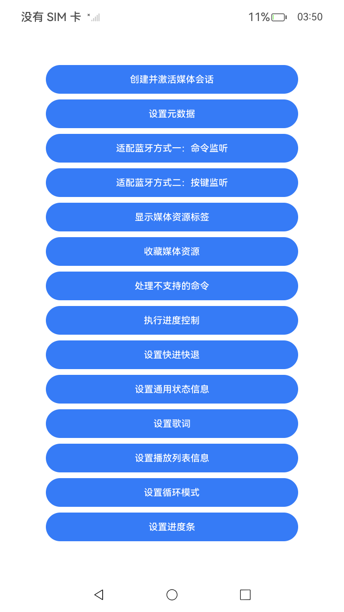

# 应用接入AVSession场景介绍

## 介绍

本示例展示了一些典型的接入AVSession的展示和控制场景，方便开发者根据场景进行适配。示例包含会话创建、元数据设置、播放控制、进度管理、蓝牙适配等功能。

## 效果预览

| 主页面                               | 创建并激活媒体会话页                                  |
|-----------------------------------|---------------------------------------------|
|  |  |
## 使用说明

1. 启动应用后显示主页面，列出14个功能入口按钮。
2. 点击对应按钮进入功能页面，每个页面包含"hello world"文本，点击触发功能执行。

## 工程目录

```
entry/src/main/ets/
└── pages/
    ├── AdaptingToBluetoothMethodOne.ets           // 适配蓝牙方式一：命令监听
    ├── AdaptingToBluetoothMethodTwo.ets           // 适配蓝牙方式二：按键监听
    ├── CreateAVSession.ets                        // 创建并激活媒体会话
    ├── DisplayTagsOfMediaAssets.ets               // 显示媒体资源标签
    ├── FavoritingMediaAssets.ets                  // 收藏媒体资源
    ├── HandlingUnsupportedCommands.ets            // 处理不支持的命令
    ├── ImplementingIntentBasedPlayback.ets        // 实现意图启动播放
    ├── Index.ets                                  // 主页面，提供14个功能入口
    ├── PerformingProgressControl.ets              // 执行进度控制
    ├── SetAVMetadata.ets                          // 设置元数据
    ├── SettingFastForward.ets                     // 设置快进快退
    ├── SettingGeneralStateInformation.ets         // 设置通用状态信息
    ├── SettingLyrics.ets                          // 设置歌词
    ├── SettingPlaylistInformation.ets             // 设置播放列表信息
    ├── SettingTheLoopMode.ets                     // 设置循环模式
    └── SettingTheProgressBar.ets                  // 设置进度条
entry/src/ohosTest/
└── ets/
    └── test/
        └── AccessingAVSession.test.ets            // UI自动化测试用例
```

## 具体实现

* 创建并激活媒体会话：创建AVSession实例并激活，获取sessionId。
* 设置循环模式：注册setLoopMode监听器，通过controller触发循环模式切换命令。
* 设置进度条：设置播放进度相关信息（位置、缓冲进度等）。
* 设置元数据：设置媒体元数据（标题、艺术家、专辑、封面等）。
* 适配蓝牙方式一：通过注册play/pause命令监听器适配蓝牙播控。
* 适配蓝牙方式二：通过注册handleKeyEvent监听器接收蓝牙按键事件。
* 显示媒体资源标签：设置媒体资源标签信息（收藏、热门等）。
* 收藏媒体资源：注册toggleFavorite监听器处理收藏/取消收藏操作。
* 执行进度控制：注册seek监听器响应进度跳转命令。
* 设置快进快退：注册fastForward和rewind监听器，设置跳转间隔。
* 设置通用状态信息：设置播放状态（播放/暂停/停止/缓冲等）。
* 设置歌词：设置当前播放歌曲的歌词内容。
* 设置播放列表信息：设置播放列表和队列项信息。
* 处理不支持的命令：演示如何注册和取消事件监听器。

## 依赖

无。

## 相关权限

无。

## 约束与限制

1.  本示例支持标准系统上运行，支持设备：RK3568；

2.  本示例支持API23版本的SDK，版本号：6.1.0.25；

3.  本示例已支持使用Build Version: 6.0.1.251, built on November 22, 2025；

4.  高等级APL特殊签名说明：无；

## 下载

如需单独下载本工程，执行如下命令：

```git	 
git init	 
git config core.sparsecheckout true
echo Media/AVSession/LocalAVSession/AccessingAVSession> .git/info/sparse-checkout
git remote add origin https://gitcode.com/HarmonyOS_Samples/guide-snippets.git
git pull origin master
 ```