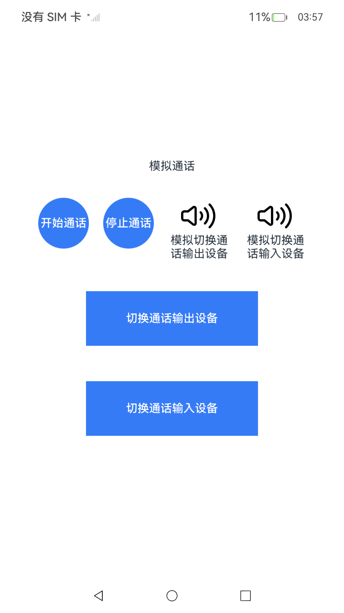

# 通话设备切换

### 介绍

本文主要介绍AVCastPicker组件接入和AVInputCastPicker组件的接入，实现通话输入输出设备的切换功能。

> 注意：
> 通话设备切换按钮可显示默认样式或者自定义样式，默认样式由系统提供，自定义组件由应用提供。还可参考相关的[开发指南](https://gitee.com/openharmony/docs/blob/master/zh-cn/application-dev/media/avsession/using-switch-call-devices.md)。

### 效果预览

| 主页                                | 输出设备页面                                      | 输入设备页面                                                |
|-----------------------------------|---------------------------------------------|-------------------------------------------------------|
|  |  |  |

### 使用说明

1. 进入页面后，有六个按钮，分别是“开始通话”，“停止通话”，“模拟切换输出设备”按钮，“模拟切换输入设备”按钮，“切换输出设备”按钮和“切换输入设备”按钮。
2. 点击“开始通话”按钮，可播放音频。
3. 点击“模拟切换输出设备”按钮，选择当前输出设备并显示设备对应的样式，选择后可将音频投播到选中的设备上。
4. 点击“模拟切换输入设备”按钮，选择当前输入设备并显示设备对应的样式，选择后可在选中的设备上输入音频。
5. 点击stop，可暂停播放音频。
6. 点击“切换输出设备”按钮，可进入“选择当前输出设备”页面，开始通话后，选择当前输出设备并显示设备对应的样式，选择后可将音频投播到选中的设备上。
7. 点击“切换输入设备”按钮，可进入“选择当前输入设备”页面，开始通话后，可选择当前输入设备并显示设备对应的样式，选择后可在选中的设备上输入音频。

### 工程目录

项目中关键的目录结构如下：

```
entry/src/main/ets/
|---pages
|---|---Index.ets // 音频播放界面实现
|---|---SelfAVCastPicker.ets // 自定义CastPicker样式实现
|---|---SelfAVInputCastPicker.ets // 自定义InputCastPicker样式实现
|---|---SwitchInputDevice.ets // 默认CastPicker样式实现
|---|---SwitchOutputDevice.ets // 默认InputCastPicker样式实现
|---utils
|---|---AudioRenderer.ets // AudioRenderer工具类
|---|---AVCastPickerHelper.ets // AVCastPickerHelper工具类
```

### 具体实现

#### 初始界面实现

  初始界面相关的实现都封装在pages/Index.ets下，源码参考：[pages/Index.ets](./entry/src/main/ets/pages/Index.ets)。

  * 界面显示两个按钮分别为默认CastPicker组件和默认InputCastPicker组件，可分别跳转到系统默认CastPicker界面和默认InputCastPicker界面，相关代码如下：

    ```ets
    Column() {
        Button()
          .onClick(async() => {
            await this.router.pushUrl({ url:'pages/SwitchOutput' });
          })
          .size({ width: 64, height: 64 })
          .type(ButtonType.Circle)
      }
      .size({ width: '25%', height: 64 })
      Column() {
        Button()
          .onClick(async() => {
            await this.router.pushUrl({ url:'pages/SwitchInput' });
          })
          .size({ width: 64, height: 64 })
          .type(ButtonType.Circle)
      }
      .size({ width: '25%', height: 64 })
    ```
#### 默认CastPicker组件

  默认CastPicker组件内容封装在pages/SwitchOutputDevice.ets下，源码参考：[pages/SwitchOutputDevice.ets](./entry/src/main/ets/pages/SwitchOutputDevice.ets)。

  * 在需要切换设备的通话界面创建AVCastPicker组件。

    ```ets
    import { AVCastPicker } from '@kit.AVSessionKit';
    
    AVCastPicker()
        .size({ height:45, width:45 })
    ```

  * 拉起组件前需创建voice_call类型的AVSession，AVSession在构造方法中支持不同的类型参数，由AVSessionType定义，voice_call表示通话类型。

    ```ets
    import { avSession } from '@kit.AVSessionKit';

    init() {
      //...
      this.session = await avSession.createAVSession(this.appContext, 'voiptest', 'voice_call');
    }
    ```

  * 创建VOICE_COMMUNICATION类型的AudioRenderer，并播放，可模拟通话场景：

    * 创建如下三个变量。

    ```ets
    private audioRendererInfo: audio.AudioRendererInfo = {
      usage: audio.StreamUsage.STREAM_USAGE_VOICE_COMMUNICATION,
      rendererFlags: 0
    }
    private audioStreamInfo: audio.AudioStreamInfo = {
      samplingRate: audio.AudioSamplingRate.SAMPLE_RATE_48000, // 采样率
      channels: audio.AudioChannel.CHANNEL_2, // 通道
      sampleFormat: audio.AudioSampleFormat.SAMPLE_FORMAT_S16LE, // 采样格式
      encodingType: audio.AudioEncodingType.ENCODING_TYPE_RAW // 编码格式
    }
    private  audioRendererOption: audio.AudioRendererOptions = {
      streamInfo: this.audioStreamInfo,
      rendererInfo: this.audioRendererInfo
    }
    ``` 
    
    * 调用 startRenderer() 播放音频。

    * 调用 stopRenderer() 暂停播放音频。

#### 默认InputCastPicker组件

  默认InputCastPicker的相关内容封装在pages/SwitchInputDevice.ets下，源码参考：[pages/SwitchInputDevice.ets](./entry/src/main/ets/pages/SwitchInputDevice.ets)。

  * 在需要切换设备的通话界面创建AVInputCastPicker组件。
    
    ```ets
    
    import { AVCastPicker } from '@kit.AVSessionKit';
    
    @State pickerImage: ResourceStr = $r('app.media.startIcon'); // 自定义资源。
    
    // 设备列表显示状态变化回调（可选）。
    private onStateChange(state: AVCastPickerState) {
    if (state === AVCastPickerState.STATE_APPEARING) {
      console.info('The picker starts showing.');
    } else if (state === AVCastPickerState.STATE_DISAPPEARING) {
      console.info('The picker finishes presenting.');
    }
    }
    
    AVInputCastPicker(
    {
      customPicker: this.ImageBuilder.bind(this), // 新增自定义参数。
      onStateChange: this.onStateChange
    }
    ).size({ height: 45, width: 45 })
    ```
    
  * 实现通话功能，请参考开发音频通话功能[开发音频通话功能](https://gitee.com/openharmony/docs/blob/master/zh-cn/application-dev/media/audio/audio-call-development)。


### 相关权限

不涉及

### 依赖

不涉及

### 约束与限制

1. 本示例仅支持标准系统上运行。

2. 本示例为Stage模型，支持API20版本及以上版本的Sdk。

3. 本示例需要使用DevEco Studio 版本号(5.0 Release)及以上版本才可编译运行。

4. 本示例手机设备支持，RK暂不支持。

### 下载

如需单独下载本工程，执行如下命令：

```shell
git init
git config core.sparsecheckout true
echo Media/AVSession/SwitchCallDevices> .git/info/sparse-checkout
git remote add origin OpenHarmony/applications_app_samples
git pull origin master
```