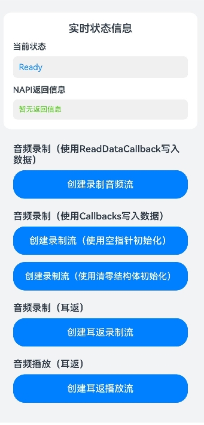

# 实现音频录制功能

## 介绍

本示例基于AudioRender、AudioCapturer等能力，实现了多种方式起流录制以及音频耳返等功能，包含了功能调用接口的完整链路。

## 效果图预览

**图1**：主界面

 

- 点击'创建录制音频流'按钮，即可实现录制的全流程，包括创建构造器、配置流参数、设置回调、构造录制流、设置低时延模式、销毁录制流以及注销回调监听等。
- 点击'创建录制流（使用空指针初始化）'按钮，即可实现录制的全流程，与第一个按钮的流程差异在于使用了OH_AudioCapturer_Callbacks的方式设置回调函数，回调函数的初始化通过设置为空指针进行。
- 点击'创建录制流（使用清零结构体初始化）'按钮，即可实现录制的全流程，与第一个按钮的流程差异在于使用了OH_AudioCapturer_Callbacks的方式设置回调函数，回调函数的初始化通过清零结构体进行。
- 点击'创建耳返录制流'按钮，即可实现耳返录制的全流程，包括创建构造器、配置流参数、设置回调、构造录制流、设置低时延模式、销毁录制流以及注销回调监听等。
- 点击'创建耳返播放流'按钮，即可实现耳返播放的全流程，包括创建构造器、配置流参数、设置回调、构造录制流、设置低时延模式、销毁录制流以及注销回调监听等。


## 工程结构&模块类型

```
├───entry/src/main/ets
|   ├───cpp
|   |   ├───types/libentry
|   |   |   └───Index.d.ts                      //NAPI接口声明
|   |   ├───CMakeLists.txt                      //CMake编译配置文件
|   |   └───AudioCapture.cpp                    //NAPI接口配置
|   ├───ets
│       ├───entryability                        
│       │   └───EntryAbility.ets                // Ability的生命周期回调内容。
│       ├───entrybackupability                  
│       │   └───EntryBackupAbility.ets          // BackupAbility的生命周期回调内容。
│       ├───pages                               
│           └───Index.ets                       // 主界面。
└───entry/src/main/resources                    // 资源目录。
```
### 具体实现

### 使用AudioCapturer与AudioRender实现音频录制与耳返功能
- 源码参考：[AudioCapture.cpp](entry/src/main/cpp/AudioCapture.cpp)  
- 使用流程：
  - 需申请`ohos.permission.MICROPHONE`权限来获取麦克风权限保证录音可以正常起流。当获取权限成功后，后续再使用麦克风权限的接口时不需要重复申请该权限。
  - 点击'创建录制音频流'按钮，首先调用`OH_AudioStreamBuilder_Create`创建音频流构造器，接着设置音频流参数并通过调用`OH_AudioStreamBuilder_SetCapturerInterruptCallback`、`OH_AudioStreamBuilder_SetCapturerErrorCallback`、`OH_AudioStreamBuilder_SetCapturerReadDataCallback`配置音频中断事件、音频异常事件监听以及写入数据回调。然后调用`OH_AudioStreamBuilder_SetLatencyMode`设置录制流为低时延模式。再调用`OH_AudioStreamBuilder_GenerateCapturer`构造音频流。最后调用`OH_AudioStreamBuilder_Destroy`销毁音频流。
  - 点击'创建录制流（使用空指针初始化）'按钮，流程基本与'创建录制音频流'相同，区别在于设置回调时通过`OH_AudioCapturer_Callbacks`来配置写入数据回调，并通过将监听内容赋值、非监听内容设置为`nullptr`实现初始化。
  - 点击'创建录制流（使用清零结构体初始化）'按钮，流程基本与'创建录制音频流'相同，区别在于设置回调时通过`OH_AudioCapturer_Callbacks`来配置写入数据回调，并通过`memset`将结构体清零再将监听内容赋值实现初始化。
  - 点击'创建耳返录制流'按钮，首先调用`OH_AudioStreamBuilder_Create`创建音频流构造器，接着调用`OH_AudioStreamBuilder_SetLatencyMode`设置录制流为低时延模式。然后调用`OH_AudioStreamBuilder_SetCapturerCallback`设置输入数据回调并注册音频流事件、中断事件以及错误事件监听。再调用`OH_AudioStreamBuilder_GenerateCapturer`构造音频流。最后调用`OH_AudioStreamBuilder_Destroy`销毁音频流。耳返的录制与监听数据共用同一缓存区，播放的内容与录制的内容一致。
  - 点击'创建耳返播放流'按钮，首先调用`OH_AudioStreamBuilder_Create`创建音频流构造器，接着调用`OH_AudioStreamBuilder_SetLatencyMode`设置播放流为低时延模式。然后调用`OH_AudioStreamBuilder_SetRendererCallback`设置输出数据回调并注册音频流事件、中断事件以及错误事件监听。再调用`OH_AudioStreamBuilder_GenerateRenderer`构造音频流。最后调用`OH_AudioStreamBuilder_Destroy`销毁音频流。耳返的录制与监听数据共用同一缓存区，播放的内容与录制的内容一致。

## 相关权限

麦克风使用权限：ohos.permission.MICROPHONE

## 模块依赖

不涉及。

## 约束与限制

1.  本示例支持在标准系统上运行，支持设备：RK3568。

2.  本示例支持API version 20，版本号： 6.0.0.43。

3.  本示例已支持使Build Version: 6.0.0.43, built on August 24, 2025。

4.  高等级APL特殊签名说明：无。