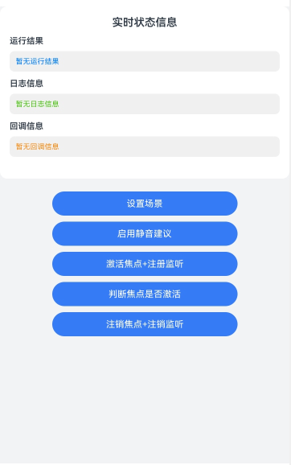

# 实现音频焦点功能

## 介绍

本示例基于AudioSessionManager提供的能力，实现了通过AudioSession主动管理应用内音频流的焦点、自定义本应用音频流的焦点策略、调整本应用音频流释放音频焦点的时机等功能，包含了功能调用接口的完整链路。

## 效果图预览

**图1**：主界面



- 依次点击'设置场景'、'激活焦点+注册监听'按钮，即可激活音频焦点，焦点策略为混合播放。
- 依次点击'设置场景'、'启用静音建议'、'激活焦点+注册监听'按钮，即可启用混音播放下静音建议通知。
- 点击'判断焦点是否激活'按钮，即可查询焦点状态，查询信息在运行结果栏显示。
- 点击'注销焦点+注销监听'按钮，即可注销音频焦点。

## 工程结构&模块类型

```
├───entry/src/main/ets
│   ├───entryability                        
│   │   ├───EntryAbility.ets                // Ability的生命周期回调内容。
│   ├───entrybackupability                  
│   │   └───EntryBackupAbility.ets          // BackupAbility的生命周期回调内容。
│   ├───pages                               
│       └───Index.ets                       // 主界面。
└───entry/src/main/resources                // 资源目录。
```
### 具体实现

### 使用 AudioSession 管理应用音频焦点
- 源码参考：[Index.ets](entry/src/main/ets/pages/Index.ets)  
- 使用流程：
  - 点击'设置场景'按钮，调用`audioSessionManager.setAudioSessionScene`设置当前音频场景为`MEDIA`。
  - 点击'启用静音建议'按钮，调用`audioSessionManager.enableMuteSuggestionWhenMixWithOthers`启用混音播放下静音建议通知。
  - 点击'激活焦点+注册监听'按钮，首先配置焦点策略为`CONCURRENCY_MIX_WITH_OTHERS`，接着调用`audioSessionManager.activateAudioSession`激活音频焦点，然后通过`audioSessionManager.on`监听焦点变化事件与焦点注销事件，监听事件触发后回调内容在回调信息栏打印。
  - 点击'判断焦点是否激活'按钮，调用`audioSessionManager.isAudioSessionActivated`来查询当前音频焦点激活状态，查询结果在运行结果栏打印。
  - 点击'注销焦点+注销监听'按钮，首先调用`audioSessionManager.deactivateAudioSession`停用当前应用的音频会话，再调用`audioSessionManager.off`来注销对焦点变化事件与焦点注销事件的监听。


## 相关权限

不涉及。

## 模块依赖

不涉及。

## 约束与限制

1.  本示例支持在标准系统上运行，支持设备：RK3568。

2.  本示例支持API version 20，版本号： 6.0.0.43。

3.  本示例已支持使Build Version: 6.0.0.43, built on August 24, 2025。

4.  高等级APL特殊签名说明：无。