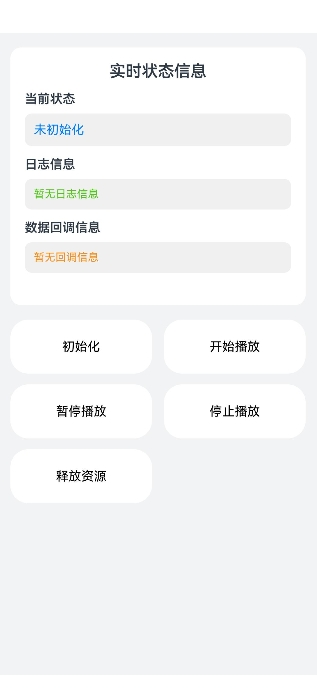
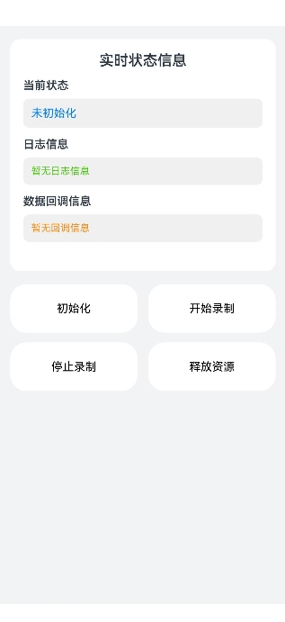

# 音频通话功能示例

## 介绍

本示例基于AudioRender与AudioCapture能力，实现了语音通话场景，包含语音流的录制与播放的全流程。

## 效果图预览

**图1**：首页

选择跳转到对应功能页面。


**图2**：播放对端通话声音界面

- 依次点击'初始化'、'开始播放'按钮，即可创建语音通话流播放音频。
- 点击'暂停播放'按钮，即可暂停音频播放，可以通过点击'开始播放'来恢复音频播放。
- 点击'停止播放'、'释放资源'按钮，即可结束音频播放。

   

**图3**：录制本端通话声音界面

- 依次点击'初始化'、'开始录制'按钮，即可创建语音通话流录制音频。
- 点击'停止录制'、'释放资源'按钮，即可结束录制。

  

## 工程结构&模块类型

```
├───entry/src/main/ets
│   ├───pages                               
│   │   └───Index.ets                                        // 首页。
│   │   └───VoIpDemoForAudioCapturer.ets                     // 使用AudioCapturer录制对端的通话声音页。
│   │   └───VoIpDemoForAudioRenderer.ets                     // 使用AudioRenderer播放本端的通话声音页。
└───entry/src/main/resources                                 // 资源目录。         
```

## 具体实现

### 使用AudioRenderer播放对端的通话声音
- 源码参考：[VoIpDemoForAudioRenderer.ets](entry/src/main/ets/pages/VoIpDemoForAudioRenderer.ets)
- 使用流程：
  - 点击'初始化'按钮，开始配置`audioRendererOptions`内容，包括采样率、通道数、采样格式、编码格式、流类型以及采集器标志，其中流类型设置为`STREAM_USAGE_VOICE_COMMUNICATION`即可创建语音通话类型的播放流。接着配置写入数据回调并订阅监听。最后调用`audio.createAudioRenderer`创建播放实例。
  - 点击'开始播放'按钮，调用`audioRenderer.start`，开始播放。
  - 点击'暂停播放'按钮，调用`audioRenderer.pause`，暂停录制。
  - 点击'停止播放'按钮，调用`audioRenderer.stop`，停止播放。
  - 点击'释放资源'按钮，调用`audioRenderer.release`，释放音频流资源并注销回调。

### 使用AudioCapturer录制本端的通话声音
- 源码参考：[VoIpDemoForAudioCapturer.ets](entry/src/main/ets/pages/VoIpDemoForAudioCapturer.ets)
- 使用流程：
  - 需申请`ohos.permission.MICROPHONE`权限来获取麦克风权限保证录音可以正常起流。当获取权限成功后，后续再使用麦克风权限的接口时不需要重复申请该权限。
  - 点击'初始化'按钮，开始配置`AudioCapturerOptions`内容，包括采样率、通道数、采样格式、编码格式、音源类型以及采集器标志，其中音源类型设置为`SOURCE_TYPE_VOICE_COMMUNICATION`即可创建语音通话类型的录制流。接着配置读入数据回调并订阅监听。最后调用`audio.createAudioCapturer`创建录制实例。
  - 点击'开始录制'按钮，调用`audioCapturer.start`，开始录制。
  - 点击'停止录制'按钮，调用`audioCapturer.stop`，停止录制。
  - 点击'释放资源'按钮，调用`audioCapturer.release`，释放音频流资源并注销回调。

## 相关权限

麦克风使用权限：ohos.permission.MICROPHONE

## 模块依赖

不涉及。

## 约束与限制

1. 本示例支持在标准系统上运行，支持设备：RK3568。

2. 本示例支持API version 20，版本号： 6.0.0.43。

3. 本示例已支持使Build Version: 6.0.0.43, built on August 24, 2025。

4. 高等级APL特殊签名说明：无。