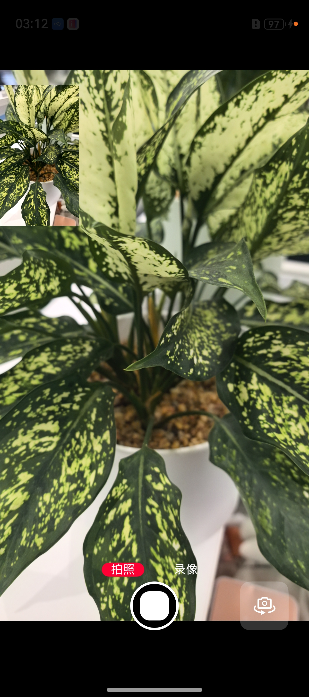

# NDKPreviewImageSample

### 介绍

本示例展示了如何基于 OpenHarmony Camera Kit 实现 **预览流二次处理（主预览 + 小窗预览）**，并利用 ImageReceiver 接收预览流的原始图像数据，以支持后续的图像二次处理（如滤镜、AI识别等）。

当前版本 sample 主要用于联调验证，依赖 C/C++ NDK 相机接口（`libohcamera.so` 等），需配合支持 Camera C API 的 SDK 使用。

### 效果预览

| 效果展示                                                  |
|-------------------------------------------------------|
|  |


### 使用说明

1. 弹出是否允许使用相机？点击“允许”。

2. 弹出是否允许使用麦克风？点击“允许”。

3. 弹出是否允许访问文件？点击“允许”。

4. 进入预览界面，**主画面正常显示，左上角小窗同步显示预览流**（由 ImageReceiver 接收并绘制）。

5. 录像功能正常，视频保存与播放无异常。

6. 切换前置摄像头后，主预览与小窗均正确显示画面。

>💡 小窗内容并非直接绑定 XComponent，而是通过 `ImageReceiver` 接收预览帧后，手动写入另一个 Surface 显示，可用于实现滤镜、美颜、AI检测等二次处理逻辑。

### 工程目录

```

entry
│
└── src
│   └── main
│       ├── cpp
│       │   ├── CMakeLists.txt					// CMake打包配置文件，编译工程动态库脚本，依赖头文件、cpp以及相关依赖
│       │   ├── camera_manager.cpp				// 相机基本功能接口定义cpp实现侧
│       │   ├── camera_manager.h				// 相机基本功能接口定义头文件
│       │   ├── napi_init.cpp					// NAPI实现JS与C++通信的接口（相当于main.cpp）
│       │   └── types
│       │       └── libentry
│       │           ├── Index.d.ts				// 导入NAPI接口供JS调用
│       │           └── oh-package.json5		// 接口注册配置文件
│       └── ets
│           ├── common
│           │   ├── GlobalContext.ets			// 全局上下文管理，用于跨页面共享状态或数据
│           │   ├── Logger.ets					// 日志工具类，封装统一日志输出逻辑
│           │   └── Constants.ets				// 基础常量定义：如设备类型、纵横比、帧率等枚举值
│           ├── entryability
│           │   └── EntryAbility.ets			// Ability生命周期回调入口，应用启动/退出等事件处理
│           ├── entrybackupability
│           │   └── EntryBackupAbility.ets		// 备份恢复能力相关逻辑（如数据迁移）
│           └── pages
│               ├── EditPage.ets				// 编辑页面
│               └── Index.ets					// 应用主页面，相机APP首页，负责UI展示与交互入口

```

### 具体实现

#### 一、TS UI 层：创建双 Surface 并传递 ID

在应用主页面（`Index.ets`）中，开发者声明了两个 `XComponent` 组件：

- 第一个用于显示主相机预览画面；
- 第二个用于显示由 C++ 层处理后的小窗预览（例如带滤镜或 AI 标注的画面）。

当这两个 `XComponent` 加载完成后，系统会分别调用其 `onLoad` 回调，在回调中通过 `getXComponentSurfaceId()` 方法获取各自对应的 Surface ID（字符串形式）。这两个 Surface ID 通过 AppStorage 或直接作为参数，传递给 C++ 层的初始化函数（如 `initCamera`）。

> **注意：**主预览的 Surface ID 会直接用于 Camera Kit 创建预览输出；而小窗的 Surface ID 将用于后续手动渲染 ImageReceiver 接收到的图像帧。


#### 二、NAPI 桥接层：参数透传与接口暴露

在 `napi_init.cpp` 中，定义了供 TS 调用的 NAPI 接口，例如 `initCamera(mainSurfaceId, slaveSurfaceId, ...)`。该函数负责：

- 将传入的两个 Surface ID 字符串转换为 C++ 可用的格式；
- 调用底层 `CameraManager` 类的初始化方法，并传入这两个 Surface ID；
- 同时注册图像数据回调函数（如拍照 Buffer 回调），以支持拍照/录像功能。


#### 三、C++ 相机控制与图像接收层（核心逻辑）

##### 1. 初始化 ImageReceiver（用于小窗图像源）

在 `CameraManager` 的初始化流程中，首先调用一个名为 `InitImageReceiver` 的函数来创建图像接收器：

- 调用 `OH_ImageReceiverOptions_Create` 创建配置对象；
- 通过 `OH_ImageReceiverOptions_SetSize` 设置期望接收的图像尺寸（例如 1920×1080）；
- 通过 `OH_ImageReceiverOptions_SetCapacity` 设置内部 Buffer 队列的最大容量（推荐值为 8，避免内存溢出或丢帧）；
- 调用 `OH_ImageReceiverNative_Create` 基于上述配置创建 `OH_ImageReceiverNative` 实例；
- 调用 `OH_ImageReceiverNative_On` 注册图像到达回调函数 `CallbackReadNextImage`；
- 最后，调用 `OH_ImageReceiverNative_GetReceivingSurfaceId` 获取该接收器专属的 Surface ID（类型为 `uint64_t`）。

这个 Surface ID 将作为 **第二路预览输出的目标**，由 Camera Kit 写入预览帧数据。

##### 2. 创建双路预览输出并加入会话

使用两个不同的 Surface ID 创建两个 `PreviewOutput`：

- 第一个使用 TS 传来的主预览 Surface ID，用于正常显示相机画面；
- 第二个使用上一步从 `ImageReceiver` 获取的 Surface ID，用于向接收器输送图像数据。

随后，调用 `OH_CaptureSession_AddPreviewOutput` 将这两个预览输出都添加到同一个 `CaptureSession` 中。这样，Camera Kit 会在每一帧同时向两个 Surface 写入相同的预览图像。

##### 3. 图像回调与小窗渲染（二次处理入口）

当预览开始后，只要有新帧写入 ImageReceiver 的 Surface，系统就会自动触发之前注册的 `CallbackReadNextImage` 回调函数。该函数执行以下操作：

- 调用 `OH_ImageReceiverNative_ReadNextImage` 从队列中取出最新的 `OH_ImageNative` 对象；
- 将该图像对象传递给 `ShowImage` 函数进行处理；
- 处理完成后，必须调用 `OH_ImageNative_Release` 释放图像资源，否则会导致内存泄漏。

在 `ShowImage` 函数中，实现将图像数据显示到小窗 `XComponent` 的逻辑：

- 首先，将 TS 传入的小窗 Surface ID（字符串）转换为 `uint64_t`；
- 调用 `OH_NativeWindow_CreateNativeWindowFromSurfaceId` 创建对应的小窗 `OHNativeWindow`；
- 调用 `OH_NativeWindow_NativeWindowHandleOpt` 设置窗口的缓冲区尺寸（需与图像尺寸一致）和像素格式（如 NV21）；
- 根据当前是否为前置摄像头，设置旋转角度（后置通常需旋转 270°，前置旋转 90°）；
- 调用 `OH_ImageNative_GetByteBuffer` 获取图像的原始字节缓冲区（`OH_NativeBuffer`）；
- 调用 `OH_NativeWindow_NativeWindowRequestBuffer` 从小窗 Surface 的 BufferQueue 中申请一个可写入的缓冲区；
- 将图像数据从 `OH_NativeBuffer` 拷贝 到申请到的 `OHNativeWindowBuffer` 中（通过 mmap 映射 fd 内存实现）；
- 最后调用 `OH_NativeWindow_NativeWindowFlushBuffer` 提交缓冲区，使图像在小窗上显示。

> **说明：**此处是 **图像二次处理的关键插入点**：开发者可在 `memcpy` 之前对 `srcVir` 指向的数据进行滤镜、AI 推理、人脸检测等操作，再写入目标缓冲区。

##### 4. 其他相机功能

除双路预览外，其他功能（包括拍照、录像、变焦、对焦、闪光灯）沿用原有设计：

- 所有控制接口（如 `TakePicture`、`SetZoomRatio`）均封装在 `camera_manager.cpp` 中；
- 通过 NAPI 暴露给 TS 层调用；
- 底层调用对应的 `OH_CaptureSession_*` 或 `OH_CameraManager_*` C API；
- 各类状态通过注册的回调函数（如 `CaptureSessionRegisterCallback`）通知上层。


### 相关权限

[ohos.permission.CAMERA](https://gitcode.com/openharmony/docs/blob/master/zh-cn/application-dev/security/AccessToken/permissions-for-all-user.md#ohospermissioncamera)

[ohos.permission.MICROPHONE](https://gitcode.com/openharmony/docs/blob/master/zh-cn/application-dev/security/AccessToken/permissions-for-all-user.md#ohospermissionmicrophone)

[ohos.permission.READ_MEDIA](https://gitcode.com/openharmony/docs/blob/master/zh-cn/application-dev/security/AccessToken/permissions-for-all-user.md#ohospermissionread_media)

[ohos.permission.WRITE_MEDIA](https://gitcode.com/openharmony/docs/blob/master/zh-cn/application-dev/security/AccessToken/permissions-for-all-user.md#ohospermissionwrite_media)

[ohos.permission.ACCELEROMETER](https://gitcode.com/openharmony/docs/blob/master/zh-cn/application-dev/security/AccessToken/permissions-for-all.md#ohospermissionaccelerometer)


### 依赖

不涉及

### 约束与限制

1. 本示例仅支持标准系统上运行，支持设备：华为手机。

2. 本示例支持API20版本SDK，版本号：6.0.0.47。

3. 本示例已支持使DevEco Studio 6.0.0 Release(构建版本：6.0.0.858，构建 2025年9月25日)编译运行。
