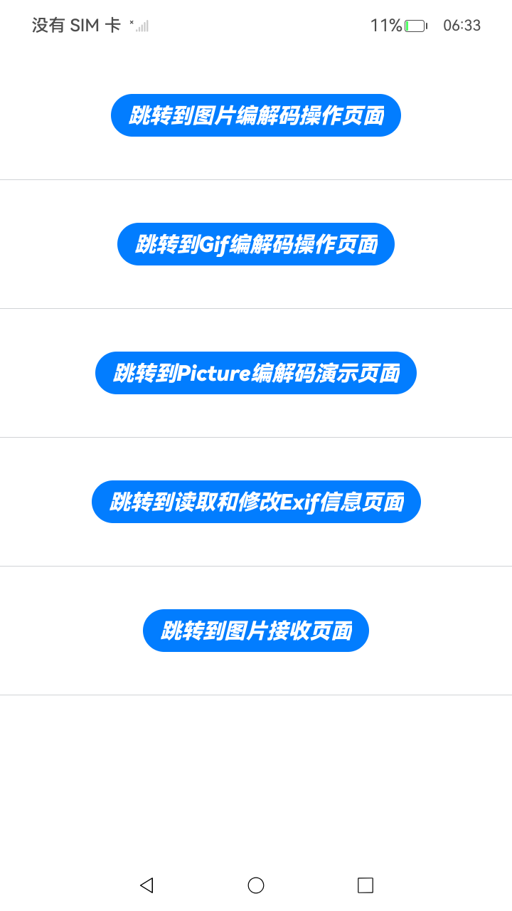
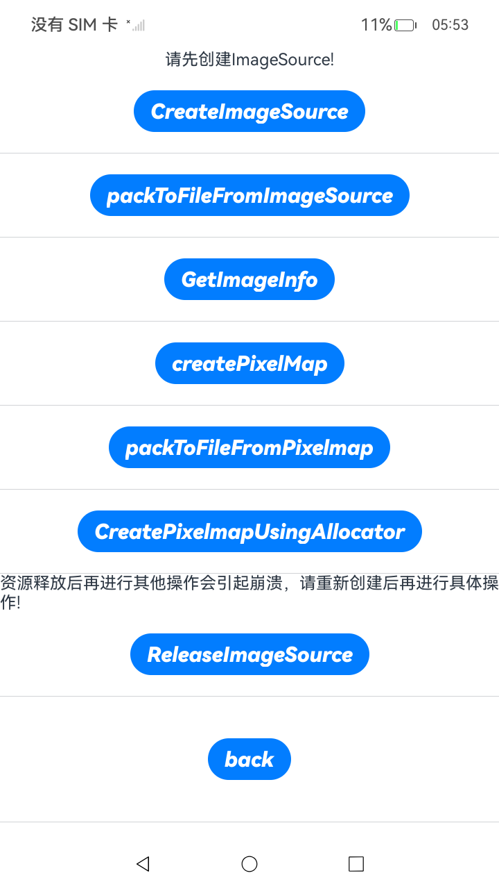
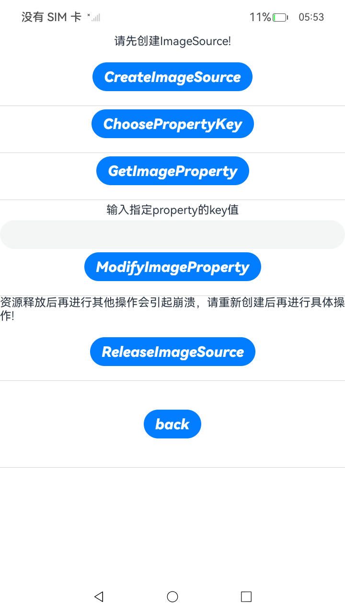

# Image开发指导(C/C++)

### 介绍

此Sample为开发指南中**图片开发指导(C/C++)**章节中部分示例代码的工程。包含图片编解码，图片接收，内存分配，以及图片Exif信息的相关操作。

### 效果预览

| index页面                           | 图片解码页面示例                          | Exif信息编辑页面示例                     |
|-----------------------------------|-----------------------------------|----------------------------------|
|  |  |  |

使用说明：

1.安装应用，弹出权限允许界面，点击“允许”按钮，弹出菜单后，根据需要点击按钮跳转到不同功能的界面。

2.从菜单页面，点击“跳转到图片编解码操作页面”按钮，进入图片编解码页面，首先点击“CreateImageSource”按钮解码创建ImageSource对象，然后点击“packToFileFromImageSource”按钮
对ImageSource对象进行编码，点击“GetImageInfo”按钮获取ImageInfo的width。在编解码操作结束后点击“ReleaseImageSource”按钮进行资源的释放。

3.从菜单页面，点击“跳转到图片编解码操作页面”按钮，进入图片编解码页面，首先点击“CreateImageSource”按钮解码创建ImageSource对象，然后点击“createPixelMap”按钮
解码创建PixelMap对象，点击“packToFileFromPixelmap”按钮对PixelMap对象进行编码。在编解码操作结束后点击“ReleaseImageSource”按钮进行资源的释放。

4.从菜单页面，点击“跳转到图片编解码操作页面”按钮，进入图片编解码页面，首先点击“CreateImageSource”按钮解码创建ImageSource对象，
然后点击“CreatePixelmapUsingAllocator”按钮申请图片解码内存解码创建PixelMap对象，在解码结束后点击“ReleaseImageSource”按钮进行资源的释放。

5.从菜单页面，点击“跳转到Gif编解码操作页面”按钮进入Gif编解码操作页面，首先点击“CreateImageSource”按钮解码创建ImageSource对象，然后点击“CreatePixelmapList”按钮
创建Pixelmap列表，点击“GetDelayTimeList”按钮获取图像延迟时间列表，在解码结束后点击“ReleaseImageSource”按钮进行资源的释放。

6.从菜单页面，点击“跳转到Picture编解码演示页面”按钮，进入多图编解码演示页面，首先点击“SetDesiredAuxiliaryPictures”按钮设置解码参数，然后点击“CreateImageSource”按钮
解码创建ImageSource对象，点击“packToDataFromPicture”按钮将Picture对象进编码进data，点击“packToFileFromPicture”按钮将Picture对象进编码进file，
在编解码操作结束后点击“ReleasePictureSource”按钮进行资源的释放。

7.从菜单页面，点击“跳转到读取和修改Exif信息页面”按钮，进入Exif信息编辑页面，首先点击“CreateImageSource”按钮解码创建ImageSource对象，然后点击“ChoosePropertyKey”按钮
选择PropertyKey，点击“GetImageProperty”按钮获取其Exif信息。在操作结束后点击“ReleaseImageSource”按钮进行资源的释放。

8.从菜单页面，点击“跳转到读取和修改Exif信息页面”按钮，进入Exif信息编辑页面，首先点击“CreateImageSource”按钮解码创建ImageSource对象，然后点击“ChoosePropertyKey”按钮
选择PropertyKey，在输入栏输入要修改value值，点击"ModifyImageProperty"按钮修改Exif信息。在操作结束后点击“资源释放”按钮进行资源的释放。

9.从菜单页面，点击“跳转到图片接收页面”按钮，进入图片接收页面，首先点击“initImageReceiver”按钮初始化ImageReceiver，注册回调函数，点击"takePhoto"按钮触发回调，并获取image信息。
在操作结束后点击“releaseImageReceiver”按钮进行资源的释放。

### 工程目录

```
NdkPicture
entry/src/main/cpp/
├── types
│   └── libentry 
│       └── Index.d.ts (声明Napi接口，供ts调用)
├── imageKits.txt (声明文件)
├── loadAllocator.txt (内存分配接口调用文件)
├── loadImageSource.txt (ImageSource接口调用文件)
├── loadPicture.txt (Picture接口调用文件)
├── loadReceiver.txt (Receiver接口调用文件)
├── loadReceiver.h (Receiver接口导出文件)
└── napi_init.cpp (初始化Napi接口)
entry/src/main/ets/
├── utils
│   └── FunctionUtility.ets (辅助功能函数)
│   └── Logger.ets (logger日志类)
│   └── MyButton.ets (自定义Button按钮类)
│   └── PictureFunctions.ets (Picture函数类)
│   └── ReceiverFunctions.ets (Receiver函数类)
│   └── SourceFunctions.ets (ImageSource函数类)
└── pages
    └── EditExif.ets (Exif编辑界面)
    └── GifCodec.ets (Gif编解码界面)
    └── ImageCodec.ets (ImageSource操作界面)
    └── ImageReceiver.ets (Receiver操作界面)
    └── Index.ets (菜单界面)
    └── PictureCodec.ets (Picture编解码操作界面)
entry/src/main/resources/
└── rawfile
    └── test.jpeg(单图资源)
    └── test.gif(Gif资源)
    └── allAux.jpg(Picture资源)
entry/src/ohosTest/ets/
└── test
    ├── Ability.test.ets (UI测试样例代码)
    ├── Exif.test.ets (Exif UI测试代码)
    ├── Gif.test.ets (Gif UI测试代码)
    ├── ImageSource.test.ets (ImageSource UI测试代码)
    ├── Picture.test.ets (Picture UI测试代码)
    ├── Receiver.test.ets (Receiver UI测试代码)
    └── List.test.ets (测试套件列表)
```

### 具体实现

+ 图片编解码,部分ImageSource操作，Exif信息获取与修改功能和内存申请等功能的接口调用均封装在SourceFunctions中实现，
源码参考[SourceFunctions.ets](./entry/src/main/ets/utils/SourceFunctions.ets)。
+ 多图编解码相关操作的接口调用均封装在PictureFunctions中实现，源码参考[PictureFunctions.ets](./entry/src/main/ets/utils/PictureFunctions.ets)。
+ 图片接收功能的接口调用封装在ReceiverFunctions中实现，源码参考[ReceiverFunctions.ets](./entry/src/main/ets/utils/ReceiverFunctions.ets)。

### 相关权限

相机权限。

### 依赖

不涉及。

### 约束与限制

1. 本示例仅支持标准系统上运行, 支持设备：华为手机。

2. HarmonyOS系统：HarmonyOS 5.0.5 Release及以上。

3. DevEco Studio版本：6.0.0 Release及以上。

4. HarmonyOS SDK版本：HarmonyOS 6.0.0 Release SDK及以上。

### 下载

如需单独下载本工程，执行如下命令：

````
git init
git config core.sparsecheckout true
echo Media/Image/ImageNativeSample > .git/info/sparse-checkout
git remote add origin https://gitcode.com/HarmonyOS_Samples/guide-snippets.git
git pull origin master
````