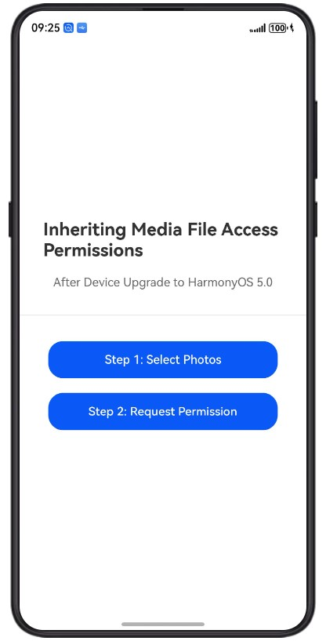
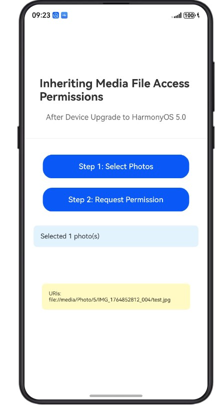
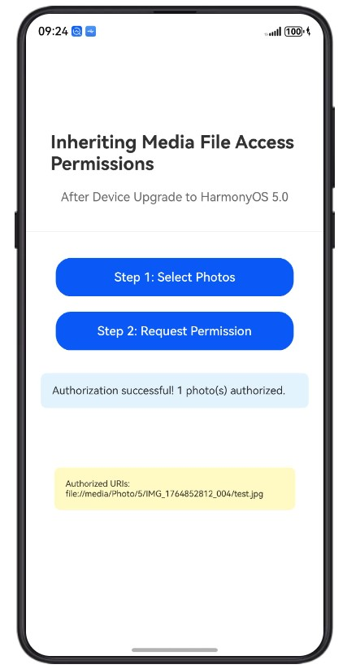

# 继承媒体文件访问权限示例

## 简介

本示例展示了如何在设备升级到最新系统版本后继承媒体文件访问权限。当应用从旧版本系统升级后，原有的媒体文件URI可能失效，此时需要通过系统授权对话框重新获取访问权限。

本示例使用的核心包包括：
- [@kit.MediaLibraryKit](https://developer.huawei.com/consumer/cn/doc/harmonyos-guides/medialibrary-kit) - 提供photoAccessHelper模块用于请求媒体文件访问权限
- [@kit.AbilityKit](https://developer.huawei.com/consumer/cn/doc/harmonyos-guides/ability-kit) - 提供应用能力相关支持
- [@kit.BasicServicesKit](https://developer.huawei.com/consumer/cn/doc/harmonyos-guides/basic-services-kit) - 提供基础服务能力

## 效果预览

| 步骤1：选择照片              | 第二步：请求权限              | 授权结果              |
| --------------------- | --------------------- | --------------------- |
|  |  |  |

## 使用说明

1. 启动应用后，在主界面可以看到两个主要步骤；
2. 点击"步骤1：选择照片"按钮，使用Picker选择照片（最多5张），模拟生成旧版本具有图片访问权限的照片URI；
3. 点击"步骤2：请求权限"按钮，调用requestPhotoUrisReadPermission()启动系统授权对话框；
4. 在系统授权对话框中，查看选定的照片并授予访问权限；
5. 如果用户授予权限，应用将收到新的照片URI；如果取消，则不返回URI；
6. 授权后的URI将显示在界面底部的信息框中。

## 工程目录
```
entry/src/main/ets/
├─entryability
│  └─EntryAbility.ets                    # 应用入口
├─entrybackupability
│  └─EntryBackupAbility.ets              # 备份能力
└─pages
   └─Index.ets                           # 主界面
entry/src/main/resources/                # 资源文件
```

## 具体实现

### 升级场景说明

**升级前：**
- 应用具有访问特定图像/视频的权限；
- 存储在应用中的URI正常工作；
- 可以直接访问媒体文件。

**升级后：**
- 原始URI不再有效；
- 默认情况下应用无法访问媒体文件；
- 需要通过系统对话框重新请求访问权限。

### 1. 选择照片并获取旧URI

使用PhotoViewPicker选择照片，模拟旧版本的URI，源码参考：[Index.ets](entry/src/main/ets/pages/Index.ets)

- 创建PhotoViewPicker实例：使用photoAccessHelper.PhotoViewPicker()创建选择器；
- 配置选择参数：设置PhotoSelectOptions，限制最多选择5张照片；
- 获取照片URI：调用picker.select()获取选中照片的URI数组；
- 保存旧URI：将获取的URI保存到应用数据中，模拟升级前的场景。

### 2. 请求权限继承

调用requestPhotoUrisReadPermission()请求继承媒体文件访问权限，源码参考：[Index.ets](entry/src/main/ets/pages/Index.ets)

- 传入旧URI数组：将步骤1中获取的URI数组作为参数传入；
- 启动系统授权对话框：系统自动显示包含照片缩略图的授权对话框；
- 用户选择授权：用户可以选择授权全部或部分照片的访问权限；
- 获取新URI：如果用户授予权限，API返回新的授权后的照片URI数组；如果用户取消，则返回空数组。

### 3. 显示授权结果

在界面中展示授权后的新URI，源码参考：[Index.ets](entry/src/main/ets/pages/Index.ets)

- 解析返回结果：处理requestPhotoUrisReadPermission()返回的新URI数组；
- 更新界面显示：将新URI显示在界面底部的信息框中；
- 保存新URI：将新URI保存到应用数据中，替换旧URI用于后续访问。

## 相关权限

无需申请权限，requestPhotoUrisReadPermission() API通过系统对话框进行授权，无需在module.json5中声明权限。

## 依赖

无

## 约束与限制

1. 本示例仅支持标准系统上运行；
2. 本示例支持API22版本SDK，版本号：6.0.2；
3. 本示例需要使用DevEco Studio 6.0.0 Canary1（构建版本：6.0.0.63，构建于2025年10月30日）及以上版本才可编译运行。

## 下载

如需单独下载本工程，执行如下命令：
```
git init
git config core.sparsecheckout true
echo MediaLibraryKit/PhotourisPermissionSample/ > .git/info/sparse-checkout
git remote add origin https://gitcode.com/HarmonyOS_Samples/guide-snippets.git
git pull origin master
```