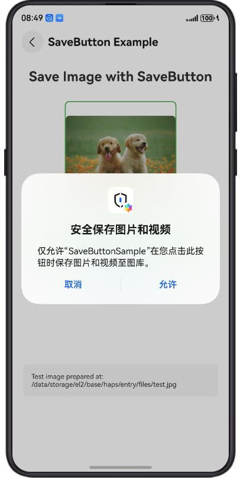
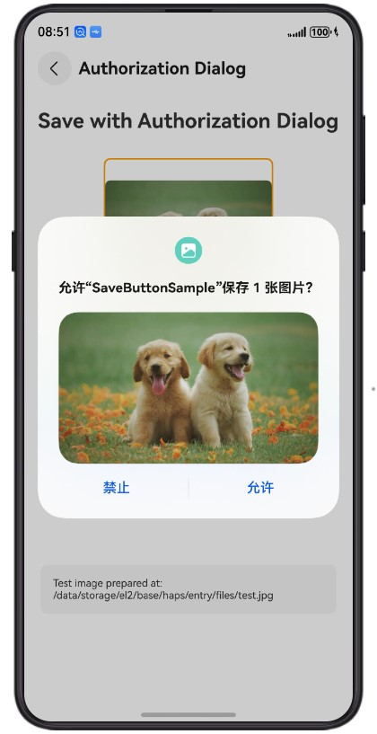
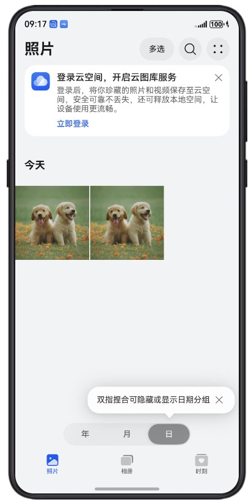

# 保存媒体库资源示例

## 简介

本示例展示了如何在不需要ohos.permission.WRITE_IMAGEVIDEO权限的情况下将媒体资产（图片和视频）保存到图库。通过使用SaveButton安全组件和授权弹窗，应用可以安全地将媒体文件保存到用户的图库中。

本示例使用的核心包包括：
- [@kit.MediaLibraryKit](https://developer.huawei.com/consumer/cn/doc/harmonyos-guides/medialibrary-kit) - 提供photoAccessHelper模块用于媒体资源管理
- [@kit.AbilityKit](https://developer.huawei.com/consumer/cn/doc/harmonyos-guides/ability-kit) - 提供应用能力相关支持
- [@kit.CoreFileKit](https://developer.huawei.com/consumer/cn/doc/harmonyos-guides/core-file-kit) - 提供文件系统访问能力

## 效果预览

| SaveButton组件          | 授权对话框                 | 保存成功                  |
| --------------------- | --------------------- | --------------------- |
|  |  |  |

## 使用说明

1. 启动应用后，在主界面可以看到三个功能选项；
2. 点击"SaveButton组件"按钮，使用SaveButton安全组件保存图片或视频到图库；
3. 点击"授权弹窗场景"按钮，通过授权弹窗方式保存媒体资源；
4. 系统会显示授权对话框，通知用户保存操作，用户同意后媒体文件自动保存到图库；
5. 点击"获取支持的格式"按钮，查看系统支持的图片和视频格式；
6. 保存成功后，可以在图库应用中查看保存的文件。

## 工程目录
```
entry/src/main/ets/
├─entryability
│  └─EntryAbility.ets                    # 应用入口
├─entrybackupability
│  └─EntryBackupAbility.ets              # 备份能力
└─pages
   ├─Index.ets                           # 主界面
   ├─Scene1.ets                          # 获取支持的媒体格式场景
   ├─Scene2.ets                          # 使用SaveButton组件保存场景
   └─Scene3.ets                          # 使用授权弹窗保存场景
entry/src/main/resources/                # 资源文件
```

## 具体实现

### 1. 获取支持的媒体格式

查询系统支持的图片和视频格式，源码参考：[Scene1.ets](entry/src/main/ets/pages/Scene1.ets)

- 获取PhotoAccessHelper实例：使用photoAccessHelper.getPhotoAccessHelper()获取实例；
- 查询支持的格式：调用photoAccessHelper.getSupportedPhotoFormats()获取支持的图片和视频格式列表；
- 显示格式信息：在界面中展示支持的文件格式，包括jpg、png、gif、mp4等；
- 格式验证：在保存前可以验证要保存的文件格式是否被系统支持。

### 2. 使用SaveButton组件保存

使用SaveButton安全组件保存媒体资源，源码参考：[Scene2.ets](entry/src/main/ets/pages/Scene2.ets)

- 准备媒体文件：确保要保存的图片或视频文件存在于应用沙箱目录；
- 添加SaveButton组件：在界面中添加SaveButton组件；
- 配置保存选项：设置saveButtonOptions参数，指定要保存的文件URI和类型；
- 自动权限处理：SaveButton组件会自动处理保存权限，无需手动申请ohos.permission.WRITE_IMAGEVIDEO权限；
- 用户确认保存：用户点击SaveButton后，系统显示授权对话框，用户同意后完成保存。

### 3. 使用授权弹窗保存

通过授权弹窗方式保存媒体资源到图库，源码参考：[Scene3.ets](entry/src/main/ets/pages/Scene3.ets)

- 准备媒体文件：确保要保存的图片或视频文件存在于应用沙箱目录；
- 触发保存操作：调用相关API触发保存操作；
- 显示授权弹窗：系统自动弹出授权对话框，向用户说明保存操作；
- 用户授权：用户在弹窗中同意授权后，媒体文件被保存到图库；
- 保存结果反馈：保存成功后在界面中显示结果信息。

## 相关权限

无需申请权限，SaveButton组件和授权弹窗会自动处理保存媒体资源所需的权限。

注：如需读取和保存音频文件，请使用AudioViewPicker。

## 依赖

无

## 约束与限制

1. 本示例仅支持标准系统上运行；
2. 本示例支持API22版本SDK，版本号：6.0.2；
3. 本示例需要使用DevEco Studio 6.0.0 Canary1（构建版本：6.0.0.63，构建于2025年10月30日）及以上版本才可编译运行。

## 下载

如需单独下载本工程，执行如下命令：
```
git init
git config core.sparsecheckout true
echo MediaLibraryKit/SaveButtonSample/ > .git/info/sparse-checkout
git remote add origin https://gitcode.com/HarmonyOS_Samples/guide-snippets.git
git pull origin master
```