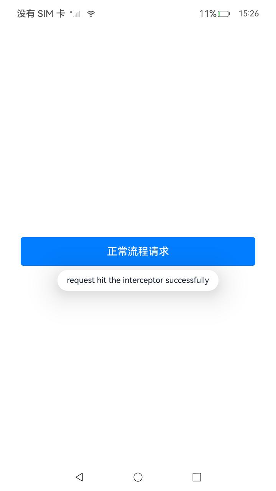

# HTTP_interceptor_case(网络请求拦截器)

### 介绍

应用通过`http.HttpInterceptorChain()`创建拦截器链，使用`addChain()`方法将需要的拦截器加入到链中，使用`apply()`方法将http请求与拦截器链绑定，最后通过`httpRequest.request(url)`发送请求。本项目的构建依据[HTTP数据请求](https://gitcode.com/openharmony/docs/blob/master/zh-cn/application-dev/network/http-request.md)示例代码，构建了一个HTTP数据请求拦截器的示例应用，它实现了通过按钮实现http添加拦截器的开发步骤功能，使用了[@ohos.net.http](https://gitcode.com/openharmony/docs/blob/master/zh-cn/application-dev/reference/apis-network-kit/js-apis-http.md)接口。

**注意**：本示例需要用户输入一个实际的URL，方能获得通过的结果。

### 效果预览

|  发送HTTP请求并命中拦截器                                     |
| ----------------------------------------------------------| 
|  | 


**使用说明**

1. 点击 "正常流程请求" 按钮，发送一个请求到 HTTP_URL 并显示测试结果。

   注1：日志输出使用 `hilog.info` 进行调试，可以查看 HTTP 请求命中拦截器是否成功，
   - 如果成功，日志打印请求命中拦截器的的详细信息，包括请求头、响应数据、状态码等。
   - 如果失败，日志打印错误状态码和错误信息。

   注2：弹窗信息展示，
   - 如果成功，展示`request hit the interceptor successfully`。
   - 如果失败，展示`request hit the interceptor fail`。
   - 如果报错，展示错误信息。

### 工程目录

```
entry/src/main/ets/
|---entryability
|   │---EntryAbility.ets
|---entrybackupability
│   |---EntryBackupAbility.ets      
|---pages
│   |---Index.ets                      // 主页
```

### 具体实现

1. **HTTP 正常请求 (`httpNormalRequest`)**
   - 使用 `http.createHttp()` 创建一个 HTTP 请求对象 `httpRequest`。
   - 使用 `http.HttpInterceptorChain()` 创建一个拦截器链对象 `chain`。
   - 将需要的拦截器实例化，并使用 `chain.addChain()` 加入到拦截器链中。
   - 使用 `chain.apply(httpRequest)` 将当前配置好的拦截器链附加到 `httpRequest` 对象上。
   - 使用 `httpRequest.request(HTTP_URL, options)` 发起 http 请求。
   - 日志记录请求返回的 http.HttpResponse 信息。
   - 在请求完成时，成功会将 `request hit the interceptor successfully` 展示在 UI 中
   - 请求完成后销毁 `httpRequest` 实例，确保资源释放。
2. **HTTP 请求参数配置**
   - **请求方法**：请求使用 `http.RequestMethod.POST`或者 `http.RequestMethod.GET`。
   - **请求头**：两种请求都设置了 `content-Type: text/html`，说明请求体为 html 数据。
3. **异常处理与状态更新**
   - **请求失败处理**：在请求失败时，`err` 会被捕获，并将 UI 显示为“request hit the interceptor fail”，同时在日志中记录错误信息。
   - **请求异常处理**：在请求异常时，使用 `catch` 捕获错误并更新 UI 显示为“错误信息”，同时在日志中记录错误信息。
4. **资源释放与请求销毁**
   - 每次请求结束后，都调用 `httpRequest.destroy()` 销毁请求对象，释放相关资源。

### 相关权限

[ohos.permission.INTERNET](https://gitcode.com/openharmony/docs/blob/master/zh-cn/application-dev/security/AccessToken/permissions-for-all.md#ohospermissioninternet)

### 依赖

不涉及。

### 约束与限制

1. 本示例仅支持标准系统上运行，支持设备：Phone、PC/2in1、Tablet、TV、Wearable。
2. 本示例为Stage模型，支持API22版本SDK，版本号：6.0.2.57。
3. 本示例需要使用DevEco Studio Release（6.0.0.858）及以上版本才可编译运行。

### 下载

如需单独下载本工程，执行如下命令：

```
git init
git config core.sparsecheckout true
echo code/DocsSample/NetWork_Kit/NetWorkKit_Datatransmission/HTTP_interceptor_case/ > .git/info/sparse-checkout
git remote add origin https://gitcode.com/openharmony/applications_app_samples.git
git pull origin master
```