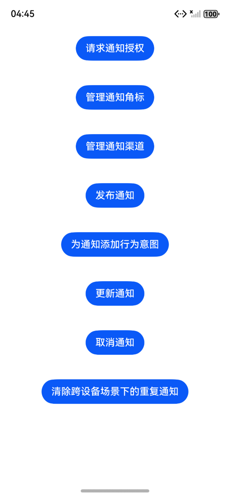
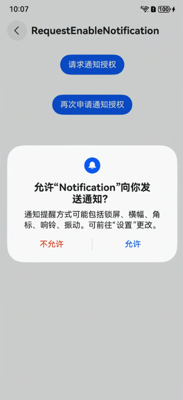
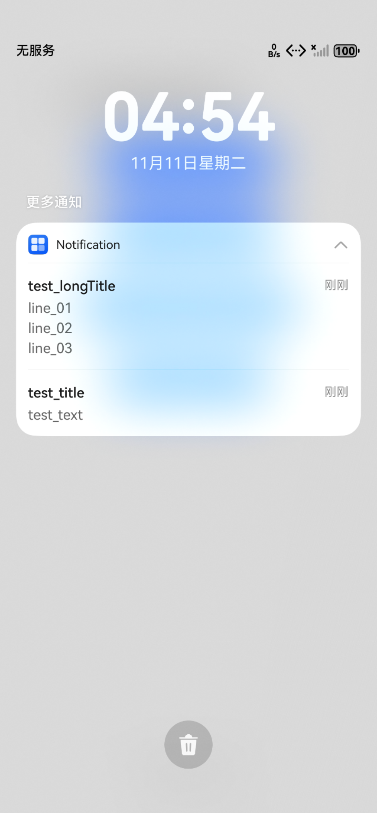
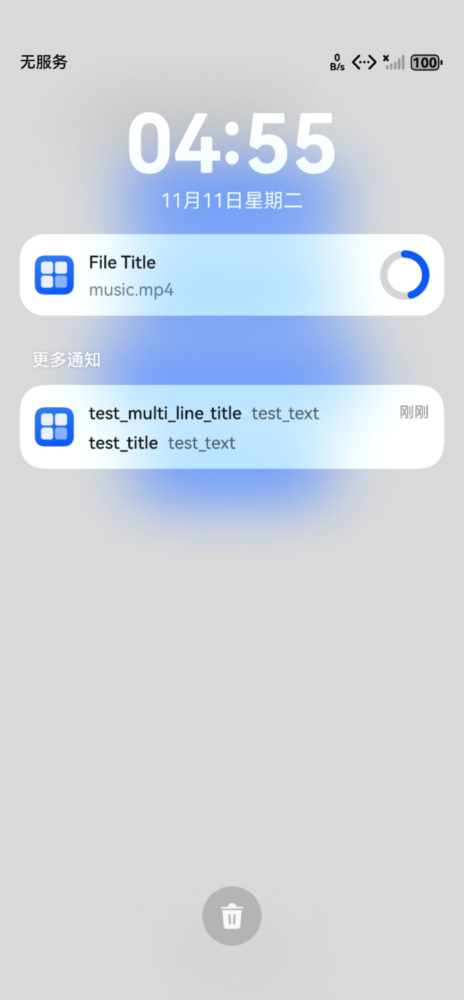

# Notification Kit（用户通知服务）

### 介绍

本示例展示了在一个Stage模型中，开发者可借助[Notification Kit（用户通知服务）](https://gitcode.com/openharmony/docs/blob/master/zh-cn/application-dev/notification/Readme-CN.md)将应用产生的通知直接在客户端本地推送给用户，本地通知根据通知类型及发布场景会产生对应提醒。


### 效果预览

| 项目主界面                                                | 弹窗通知授权                                                           | 
|------------------------------------------------------|------------------------------------------------------------------|
|  |  |

| 发布文本类型通知                                           | 进度条类型通知                  |
|----------------------------------------------------|----------------------------|
|   |  |


### 使用说明

1. 在主界面中，可以点击按钮进入对应的功能测试界面；
2. 在请求通知授权界面中，可以通过点击界面中的 “请求通知授权” 按钮获取权限，如果用户拒绝授权，可以点击 “再次申请通知授权” 让用户进行手动授权；
3. 在管理通知角标界面中，可以通过点击对应的按钮对应用角标进行一系列的操作；
4. 在管理通知渠道界面中，可以点击该界面的按钮进行通知渠道的创建、查询和删除操作；
5. 在发布通知界面中，可以点击相应的按钮，发布不同类型的通知；
6. 在为通知添加行为意图界面中，可以构造不同的意图，发布携带不同按钮个数的通知；
7. 在更新通知界面中，可以点击界面中的 “发布进度条类型通知” 按钮发布进度条通知，然后通过点击 “更新通知” 更新进度；
8. 在取消通知界面中，可以点击界面中的 “发布普通文本类型通知” 按钮，先发布通知，再点击 “取消通知” 按钮，取消通知；
9. 在清除跨设备场景下的重复通知界面中，可以发布包含appMessageId字段的消息，避免重复展示同一通知。

### 工程目录

给出项目中关键的目录结构并描述它们的作用，示例如下：

```
entry/src/
├── main
│   ├── ets
│   │   ├── entryability
│   │   │   └── EntryAbility.ets
│   │   ├── entrybackupability
│   │   │   └── EntryBackupAbility.ets
│   │   ├── filemanger
│   │   │   ├── AddWantAgent.ets                    // 为通知添加行为意图
│   │   │   ├── CancelNotification.ets              // 取消通知
│   │   │   ├── ClearDuplicateNotifications.ets     // 清除重复通知
│   │   │   ├── ManageNotificationBadges.ets        // 管理通知角标
│   │   │   ├── ManageNotificationWays.ets          // 管理通知渠道
│   │   │   ├── PublishNotification.ets             // 发布通知
│   │   │   ├── RequestEnableNotification.ets       // 请求通知授权
│   │   │   └── UpdateNotification.ets              //更新通知
│   │   ├── pages
│   │   │   └── Index.ets                           //首页
│   ├── module.json5
│   └── resources
└── ohosTest
    └── ets
        └── test
            ├── Ability.test.ets                    // 自动化测试代码
            └── List.test.ets                       // 测试套执行列表
```

### 具体实现

* 第一次申请通知权限、重新打开通知设置的功能封装在RequestEnableNotification，源码参考：[RequestEnableNotification.ets](https://gitcode.com/openharmony/applications_app_samples/blob/master/code/DocsSample/Notification-Kit/Notification/entry/src/main/ets/filemanager/RequestEnableNotification.ets)
  * 第一次申请：通过点击界面中的 “请求通知授权” 按钮来调用 notificationManager.isNotificationEnabled() 检查权限，未授权则调用 requestEnableNotification(context) 弹出授权弹窗。
  * 重新申请：用户拒绝授权后，通过点击界面中的 “再次申请通知授权” 按钮来调用 openNotificationSettings(context) 打开系统通知设置页面，引导用户手动开启。接口参考：[@ohos.notificationManager (NotificationManager模块)](https://gitcode.com/openharmony/docs/blob/master/zh-cn/application-dev/reference/apis-notification-kit/js-apis-notificationManager.md)

* 管理应用角标（增减、固定值设置、序列更新、清除）的功能封装在ManageNotificationBadges，源码参考：[ManageNotificationBadges.ets](https://gitcode.com/openharmony/applications_app_samples/blob/master/code/DocsSample/Notification-Kit/Notification/entry/src/main/ets/filemanager/ManageNotificationBadges.ets)
   * 增减角标：通过点击界面中的 “增加角标个数” 和  “减少角标个数” 按钮，通过执行 this.badgeNum++/-- 控制数量（0≤数量≤100），调用 notificationManager.setBadgeNumber() 同步到系统。
   * 固定值设置：通过点击界面中的 “设置角标个数为9” 和  “设置角标个数为8” 按钮，直接指定 badgeNumber=8/9，调用角标设置接口。
   * 序列更新：通过点击界面中的 “角标设置个数反例” 和  “角标设置个数正例” 按钮，连续设置角标值（10→11），正例通过嵌套 then() 保证执行顺序，反例直接连续调用（可能导致顺序错乱）。
   * 清除角标：通过点击界面中的 “清除通知” 按钮，设置 badgeNum=0，同时调用 notificationManager.cancelAll() 取消所有通知。接口参考：[@ohos.notificationManager (NotificationManager模块)](https://gitcode.com/openharmony/docs/blob/master/zh-cn/application-dev/reference/apis-notification-kit/js-apis-notificationManager.md)

* 管理 “社交通信” 类型通知渠道（创建、查询、删除），渠道属性（是否启用、振动、灯光）可通过查询接口获取的功能封装在ManageNotificationWays，源码参考：[ManageNotificationWays.ets](https://gitcode.com/openharmony/applications_app_samples/blob/master/code/DocsSample/Notification-Kit/Notification/entry/src/main/ets/filemanager/ManageNotificationWays.ets)
   * 创建渠道：通过点击界面中的 “创建社交通信类型的通知渠道” 按钮，调用 notificationManager.addSlot(SlotType.SOCIAL_COMMUNICATION, callback) 创建社交通信渠道。
   * 查询渠道：通过点击界面中的 “查询社交通信类型的通知渠道” 按钮，调用 notificationManager.getSlot(SlotType.SOCIAL_COMMUNICATION, callback)，获取渠道启用状态、振动 / 灯光开关等属性。
   * 删除渠道：通过点击界面中的 “删除社交通信类型的通知渠道” 按钮，调用 notificationManager.removeSlot(SlotType.SOCIAL_COMMUNICATION, callback) 删除指定类型渠道。接口参考：[@ohos.notificationManager (NotificationManager模块)](https://gitcode.com/openharmony/docs/blob/master/zh-cn/application-dev/reference/apis-notification-kit/js-apis-notificationManager.md)

* 发布 4 类通知（普通文本、多行文本、进度条模板），并支持查询系统是否兼容进度条模板的功能封装在PublishNotification，源码参考：[PublishNotification.ets](https://gitcode.com/openharmony/applications_app_samples/blob/master/code/DocsSample/Notification-Kit/Notification/entry/src/main/ets/filemanager/PublishNotification.ets)
   * 普通文本通知：通过点击界面中的 “发布普通文本类型通知” 按钮，将 contentType 设为 NOTIFICATION_CONTENT_BASIC_TEXT，并配置标题、正文、附加文本，然后发布普通文本通知。
   * 多行文本通知：通过点击界面中的 “发布多行文本类型通知” 按钮，将 contentType 设为 NOTIFICATION_CONTENT_MULTILINE，支持配置长标题、多行正文。
   * 进度条模板查询：通过点击界面中的 “查询系统是否支持进度条模板” 按钮，调用 notificationManager.isSupportTemplate('downloadTemplate')，判断系统是否支持进度条通知。
   * 进度条通知：通过点击界面中的 “发布进度条类型通知” 按钮，将template 字段配置为 name: 'downloadTemplate'，并指定文件标题、进度值（如 45%），然后发布进度条类型通知。接口参考：[@ohos.notificationManager (NotificationManager模块)](https://gitcode.com/openharmony/docs/blob/master/zh-cn/application-dev/reference/apis-notification-kit/js-apis-notificationManager.md)

* 发布 3 类通知（无按钮、单按钮、双按钮），并为通知 / 按钮绑定 WantAgent 行为意图（拉起应用、发送公共事件）的功能封装在AddWantAgent，源码参考：[AddWantAgent.ets](https://gitcode.com/openharmony/applications_app_samples/blob/master/code/DocsSample/Notification-Kit/Notification/entry/src/main/ets/filemanager/AddWantAgent.ets)
   * 通过点击界面中的 “发布不携带按钮的通知” 、 “发布携带一个按钮的通知” 和  “发布携带两个按钮的通知” 按钮，来进行创建WantAgentInfo、行为意图和通知对象。
   * 创建 WantAgentInfo 配置：指定动作类型（START_ABILITY 拉起应用 /SEND_COMMON_EVENT 发送事件）、应用包名 / Ability 名、事件名等。
   * 调用 wantAgent.getWantAgent() 创建行为意图对象，通过回调获取结果。
   * 构造 NotificationRequest 通知对象，绑定 WantAgent，调用 notificationManager.publish() 发布通知。[@ohos.notificationManager (NotificationManager模块)](https://gitcode.com/openharmony/docs/blob/master/zh-cn/application-dev/reference/apis-notification-kit/js-apis-notificationManager.md)

* 更新通知：先发布进度条通知，并通过相同 ID + updateOnly: true 实现通知内容更新的功能封装在UpdateNotification，源码参考：[UpdateNotification.ets](https://gitcode.com/openharmony/applications_app_samples/blob/master/code/DocsSample/Notification-Kit/Notification/entry/src/main/ets/filemanager/UpdateNotification.ets)
   * 发布进度条通知：通过点击界面中的 “发布进度条类型通知” 按钮，构造含 downloadTemplate 模板的通知（进度值 50%），ID=5，然后发布该通知。
   * 更新通知：通过点击界面中的 “更新通知” 按钮，构造相同 ID 为 5 的通知，设置 updateOnly 为 true ，修改进度值为 99%，调用 notificationManager.publish() 实现增量更新，不创建新通知。[@ohos.notificationManager (NotificationManager模块)](https://gitcode.com/openharmony/docs/blob/master/zh-cn/application-dev/reference/apis-notification-kit/js-apis-notificationManager.md)

* 取消通知的功能封装在CancelNotification，源码参考：[CancelNotification.ets](https://gitcode.com/openharmony/applications_app_samples/blob/master/code/DocsSample/Notification-Kit/Notification/entry/src/main/ets/filemanager/CancelNotification.ets)
   * 发布通知：通过点击界面中的 “发布普通文本类型通知” 按钮，构造 NotificationRequest（普通文本类型），调用 notificationManager.publish() 发布 ID=1 的通知。
   * 取消通知：通过点击界面中的 “取消通知” 按钮，调用 notificationManager.cancel(1, callback)，通过通知 ID 精准取消已发布的通知。[@ohos.notificationManager (NotificationManager模块)](https://gitcode.com/openharmony/docs/blob/master/zh-cn/application-dev/reference/apis-notification-kit/js-apis-notificationManager.md)

* 清除跨设备场景下的重复通知功能封装在ClearDuplicateNotifications，源码参考：[ClearDuplicateNotifications.ets](https://gitcode.com/openharmony/applications_app_samples/blob/master/code/DocsSample/Notification-Kit/Notification/entry/src/main/ets/filemanager/ClearDuplicateNotifications.ets)
   * 通过点击界面中的 “发布通知消息……” 按钮，去构造通知对象，并额外添加 appMessageId: 'test_appMessageId_1'（自定义唯一标识）。然后调用 notificationManager.publish() 发布通知，系统会根据 appMessageId 去重，避免重复显示同一类通知。[@ohos.notificationManager (NotificationManager模块)](https://gitcode.com/openharmony/docs/blob/master/zh-cn/application-dev/reference/apis-notification-kit/js-apis-notificationManager.md)

### 相关权限

不涉及。

### 依赖

不涉及。

### 约束与限制

1. 本示例支持标准系统上运行，支持设备：RK3568。
2. 本示例支持API version 20及以上版本的SDK。
3. 本示例已支持使DevEco Studio 6.0.0 Release (构建版本：6.0.0.878，构建 2025年12月24日)编译运行。
4. 高等级APL特殊签名说明：无。

### 下载

如需单独下载本工程，执行如下命令：

```
git init
git config core.sparsecheckout true
echo Notification-Kit/Notification > .git/info/sparse-checkout
git remote add origin https://gitcode.com/harmonyos_samples/guide-snippets.git
git pull origin master
```