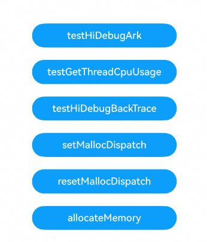

# 性能分析工具

###  介绍

本示例主要展示了HiDebug对外提供接口的使用。


该工程中的展示的代码详细描述可查如下链接：

- [使用HiDebug获取调试信息（ArkTS）](https://developer.huawei.com/consumer/cn/doc/harmonyos-guides/hidebug-guidelines-arkts)

- [使用HiDebug获取调试信息（C/C++）](https://developer.huawei.com/consumer/cn/doc/harmonyos-guides/hidebug-guidelines-ndk)


###  效果预览

|                             主页                             |
| :----------------------------------------------------------: |
|  |

#### 使用说明

1.在主界面，点击切换到“Log”窗口，日志过滤选择“No filters”,搜索内容设置为“testTag”。

2.依次点击按钮，即可在“Log”窗口看到以下日志输出。

按钮“testHiDebugArk”：

``` text
**-** **:**:**.***   *****-*****   A00000/com.sam...gtool/testTag  com.sampl...ebugtool  I     getSystemCpuUsage: 0.2878989952876323
```
按钮“testGetThreadCpuUsage”：
``` text
**-** **:**:**.***   *****-*****   A00000/com.sam...gtool/testTag  com.sampl...ebugtool  I     GetAppThreadCpuUsage: threadId *****, cpuUsage: 0.000104
**-** **:**:**.***   *****-*****   A00000/com.sam...gtool/testTag  com.sampl...ebugtool  I     GetAppThreadCpuUsage: threadId *****, cpuUsage: 0.000000
**-** **:**:**.***   *****-*****   A00000/com.sam...gtool/testTag  com.sampl...ebugtool  I     GetAppThreadCpuUsage: threadId *****, cpuUsage: 0.000040
**-** **:**:**.***   *****-*****   A00000/com.sam...gtool/testTag  com.sampl...ebugtool  I     GetAppThreadCpuUsage: threadId *****, cpuUsage: 0.000010
**-** **:**:**.***   *****-*****   A00000/com.sam...gtool/testTag  com.sampl...ebugtool  I     GetAppThreadCpuUsage: threadId *****, cpuUsage: 0.000001
**-** **:**:**.***   *****-*****   A00000/com.sam...gtool/testTag  com.sampl...ebugtool  I     GetAppThreadCpuUsage: threadId *****, cpuUsage: 0.000038
**-** **:**:**.***   *****-*****   A00000/com.sam...gtool/testTag  com.sampl...ebugtool  I     GetAppThreadCpuUsage: threadId *****, cpuUsage: 0.000000
**-** **:**:**.***   *****-*****   A00000/com.sam...gtool/testTag  com.sampl...ebugtool  I     GetAppThreadCpuUsage: threadId *****, cpuUsage: 0.000007
**-** **:**:**.***   *****-*****   A00000/com.sam...gtool/testTag  com.sampl...ebugtool  I     GetAppThreadCpuUsage: threadId *****, cpuUsage: 0.000004
**-** **:**:**.***   *****-*****   A00000/com.sam...gtool/testTag  com.sampl...ebugtool  I     GetAppThreadCpuUsage: threadId *****, cpuUsage: 0.000007
**-** **:**:**.***   *****-*****   A00000/com.sam...gtool/testTag  com.sampl...ebugtool  I     GetAppThreadCpuUsage: threadId *****, cpuUsage: 0.000006
**-** **:**:**.***   *****-*****   A00000/com.sam...gtool/testTag  com.sampl...ebugtool  I     GetAppThreadCpuUsage: threadId *****, cpuUsage: 0.000001
**-** **:**:**.***   *****-*****   A00000/com.sam...gtool/testTag  com.sampl...ebugtool  I     GetAppThreadCpuUsage: threadId *****, cpuUsage: 0.000004
**-** **:**:**.***   *****-*****   A00000/com.sam...gtool/testTag  com.sampl...ebugtool  I     GetAppThreadCpuUsage: threadId *****, cpuUsage: 0.000002
**-** **:**:**.***   *****-*****   A00000/com.sam...gtool/testTag  com.sampl...ebugtool  I     GetAppThreadCpuUsage: threadId *****, cpuUsage: 0.000001
```
按钮“testHiDebugBackTrace”(该功能仅支持arm64设备)：
```text
...
**-** **:**:**.***   *****-*****   A0FF00/com.sam...gtool/testTag  com.sampl...ebugtool  I     native stack frame info for pc: ************ is relativePc: ****** funcOffset: 0x38 mapName: /data/storage/el1/bundle/libs/arm64/libentry.so functionName: TestNativeFrames(int) buildId: b6d3429f6e2e594b1c696e13049dae7e51694099 reserved: (null).
**-** **:**:**.***   *****-*****   A0FF00/com.sam...gtool/testTag  com.sampl...ebugtool  I     native stack frame info for pc: ************ is relativePc: ****** funcOffset: 0x30 mapName: /data/storage/el1/bundle/libs/arm64/libentry.so functionName: TestNativeFrames(int) buildId: b6d3429f6e2e594b1c696e13049dae7e51694099 reserved: (null).
**-** **:**:**.***   *****-*****   A0FF00/com.sam...gtool/testTag  com.sampl...ebugtool  I     native stack frame info for pc: ************ is relativePc: ****** funcOffset: 0x1c mapName: /data/storage/el1/bundle/libs/arm64/libentry.so functionName: TestBackTrace(napi_env__*, napi_callback_info__*) buildId: b6d3429f6e2e594b1c696e13049dae7e51694099 reserved: (null).
...
**-** **:**:**.***   *****-*****   A0FF00/com.sam...gtool/testTag  com.sampl...ebugtool  I     js stack frame info for pc: ************ is relativePc: ****** line: 27 column: 21 mapName: /data/storage/el1/bundle/entry.hap functionName: testBackTraceJsFrame url: entry|entry|1.0.0|src/main/ets/pages/Index.ts packageName: .
**-** **:**:**.***   *****-*****   A0FF00/com.sam...gtool/testTag  com.sampl...ebugtool  I     js stack frame info for pc: ************ is relativePc: ****** line: 25 column: 16 mapName: /data/storage/el1/bundle/entry.hap functionName: testBackTraceJsFrame url: entry|entry|1.0.0|src/main/ets/pages/Index.ts packageName: .
**-** **:**:**.***   *****-*****   A0FF00/com.sam...gtool/testTag  com.sampl...ebugtool  I     js stack frame info for pc: ************ is relativePc: ****** line: 25 column: 16 mapName: /data/storage/el1/bundle/entry.hap functionName: testBackTraceJsFrame url: entry|entry|1.0.0|src/main/ets/pages/Index.ts packageName: .
**-** **:**:**.***   *****-*****   A0FF00/com.sam...gtool/testTag  com.sampl...ebugtool  I     js stack frame info for pc: ************ is relativePc: ****** line: 25 column: 16 mapName: /data/storage/el1/bundle/entry.hap functionName: testBackTraceJsFrame url: entry|entry|1.0.0|src/main/ets/pages/Index.ts packageName: .
...
```

按钮“setMallocDispatch”：

``` text
**-** **:**:**.***   *****-*****   A03200/com.samples.hidebugtool/MallocDispatch: SetMallocDispatch
```

按钮“allocateMemory”：

``` text
**-** **:**:**.***   *****-*****   A03200/com.samples.hidebugtool/MallocDispatch: test MyMmap
```

按钮“resetMallocDispatch”：

``` text
**-** **:**:**.***   *****-*****   A03200/com.samples.hidebugtool/MallocDispatch: test ResetMallocDispatch
```

###  具体实现

1. ArkTS项目可以在"@kit.PerformanceAnalysisKit"中导入对应模块即可在各种场景下调用对应函数，如在index.ets中直接调用，或者在EntryAbility.ets函数中在应用的各个生命周期内添加功能函数以实现应用自动在“启动”或“结束”时进行性能分析。
1. C++项目可以在CMakeLists.txt里的target_link_libraries中添加对应功能的包，在napi_init.cpp中添加注册自定义C++功能函数（还需在index.d.ts中声明）后，即可在各种场景下通过"libentry.so"库自定义一个对象来调用注册声明的测试函数即可。

###  相关权限

不涉及。

###  依赖

不涉及。

###  约束与限制

1. 本示例仅支持标准系统上运行；
2. 本示例已适配API20版本SDK，版本号：6.0.0.47，镜像版本号：OpenHarmony 6.0.0.47；
3. 本示例建议使用DevEco Studio(6.0.0.858)及以上版本编译运行。

### 下载

如需单独下载本工程，执行如下命令：

```
git init
git config core.sparsecheckout true
echo code/DocsSample/PerformanceAnalysisKit/HiDebugTool/ > .git/info/sparse-checkout
git remote add origin https://gitcode.com/openharmony/applications_app_samples.git
git pull origin master
```