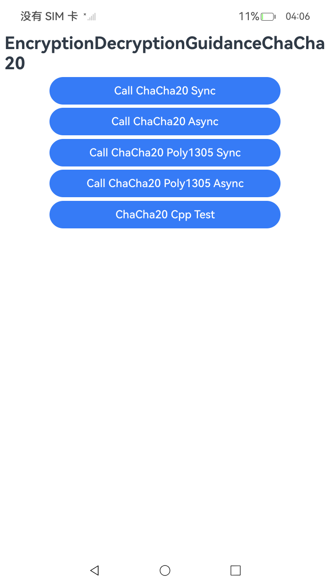
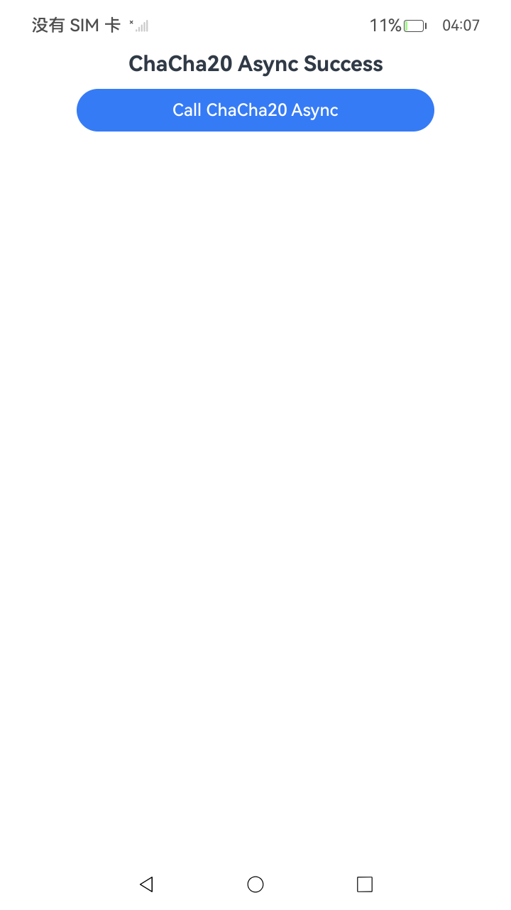
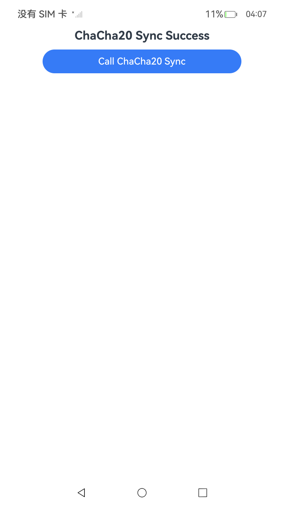
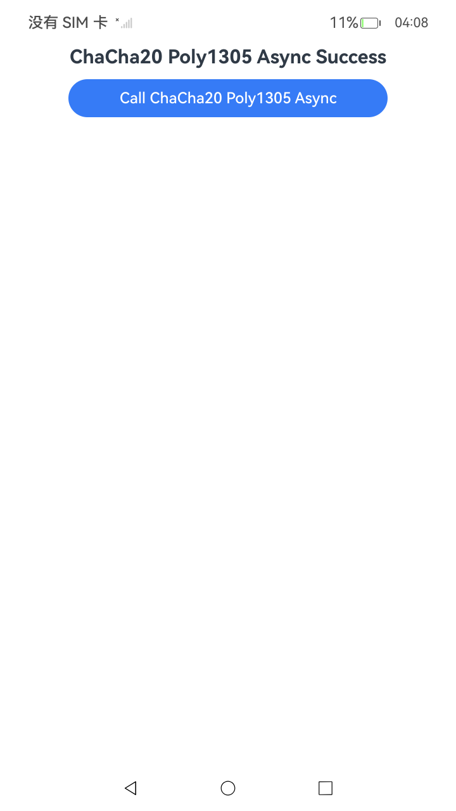
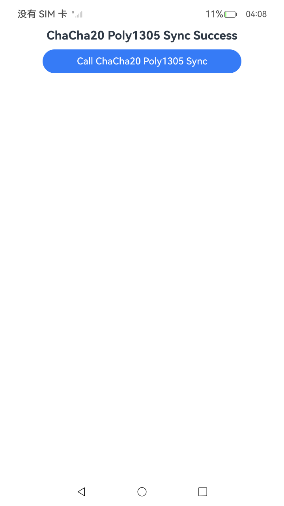
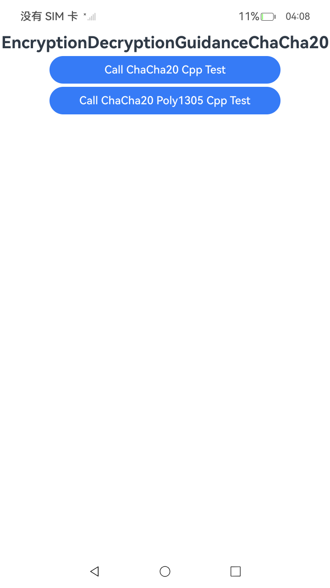

# 使用ChaCha20对称密钥加解密

### 介绍

本示例主要展示了使用ChaCha20算法和ChaCha20Poly1305算法进行加解密 。该工程中展示的代码详细描述可查如下链接。

- [使用ChaCha20对称密钥加解密(ArkTS)同步方法与异步方法](https://gitcode.com/openharmony/docs/blob/master/zh-cn/application-dev/security/CryptoArchitectureKit/crypto-chacha20-encrypt-decrypt.md)
- [使用ChaCha20对称密钥加解密(C/C++)](https://gitcode.com/openharmony/docs/blob/master/zh-cn/application-dev/security/CryptoArchitectureKit/crypto-chacha20-encrypt-decrypt-ndk.md)
- [使用ChaCha20对称密钥（Poly1305模式）加解密(ArkTS)同步方法与异步方法](https://gitcode.com/openharmony/docs/blob/master/zh-cn/application-dev/security/CryptoArchitectureKit/crypto-chacha20-encrypt-decrypt-poly1305.md)
- [使用ChaCha20对称密钥（Poly1305模式）加解密(C/C++)](https://gitcode.com/openharmony/docs/blob/master/zh-cn/application-dev/security/CryptoArchitectureKit/crypto-chacha20-encrypt-decrypt-poly1305-ndk.md)

### 效果预览

| 首页效果图                                                   | 执行结果图                                                            | 执行结果图                                                            |执行结果图                                                            |执行结果图                                                            | 执行结果图                                                                |
|---------------------------------------------------------|------------------------------------------------------------------| ------------------------------------------------------------------| ------------------------------------------------------------------|------------------------------------------------------------------|----------------------------------------------------------------------|
|  |  |  |  | |  |

### 使用说明

1. 运行Index主界面。
2. 页面呈现上述执行结果图效果，点击不同按钮可以跳转到不同功能页面，点击跳转页面中按钮可以执行对应操作，并更新文本内容。
3. 运行测试用例EncryptionDecryptionGuidanceChaCha20ArkTs.test.ets文件对页面代码进行测试可以全部通过。

### 工程目录

```
entry/src/
 ├── main
 │   ├── cpp
 │   │   ├── types
 │   │       ├── libentry
 │   │       |   ├── index.d.ts
 │   │       |   ├── oh-package.json5
 │   │       ├── project
 │   │       |   ├── chacha20_encryption_decryption.cpp
 │   │       |   ├── chacha20_poly1305_encryption_decryption.cpp
 │   │       |   ├── file.h
 │   │       ├── CMakeLists.txt
 │   │       ├── napi_init.cpp
 │   ├── ets
 │   │   ├── entryability
 │   │   ├── entrybackupability
 │   │   ├── pages
 │   │       ├── chacha20
 │   │       |   ├── ChaCha20CppTest.ets
 │   │       |   ├── ChaCha20EncryptionDecryptionAsync.ets
 │   │       |   ├── ChaCha20EncryptionDecryptionSync.ets
 │   │       |   ├── ChaCha20Poly1305EncryptionDecryptionAsync.ets
 │   │       |   ├── ChaCha20Poly1305EncryptionDecryptionSync.ets
 │   │       ├── Index.ets               // 使用ChaCha20加解密(ArkTS)示例代码
 │   ├── module.json5
 │   └── resources
 ├── ohosTest
 │   ├── ets
 │   │   └── test
 │   │       ├── Ability.test.ets 
 │   │       ├── ChaCha20ArkTs.test.ets  // 自动化测试代码
 │   │       └── List.test.ets
```

### 相关权限

不涉及。

### 依赖

不涉及。

### 约束与限制

1.本示例仅支持标准系统上运行， 支持设备：RK3568。

2.本示例为Stage模型，支持API22版本SDK，版本号：6.1.0.17，镜像版本号：OpenHarmony_6.1.0.17。

3.本示例需要使用DevEco Studio 6.0.1 Release(6.0.1.251)及以上版本才可编译运行。

### 下载

如需单独下载本工程，执行如下命令：

````
git init
git config core.sparsecheckout true
echo code/DocsSample/Security/CryptoArchitectureKit/EncryptionDecryption/EncryptionDecryptionGuidanceAesWrapArkTs > .git/info/sparse-checkout
git remote add origin https://gitcode.com/openharmony/applications_app_samples.git
git pull origin master
````