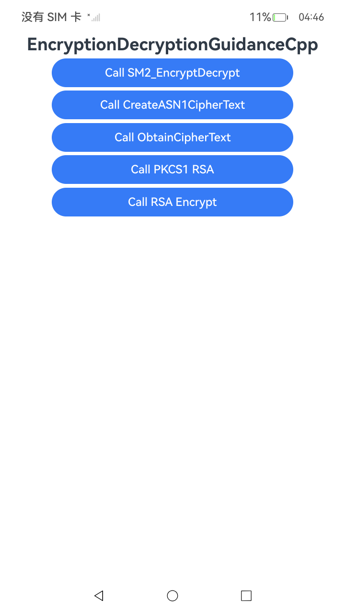

# 使用SM2非对称密钥加解密(C/C++)
# 使用SM2密文格式转换(C/C++)
# 使用RSA非对称密钥（PKCS1模式）加解密(C/C++)
# 使用RSA非对称密钥分段加解密(C/C++)

### 介绍

本示例主要展示了使用SM2、RSA非对称密钥加解密(c/c++)示例代码 。该工程中展示的代码详细描述可查如下链接。

- [使用SM2非对称密钥加解密(C/C++)](https://gitcode.com/openharmony/docs/blob/master/zh-cn/application-dev/security/CryptoArchitectureKit/crypto-sm2-asym-encrypt-decrypt-ndk.md)
- [使用SM2密文格式转换(C/C++)](https://gitcode.com/openharmony/docs/blob/master/zh-cn/application-dev/security/CryptoArchitectureKit/crypto-sm2-ciphertext-conversion-ndk.md)
- [使用RSA非对称密钥（PKCS1模式）加解密(C/C++)](https://gitcode.com/openharmony/docs/blob/master/zh-cn/application-dev/security/CryptoArchitectureKit/crypto-rsa-asym-encrypt-decrypt-pkcs1-ndk.md)
- [使用RSA非对称密钥分段加解密(C/C++)](https://gitcode.com/openharmony/docs/blob/master/zh-cn/application-dev/security/CryptoArchitectureKit/crypto-rsa-asym-encrypt-decrypt-by-segment-ndk.md)

### 效果预览

| 首页效果图                                                   | 
|---------------------------------------------------------|
|  | 

### 使用说明

1. 运行Index主界面。
2. 页面呈现上述执行结果图效果，点击不同按钮可以跳转到不同功能页面，点击跳转页面中按钮可以执行对应操作，并更新文本内容。
3. 运行测试用例RsaSm2NativeTest.test.ets文件对页面代码进行测试可以全部通过。

### 工程目录

```
entry/src/
 ├── main
 │   ├── cpp
 │   │   ├── types
 │   │       ├── libentry
 │   │       |   ├── index.d.ts
 │   │       |   ├── oh-package.json5
 │   │       ├── project
 │   │       |   ├── rsa
 │   │       |   |   ├── PKCS1_RSA.cpp
 │   │       |   |   ├── RSAEncryptDecrypt.cpp
 │   │       |   ├── sm2
 │   │       |   |   ├── CreateASN1Ciphertext.cpp
 │   │       |   |   ├── ObtainCiphertext.cpp
 │   │       |   |   ├── SM2EncryptionDecryption.cpp
 │   │       |   ├── file.h
 │   │       ├── CMakeLists.txt
 │   │       ├── napi_init.cpp
 │   ├── ets
 │   │   ├── entryability
 │   │   ├── entrybackupability
 │   │   ├── pages
 │   │   |   ├── Index.ets
 │   ├── module.json5
 │   └── resources
 ├── ohosTest
 │   ├── ets
 │   │   └── test
 │   │       ├── Ability.test.ets 
 │   │       ├── RsaSm2NativeTest.test.ets  // 自动化测试代码
 │   │       └── List.test.ets
```

### 相关权限

不涉及。

### 依赖

不涉及。

### 约束与限制

1.本示例仅支持标准系统上运行， 支持设备：RK3568。

2.本示例为Stage模型，支持API22版本SDK，版本号：6.1.0.17，镜像版本号：OpenHarmony_6.1.0.17。

3.本示例需要使用DevEco Studio 6.0.1 Release(6.0.1.251)及以上版本才可编译运行。

### 下载

如需单独下载本工程，执行如下命令：

````
git init
git config core.sparsecheckout true
echo code/DocsSample/Security/CryptoArchitectureKit/EncryptionDecryption/EncryptionDecryptionGuidanceCpp > .git/info/sparse-checkout
git remote add origin https://gitcode.com/openharmony/applications_app_samples.git
git pull origin master
````