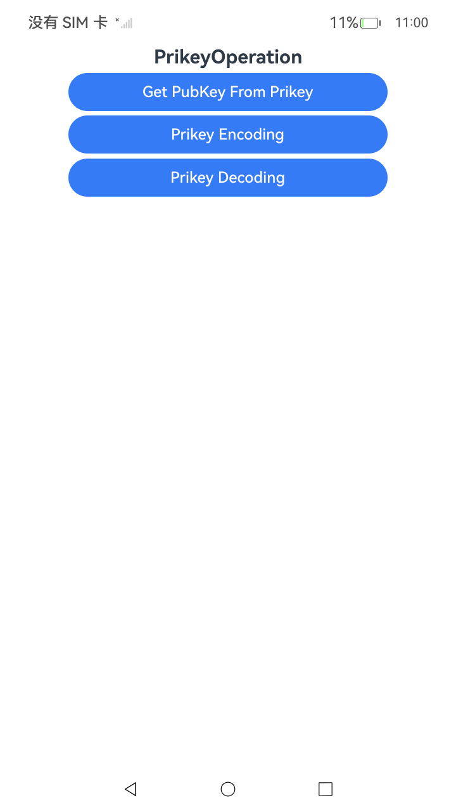

# 私钥操作

### 介绍

本示例主要展示了私钥操作场景，包括从私钥获取公钥、私钥编码、私钥解码等功能。该示例提供了异步和同步两种调用方式，同时提供了ArkTS和C/C++两种实现方式。该工程中展示的代码详细描述可查如下链接。

- [使用私钥对象获取公钥对象(ArkTS)](https://gitcode.com/openharmony/docs/blob/master/zh-cn/application-dev/security/CryptoArchitectureKit/crypto-prikey-to-get-pubkey.md)
- [使用RSA私钥进行编码解码(ArkTS)](https://gitcode.com/openharmony/docs/blob/master/zh-cn/application-dev/security/CryptoArchitectureKit/crypto-rsa-encoded-decoded.md)
- [使用私钥对象获取公钥对象(C/C++)](https://gitcode.com/openharmony/docs/blob/master/zh-cn/application-dev/security/CryptoArchitectureKit/crypto-prikey-to-get-pubkey-ndk.md)
- [使用RSA私钥进行编码解码(C/C++)](https://gitcode.com/openharmony/docs/blob/master/zh-cn/application-dev/security/CryptoArchitectureKit/crypto-rsa-encoded-decoded-ndk.md)

### 效果预览

| 首页效果图                                                   |
| ------------------------------------------------------------ |
|  | 

### 使用说明

1. 运行Index主界面。
2. 页面呈现上述执行结果图效果，主界面包含以下功能按钮：
   - **从私钥获取公钥（异步）**：使用异步方式从私钥对象中获取对应的公钥对象
   - **从私钥获取公钥（同步）**：使用同步方式从私钥对象中获取对应的公钥对象
   - **私钥编码**：将私钥对象编码为PKCS1格式数据
   - **私钥解码**：将PKCS1格式数据解码为私钥对象
   - **从私钥获取公钥（C++测试）**：使用C++方式从私钥对象中获取对应的公钥对象
   - **私钥编码（C++测试）**：使用C++方式将私钥对象编码为PKCS1格式数据
   - **私钥解码（C++测试）**：使用C++方式将PKCS1格式数据解码为私钥对象
3. 点击不同按钮可以跳转到对应功能页面或执行对应操作，并更新文本内容显示执行结果。
4. 运行测试用例PrikeyOperation.test.ets文件对页面代码进行测试可以全部通过。

### 工程目录

```
entry/src/
 ├── main
 │   ├── cpp
 │   │   ├── types
 │   │   │   ├── libentry
 │   │   │   │   ├── Index.d.ts
 │   │   │   │   └── oh-package.json5
 │   │   │   └── project
 │   │   │       ├── file.h
 │   │   │       ├── prikey_decoding.cpp
 │   │   │       ├── prikey_encoding.cpp
 │   │   │       └── prikey_get_pubkey.cpp
 │   │   ├── CMakeLists.txt
 │   │   └── napi_init.cpp
 │   ├── ets
 │   │   ├── entryability
 │   │   ├── entrybackupability
 │   │   └── pages
 │   │       ├── Index.ets                    // 私钥操作主界面
 │   │       ├── prikeyGetPubkeyAsync.ets      // 异步方式从私钥获取公钥
 │   │       ├── prikeyGetPubKeySync.ets       // 同步方式从私钥获取公钥
 │   │       ├── prikeyEncoding.ets            // 私钥编码
 │   │       └── prikeyDecoding.ets             // 私钥解码
 │   ├── module.json5
 │   └── resources
 └── ohosTest
     ├── ets
     │   └── test
     │       ├── Ability.test.ets 
     │       ├── PrikeyOperation.test.ets  // 自动化测试代码
     │       └── List.test.ets
```

### 相关权限

不涉及。

### 依赖

不涉及。

### 约束与限制

1.本示例仅支持标准系统上运行， 支持设备：RK3568。

2.本示例为Stage模型，支持API22版本SDK，版本号：6.1.0.17，镜像版本号：OpenHarmony_6.1.0.17。

3.本示例需要使用DevEco Studio 6.0.1 Release(6.0.1.251)及以上版本才可编译运行。

### 下载

如需单独下载本工程，执行如下命令：

````
git init
git config core.sparsecheckout true
echo code/DocsSample/Security/CryptoArchitectureKit/KeyGenerationConversion/PrikeyOperation > .git/info/sparse-checkout
git remote add origin https://gitcode.com/openharmony/applications_app_samples.git
git pull origin master
````