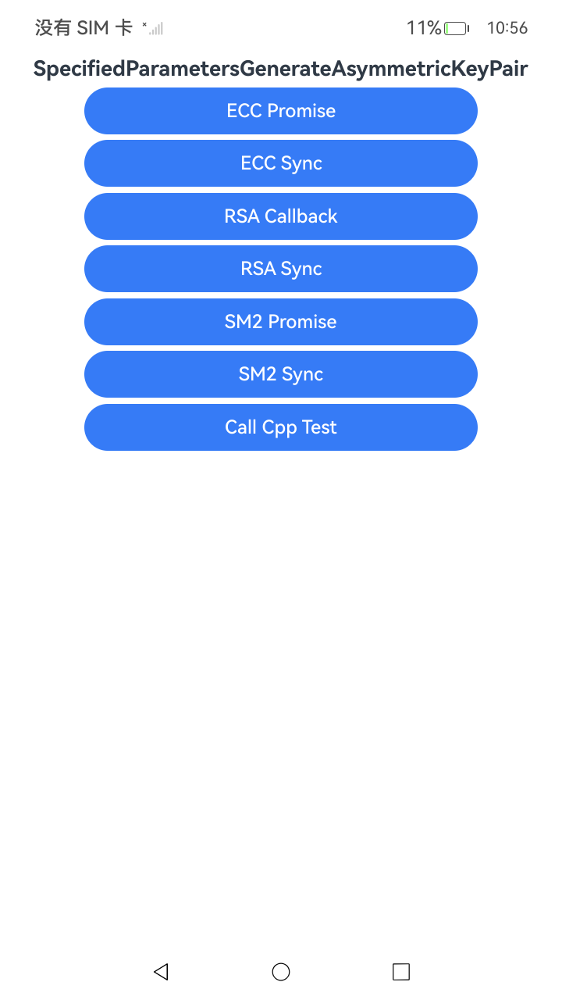

# 指定密钥参数生成非对称密钥对

### 介绍

本示例主要展示了指定密钥参数生成非对称密钥对(ArkTS、C/C++)场景。以RSA、ECC、SM2为例，根据指定的密钥参数，生成非对称密钥对（KeyPair），并获取密钥参数属性。该对象可用于后续的加解密等操作。获取的密钥参数属性可用于存储或运输。该工程中展示的代码详细描述可查如下链接。

- [指定密钥参数生成非对称密钥对(ArkTS)](https://gitcode.com/openharmony/docs/blob/master/zh-cn/application-dev/security/CryptoArchitectureKit/crypto-generate-asym-key-pair-from-key-spec.md)
- [指定密钥参数生成非对称密钥对(C/C++)](https://gitcode.com/openharmony/docs/blob/master/zh-cn/application-dev/security/CryptoArchitectureKit/crypto-generate-asym-key-pair-from-key-spec-ndk.md)

### 效果预览

| 首页效果图                                                   | 执行结果图                                                   |
|---------------------------------------------------------| ------------------------------------------------------------ |
|  |  |

### 使用说明

1. 运行Index主界面。
2. 页面呈现上述执行结果图效果，主界面包含以下功能按钮：
   - **RSA算法**：Callback方式、Sync方式
   - **ECC算法**：Promise方式、Sync方式
   - **SM2算法**：Promise方式、Sync方式
3. 点击不同按钮可以跳转到对应功能页面，点击跳转页面中按钮可以执行对应操作，并更新文本内容。
4. 运行测试用例SpecifiedParametersGenerateAsymmetricKeyPair.test.ets文件对页面代码进行测试可以全部通过。

### 工程目录

```
entry/src/
 ├── main
 │   ├── cpp
 │   │   ├── types
 │   │   │   ├── libentry
 │   │   │   │   ├── Index.d.ts
 │   │   │   │   └── oh-package.json5
 │   │   │   └── project
 │   │   │       ├── file.h
 │   │   │       ├── ecc.cpp
 │   │   │       ├── rsa.cpp
 │   │   │       └── sm2.cpp
 │   │   ├── CMakeLists.txt
 │   │   └── napi_init.cpp
 │   ├── ets
 │   │   ├── entryability
 │   │   ├── entrybackupability
 │   │   └── pages
 │   │       ├── Index.ets                    // 指定密钥参数生成非对称密钥对主界面
 │   │       ├── cpp_test.ets                 // C++测试页面
 │   │       ├── ecc
 │   │       │   ├── Promise.ets
 │   │       │   └── Sync.ets
 │   │       ├── rsa
 │   │       │   ├── Callback.ets
 │   │       │   └── Sync.ets
 │   │       └── sm2
 │   │           ├── Promise.ets
 │   │           └── Sync.ets
 │   ├── module.json5
 │   └── resources
 └── ohosTest
     ├── ets
     │   └── test
     │       ├── Ability.test.ets 
     │       ├── SpecifiedParametersGenerateAsymmetricKeyPair.test.ets  // 自动化测试代码
     │       └── List.test.ets
```

### 相关权限

不涉及。

### 依赖

不涉及。

### 约束与限制

1.本示例仅支持标准系统上运行， 支持设备：RK3568。

2.本示例为Stage模型，支持API22版本SDK，版本号：6.1.0.17，镜像版本号：OpenHarmony_6.1.0.17。

3.本示例需要使用DevEco Studio 6.0.1 Release(6.0.1.251)及以上版本才可编译运行。

### 下载

如需单独下载本工程，执行如下命令：

````
git init
git config core.sparsecheckout true
echo code/DocsSample/Security/CryptoArchitectureKit/KeyGenerationConversion/SpecifiedParametersGenerateAsymmetricKeyPair > .git/info/sparse-checkout
git remote add origin https://gitcode.com/openharmony/applications_app_samples.git
git pull origin master
````