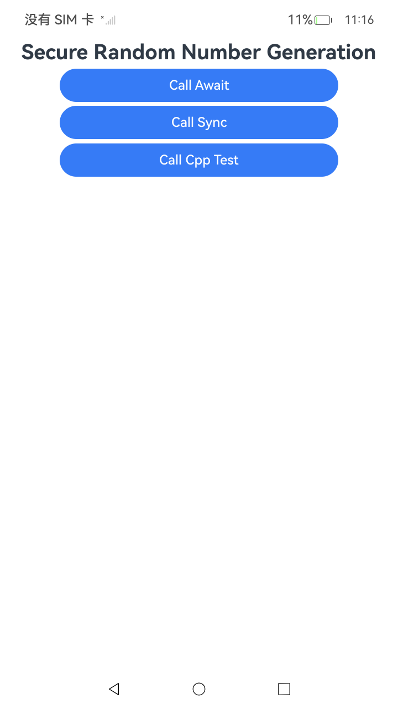

# 安全随机数生成

### 介绍

随机数主要用于临时会话密钥生成和非对称加密算法密钥生成等场景。在加解密场景中，安全随机数生成器需要具备随机性，不可预测性，与不可重现性。当前系统生成的随机数满足密码学安全伪随机性要求

本示例主要展示了安全随机数生成场景。该示例提供了异步（await）和同步两种调用方式，同时提供了ArkTS和C/C++两种实现方式。该工程中展示的代码详细描述可查如下链接。

- [安全随机数生成(ArkTS)](https://gitcode.com/openharmony/docs/blob/master/zh-cn/application-dev/security/CryptoArchitectureKit/crypto-generate-random-number.md)
- [安全随机数生成(C/C++)](https://gitcode.com/openharmony/docs/blob/master/zh-cn/application-dev/security/CryptoArchitectureKit/crypto-generate-random-number-ndk.md)

### 效果预览

| 首页效果图                                                   | 执行结果图                                                   |
|---------------------------------------------------------| ------------------------------------------------------------ |
|  |  |

### 使用说明

1. 运行Index主界面。
2. 页面呈现上述执行结果图效果，主界面包含以下功能按钮：
   - **await（异步）**：使用异步方式生成安全随机数
   - **同步**：使用同步方式生成安全随机数
   - **C++测试**：使用C++方式生成安全随机数
3. 点击不同按钮可以跳转到对应功能页面，点击跳转页面中按钮可以执行对应操作，并更新文本内容。
4. 运行测试用例SecureRandomNumberGeneration.test.ets文件对页面代码进行测试可以全部通过。

### 工程目录

```
entry/src/
 ├── main
 │   ├── cpp
 │   │   ├── types
 │   │   │   ├── libentry
 │   │   │   │   ├── index.d.ts
 │   │   │   │   └── oh-package.json5
 │   │   │   └── project
 │   │   │       ├── file.h
 │   │   │       └── rand_test.cpp
 │   │   ├── CMakeLists.txt
 │   │   └── napi_init.cpp
 │   ├── ets
 │   │   ├── entryability
 │   │   ├── entrybackupability
 │   │   └── pages
 │   │       ├── Index.ets                    // 安全随机数生成主界面
 │   │       ├── Await.ets                    // 异步方式生成随机数
 │   │       ├── Sync.ets                     // 同步方式生成随机数
 │   │       └── CppTest.ets                  // C++测试页面
 │   ├── module.json5
 │   └── resources
 └── ohosTest
     ├── ets
     │   └── test
     │       ├── Ability.test.ets 
     │       ├── SecureRandomNumberGeneration.test.ets  // 自动化测试代码
     │       └── List.test.ets
```

### 相关权限

不涉及。

### 依赖

不涉及。

### 约束与限制

1.本示例仅支持标准系统上运行， 支持设备：RK3568。

2.本示例为Stage模型，支持API22版本SDK，版本号：6.1.0.17，镜像版本号：OpenHarmony_6.1.0.17。

3.本示例需要使用DevEco Studio 6.0.1 Release(6.0.1.251)及以上版本才可编译运行。

### 下载

如需单独下载本工程，执行如下命令：

````
git init
git config core.sparsecheckout true
echo code/DocsSample/Security/CryptoArchitectureKit/SecureRandomNumberGeneration > .git/info/sparse-checkout
git remote add origin https://gitcode.com/openharmony/applications_app_samples.git
git pull origin master
````