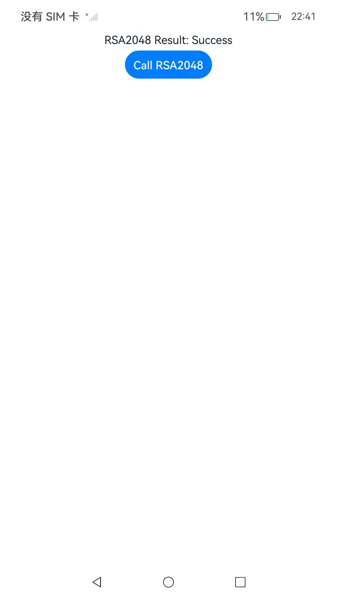
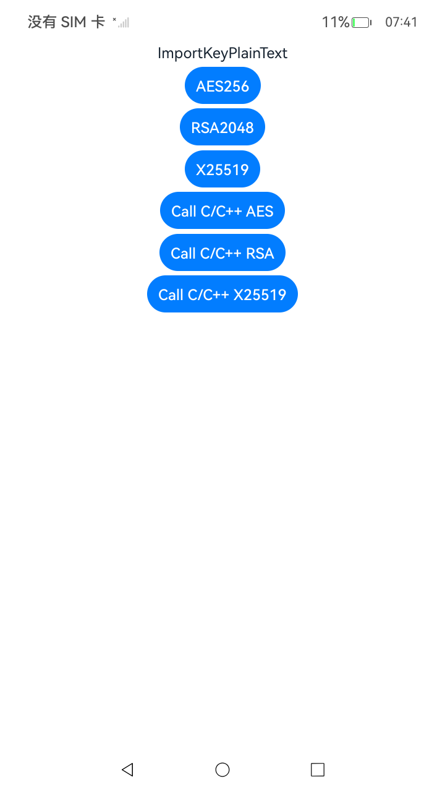
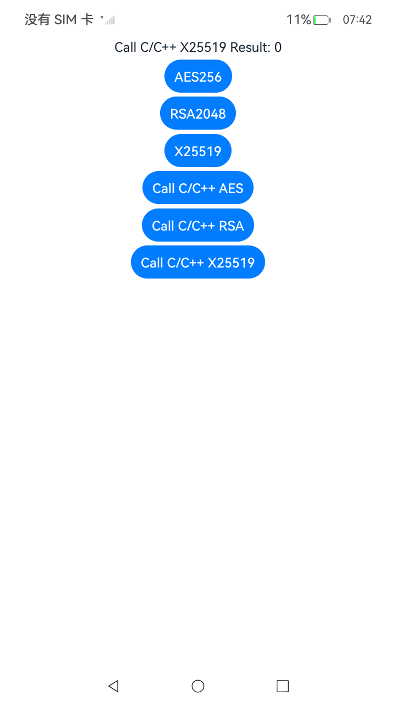

## 明文导入密钥(ArkTS)

### 介绍

1. 本工程主要实现了对以下指南文档中 https://docs.openharmony.cn/pages/v6.0/zh-cn/application-dev/security/UniversalKeystoreKit/huks-import-key-in-plaintext-arkts.md 示例代码片段的工程化，主要目标是实现指南中示例代码需要与sample工程文件同源。

####  AES256

##### 介绍

1. 本示例主要介绍明文导入AES256密钥。

##### 效果预览

| 主页                                                    | 删除                                                    |
|-------------------------------------------------------|-------------------------------------------------------|
|  |  |

使用说明

1. 点击Call AES256按钮调用接口importKeyItem，明文导入密钥。

####  RSA2048

##### 介绍

1. 本示例主要介绍明文导入RSA2048密钥。

##### 效果预览

| 主页                                                    | 删除                                                    |
|-------------------------------------------------------|-------------------------------------------------------|
|  |  |

使用说明

1. 点击Call X25519按钮调用接口importKeyItem，明文导入密钥。

####  X25519

##### 介绍

1. 本示例主要介绍明文导入X25519密钥。

##### 效果预览

| 主页                                                    | 删除                                                    |
|-------------------------------------------------------|-------------------------------------------------------|
|  |  |

使用说明

1. 点击Call X25519按钮调用接口importKeyItem，明文导入密钥。

## 加密导入密钥(C/C++)

### 介绍

1. 本工程主要实现了对以下指南文档中 https://docs.openharmony.cn/pages/v6.0/zh-cn/application-dev/security/UniversalKeystoreKit/huks-import-key-in-plaintext-ndk.md 示例代码片段的工程化，主要目标是实现指南中示例代码需要与sample工程文件同源。

#### Call C/C++ AES256

##### 介绍

1. 本示例主要介绍明文导入AES256密钥。

##### 效果预览

| 主页                                                        | 跳转页                                                       |
|-----------------------------------------------------------|-----------------------------------------------------------|
|  |  |

使用说明

1. 点击Call C/C++ AES256按钮调用接口OH_Huks_ImportKeyItem，明文导入密钥。

#### Call C/C++ RSA2048

##### 介绍

1. 本示例主要介绍明文导入RSA2048密钥。

##### 效果预览

| 主页                                                        | 跳转页                                                       |
|-----------------------------------------------------------|-----------------------------------------------------------|
|  |  |

使用说明

1. 点击Call C/C++ RSA2048按钮调用接口OH_Huks_ImportKeyItem，明文导入密钥。

#### Call C/C++ X25519

##### 介绍

1. 本示例主要介绍明文导入X25519密钥。

##### 效果预览

| 主页                                                        | 跳转页                                                       |
|-----------------------------------------------------------|-----------------------------------------------------------|
|  |  |

使用说明

1. 点击Call C/C++ X25519按钮调用接口OH_Huks_ImportKeyItem，明文导入密钥。

## 工程目录

```
entry/src/main/
|---ets
|---|---entryability
|---|---|---EntryAbility.ets
|---|---pages
|---|---|---Index.ets						 // 首页
|---|---|---ImportEncryptedKey.ets
|---cpp
|---resources								 // 静态资源
|---ohosTest
|---|---ets
|---|---|---tests
|---|---|---|---ImportEncryptedKey.test.ets  // 自动化测试用例
```


## 相关权限

无。

## 依赖

不涉及。

## 约束与限制

1. 本示例仅支持标准系统上运行，支持设备：RK3568。
2. 本示例支持API20版本SDK，SDK版本号(API Version 20 Release)。
3. 本示例需要使用DevEco Studio 版本号(6.0.0Release)才可编译运行。

## 下载

如需单独下载本工程，执行如下命令：

```
git init
git config core.sparsecheckout true
echo code/DocsSample/Security/UniversalKeystoreKit/KeyGenerationImport/KeyImport/DevelopmentGuidelines/ImportKeyPlainText > .git/info/sparse-checkout
git remote add origin https://gitcode.com/openharmony/applications_app_samples.git
git pull origin master
```