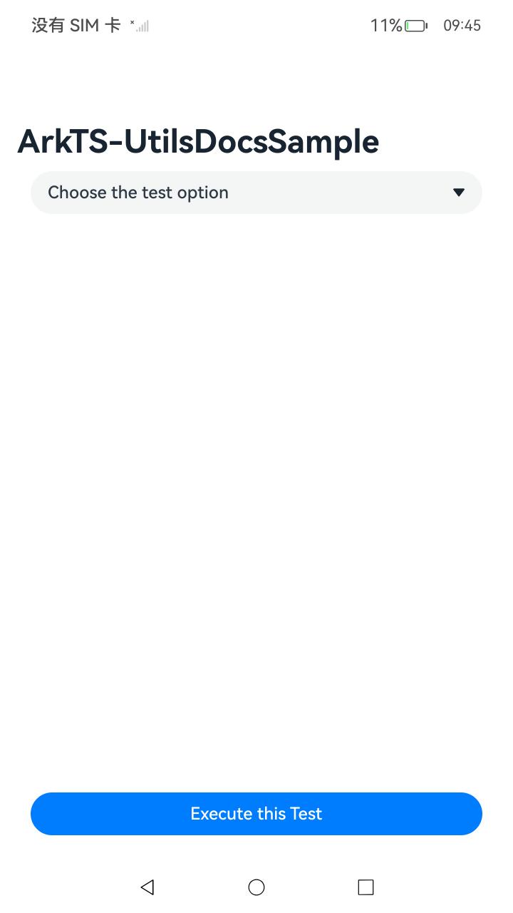
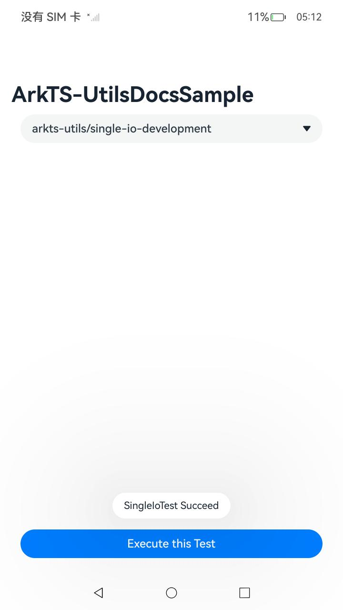

# ArkTS指南文档示例

### 介绍

本示例通过使用[ArkTS指南文档](https://gitee.com/openharmony/docs/tree/master/zh-cn/application-dev/arkts-utils)中各场景的开发示例，展示在工程中，帮助开发者更好地理解ArkTS提供的各项能力并合理使用。

该工程中展示的代码详细描述可查如下链接：

1. [共享模块开发指导](https://gitee.com/openharmony/docs/blob/master/zh-cn/application-dev/arkts-utils/arkts-sendable-module.md)
2. [CPU密集型任务开发指导 (TaskPool和Worker)](https://gitee.com/openharmony/docs/blob/master/zh-cn/application-dev/arkts-utils/cpu-intensive-task-development.md)
3. [I/O密集型任务开发指导 (TaskPool)](https://gitee.com/openharmony/docs/blob/master/zh-cn/application-dev/arkts-utils/io-intensive-task-development.md)
4. [单次I/O任务开发指导 (Promise和async/await)](https://gitee.com/openharmony/docs/blob/OpenHarmony-4.1-Release/zh-cn/application-dev/arkts-utils/single-io-development.md)
5. [同步任务开发指导 (TaskPool和Worker)](https://gitee.com/openharmony/docs/blob/master/zh-cn/application-dev/arkts-utils/sync-task-development.md)
6. [异步并发概述 (Promise和async/await)](https://gitee.com/openharmony/docs/blob/master/zh-cn/application-dev/arkts-utils/async-concurrency-overview.md)

### 效果预览

| 首页                                | 下拉选项选择各场景                  | 执行及结果即时反馈                  |
| ----------------------------------- | ----------------------------------- | ----------------------------------- |
|  |  |  |

### 使用说明

1. 在主界面，可以点击下拉选项，选择需要执行的场景。

2. 选择需要执行的场景，点击下方**Execute this Test**按钮开始执行。

3. 执行结果会即时反馈在按钮上方。

### 工程目录

```
entry/src/main/ets/
|---entryability
|---managers
|   |---arkts-sendable-module.ets                       // 共享模块示例代码
|   |---async-concurrency-overview.ets                  // 异步示例代码
|   |---cpu-intensive-task.ets                       // 密集型任务示例代码
|   |---file-write.ets                       // 文件读写实现示例代码
|   |---Handle.ets                       // 同步任务数据定义示例代码
|   |---io-intensive-task.ets                // IO密集型示例代码
|   |---manager.ets                       // 各模块函数汇总调用
|   |---sharedModule.ets                       // 共享模块数据定义示例代码
|   |---single-io-development.ets              // 单次IO示例代码
|   |---sync-task-development.ets                       // 同步任务示例代码
|---pages
|   |---Index.ets                       // 应用页面
```

### 相关权限

不涉及。

### 依赖

不涉及。

### 约束与限制

1.本示例仅支持标准系统上运行, 支持设备：RK3568。

2.本示例为Stage模型，支持API12版本SDK，版本号：5.0.0.26，镜像版本号：OpenHarmony_5.0.0.27。

3.本示例需要使用DevEco Studio NEXT Developer Preview2 (Build Version: 4.1.3.700, built on March 19, 2024)及以上版本才可编译运行。

### 下载

如需单独下载本工程，执行如下命令：

```
git init
git config core.sparsecheckout true
echo code/DocsSample/ArkTSUtilsDocModule/ > .git/info/sparse-checkout
git remote add origin https://gitee.com/openharmony/applications_app_samples.git
git pull origin master
```
