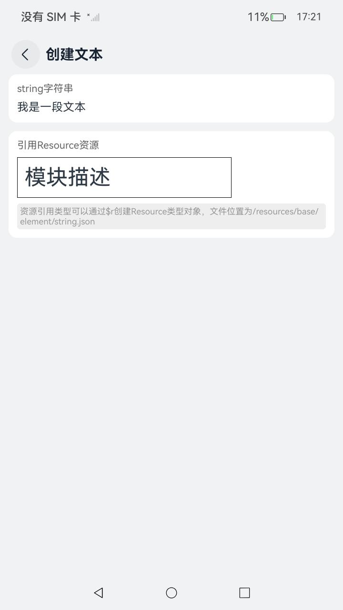

# ArkUI使用文本控件指南文档示例

### 介绍

本示例通过使用[ArkUI指南文档](https://gitee.com/openharmony/docs/tree/master/zh-cn/application-dev/ui)中各场景的开发示例，展示在工程中，帮助开发者更好地理解ArkUI提供的组件及组件属性并合理使用。该工程中展示的代码详细描述可查如下链接：

1. [文本显示 (Text/Span)](https://gitee.com/openharmony/docs/blob/master/zh-cn/application-dev/ui/arkts-common-components-text-display.md)。
2. [文本输入 (TextInput/TextArea)](https://gitee.com/openharmony/docs/blob/master/zh-cn/application-dev/ui/arkts-common-components-text-input.md)。
3. [富文本 (RichEditor)](https://gitee.com/openharmony/docs/blob/master/zh-cn/application-dev/ui/arkts-common-components-richeditor.md)。
4. [图标小符号 (SymbolGlyph/SymbolSpan)](https://gitee.com/openharmony/docs/blob/master/zh-cn/application-dev/ui/arkts-common-components-symbol.md)。
5. [属性字符串 (StyledString/MutableStyledString)](https://gitee.com/openharmony/docs/blob/master/zh-cn/application-dev/ui/arkts-styled-string.md)。
6. [Text组件的文本绘制与显示](https://gitee.com/openharmony/docs/blob/master/zh-cn/application-dev/ui/ndk-styled-string.md)。
7. [监听输入框事件](https://gitee.com/openharmony/docs/blob/master/zh-cn/application-dev/ui/ndk-textarea-event.md)。

### 效果预览

| 首页                                  | 文本显示组件目录                    | 创建文本示例                        |
|-------------------------------------| ----------------------------------- | ----------------------------------- |
|  |  |  |

### 使用说明

1. 在主界面，可以点击对应卡片，选择需要参考的组件示例。

2. 在组件目录选择详细的示例参考。

3. 进入示例界面，查看参考示例。

4. 通过自动测试框架可进行测试及维护。

### 工程目录

```
entry/src/main/ets/
|---entryability
|---pages
|   |---ndk                                          // ndk接口使用文本
|   |       |---index.ets
|   |       |---TextDrawingDisplay.ets
|   |       |---ListenTextBoxEvents.ets
|   |---propertyString                               // 属性字符串
|   |       |---CreateApply.ets
|   |       |---index.ets
|   |       |---StyledStringGestureStyle.ets
|   |       |---StyledStringHtml.ets
|   |       |---StyledStringImageAttachment.ets
|   |       |---StyledStringParagraphStyle.ets
|   |       |---StyledStringSceneExample.ets
|   |       |---StyledStringStyle.ets
|   |---richEditor                                   // 富文本
|   |       |---AddBuilderDecoratorContent.ets
|   |       |---AddEvent.ets
|   |       |---AddImageContent.ets
|   |       |---AddSymbolSpanContent.ets
|   |       |---AddTextContent.ets
|   |       |---BackplaneHighlighting.ets
|   |       |---CreateRichEditor.ets
|   |       |---GetGraphicInfoInComponent.ets
|   |       |---index.ets
|   |       |---SetAttributes.ets
|   |       |---SetUserPresetTextStyles.ets
|   |---symbol                                       // 图标小符号
|   |       |---CreatSymbolGlyph.ets
|   |       |---index.ets
|   |       |---SymbolAddEvent.ets
|   |       |---SymbolAddToText.ets
|   |       |---SymbolCustomIconAnimation.ets
|   |       |---SymbolSceneExample.ets
|   |---text                                         // 文本显示     
|   |       |---AIMenu.ets
|   |       |---CreatText.ets
|   |       |---CustomTextStyle.ets
|   |       |---index.ets
|   |       |---SelectMenu.ets
|   |       |---TextAddEvent.ets
|   |       |---TextHotSearch.ets
|   |       |---TextSpan.ets
|   |---testInput                                    // 文本输入
|   |       |---AutoFill.ets
|   |       |---CreatTextInput.ets
|   |       |---CursorAvoidance.ets
|   |       |---CustomTextInputStyle.ets
|   |       |---index.ets
|   |       |---KeyboardAvoidance.ets
|   |       |---LoginRegisterPage.ets
|   |       |---SelectMenu.ets
|   |       |---SetOmissionProperty.ets
|   |       |---SetTextInputType.ets
|   |       |---TextInputAddEvent.ets
|---pages
|   |---Index.ets                                    // 应用主页面
entry/src/ohosTest/
|---ets
|   |---index.test.ets                               // 示例代码测试代码
```

### 相关权限

不涉及。

### 依赖

不涉及。

### 约束与限制

1.本示例仅支持标准系统上运行, 支持设备：RK3568。

2.本示例为Stage模型，支持API20版本SDK，版本号：6.0.0.34，镜像版本号：OpenHarmony_6.0.0.34。

3.本示例需要使用DevEco Studio 6.0.0及以上版本才可编译运行。

### 下载

如需单独下载本工程，执行如下命令：

````
git init
git config core.sparsecheckout true
echo code/DocsSample/ArkUIDocSample/TextComponent > .git/info/sparse-checkout
git remote add origin https://gitee.com/openharmony/applications_app_samples.git
git pull origin master
````