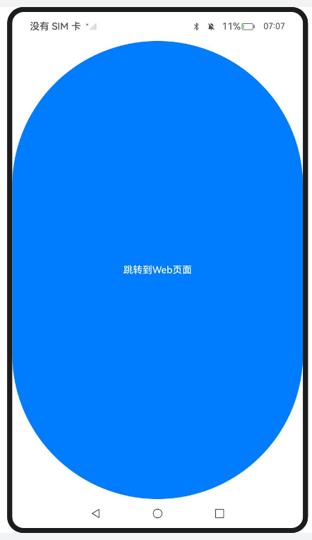
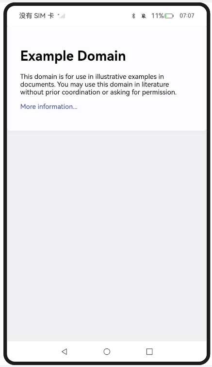

# 使用离线Web组件

### 介绍

1. 本工程主要实现了对以下指南文档中 https://docs.openharmony.cn/pages/v5.0/zh-cn/application-dev/web/web-offline-mode.md 示例代码片段的工程化，主要目标是实现指南中示例代码需要与sample工程文件同源。

### Entry:

####  CreatingOfflineWebComponents

##### 介绍

1. 本示例主要介绍使用离线Web组件加载显示页面。在需要离屏创建Web组件时，定义一个自定义组件以封装Web组件，此Web组件在离线状态下被创建，封装于无状态的NodeContainer节点中，并与相应的NodeController组件绑定。Web组件在后台预渲染完毕后，当需要展示时，通过NodeController将其挂载到ViewTree的NodeContainer中，即与对应的NodeContainer组件绑定，即可挂载上树并显示。

##### 效果预览

| 主页                                                         |
| ------------------------------------------------------------ |
|  |

使用说明

1. Index.ets通过getNWeb从NodeMap获取myNodeController，将其传入NodeContainer，实现动态组件在页面的显示。

### Entry1: 

#### PreLaunchingRenderingProcess_one

##### 介绍

1. 本示例主要介绍预启动ArkWeb渲染进程。在后台预先创建一个Web组件，以启动用于渲染的Web渲染进程，这样可以节省后续Web组件加载时启动Web渲染进程所需的时间。

##### 效果预览

| 主页                                                         | 跳转页                                                       |
| ------------------------------------------------------------ | ------------------------------------------------------------ |
|  |  |

使用说明

1. 在onWindowStageCreate时期预创建了一个Web组件加载blank页面，从而提前启动了Render进程，从index跳转到index2时，优化了Web的Render进程启动和初始化的耗时。
1. 点击跳转到web页面按钮跳转到Web页面。

### Entry2: 

#### PreLaunchingRenderingProcess_two

##### 介绍

1. 本示例主要介绍使用预渲染Web页面。预预渲染Web页面优化方案适用于Web页面启动和跳转场景，例如，进入首页后，跳转到子页。建议在高命中率的页面使用该方案。渲染Web页面的实现方案是提前创建离线Web组件，并设置Web为Active状态来开启渲染引擎，进行后台渲染。

##### 效果预览

| 主页                                                         | 跳转页面                                                     |
| ------------------------------------------------------------ | ------------------------------------------------------------ |
|  |  |

使用说明

1. 点击跳转到web页面按钮跳转到Web页面。

### 工程目录

```
entry/src/main/
|---ets
|---|---entryability
|---|---|---EntryAbility.ets
|---|---pages
|---|---|---common.ets
|---|---|---Index.ets						// 首页
|---resources								// 静态资源
|---ohosTest
|---|---ets
|---|---|---tests
|---|---|---|---Ability.test.ets            // 自动化测试用例

entry1/src/main/
|---ets
|---|---entry1ability
|---|---|---Entry1Ability.ets
|---|---pages
|---|---|---common.ets
|---|---|---Index.ets						// 首页
|---|---|---index2.ets
|---resources								// 静态资源
|---ohosTest
|---|---ets
|---|---|---tests
|---|---|---|---Ability.test.ets            // 自动化测试用例

entry2/src/main/
|---ets
|---|---entry2ability
|---|---|---Entry2Ability.ets
|---|---pages
|---|---|---common.ets
|---|---|---Index.ets						// 首页
|---|---|---index2.ets
|---resources								// 静态资源
|---ohosTest
|---|---ets
|---|---|---tests
|---|---|---|---Ability.test.ets            // 自动化测试用例
```


### 相关权限

[ohos.permission.INTERNET](https://docs.openharmony.cn/pages/v5.0/zh-cn/application-dev/security/AccessToken/permissions-for-all.md#ohospermissioninternet)

### 依赖

不涉及。

### 约束与限制

1. 本示例仅支持标准系统上运行，支持设备：RK3568。
2. 本示例支持API14版本SDK，SDK版本号(API Version 14 Release)。
3. 本示例需要使用DevEco Studio 版本号(5.0.1Release)才可编译运行。

### 下载

如需单独下载本工程，执行如下命令：

```
git init
git config core.sparsecheckout true
echo code/DocsSample/ArkWeb/UseOfflineWebComp > .git/info/sparse-checkout
git remote add origin https://gitee.com/openharmony/applications_app_samples.git
git pull origin master
```