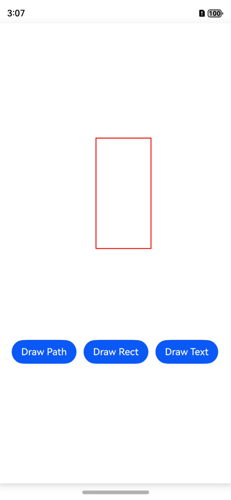
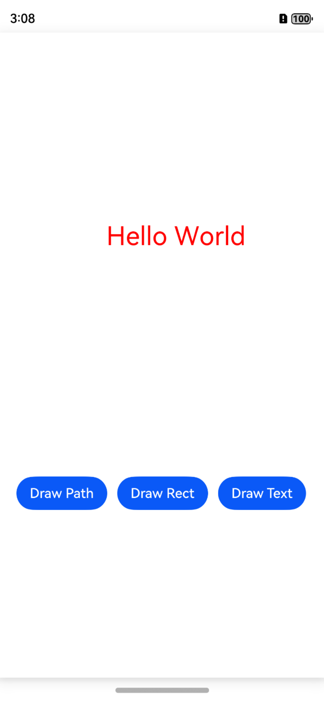

# 使用Drawing实现图形绘制与显示（ArkTS）

## 介绍

本工程主要实现了对以下指南文档中[访问控制概述](https://docs.openharmony.cn/pages/v5.0/zh-cn/application-dev/security/AccessToken/access-token-overview.md)示例代码片段的工程化，主要目标是实现指南中示例代码需要与sample工程文件同源。

## 效果预览

|  |  |  |
| ------------------------ | ------------------------ | ------------------------ |

使用说明：
1. 该工程可以选择在模拟器和开发板上运行。
2. 点击构建，即可在生成的应用中点击对应的按钮进行图案的绘制。
3. 进入”DocsSample/Drawing/ArkTSDrawing/entry/src/ohosTest/ets/test/DrawingAbility.test.ets“文件，可以对本项目进行UI的自动化测试。

## 工程目录

```
ArkTSDrawing
├──entry/src/main
│  ├──ets  // ets代码区
|  |  ├──common
|  |  |  ├──logger.ts               // 日志类
|  |  |  ├──MyNodeController.ets    // 节点控制类
|  |  |  ├──PathRenderNode.ets      // 绘制路径类
|  |  |  ├──RectRenderNode.ets      // 绘制矩形类
|  |  |  └──TextRenderNode.ets      // 绘制文本类
│  │  ├──entryability
|  |  |  └──EntryAbility.ets        // 程序入口类
|  |  ├──entrybackupability
│  │  │  └──EntryBackupAbility.ets   
│  │  └──pages                      // 页面文件
│  │     └──Index.ets               // 主界面
|  ├──resources         			// 资源文件目录
```

## 具体实现

1. 创建`NodeController`的子类`MyNodeController`，并在其中定义创建`FrameNode`的函数。`NodeController`定义了节点容器的控制器，控制着容器里在生命周期中的节点。`FrameNode`定义了节点的基本类型，并包含一个`RenderNode`。
2. 创建`RenderNode`子类`PathRenderNode`、`RectRenderNode`、`TextRenderNode`并在其中定义绘图函数。`RenderNode`中包含树结构的操作，以及对绘制属性的操作，其中`draw`方法会在`RenderNode`进行绘制时被调用。使用每个子类的`draw`方法可以实现五角星、举行和文本文字的绘制。

## 相关权限

无。

## 依赖

不涉及。

## 约束和限制

1. 本示例支持标准系统上运行，支持设备：仅在手机上可以正确显示。
2. 本示例支持API14版本SDK，版本号：5.0.2.57。
3. 本示例已支持使DevEco Studio 5.0.1 Release (构建版本：5.0.5.306，构建 2024年12月6日)编译运行。

## 下载

如需单独下载本工程，执行如下命令：

```
git init
git config core.sparsecheckout true
echo code/DocsSample/Drawing/ArkTSDrawing/ > .git/info/sparse-checkout
git remote add origin https://gitee.com/openharmony/applications_app_samples.git
git pull origin master
```

