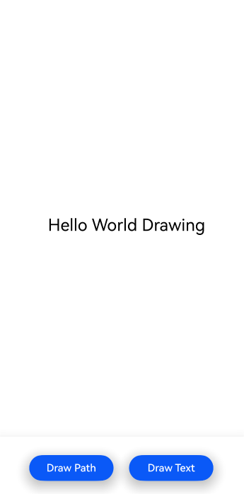

# 使用Drawing实现图形绘制与显示（C++）

## 介绍

本工程主要实现了对以下指南文档中 https://docs.openharmony.cn/pages/v5.0/zh-cn/application-dev/graphics/drawing-guidelines.md 示例代码片段的工程化，主要目标是实现指南中示例代码需要与sample工程文件同源。

## 效果预览

|  |  |
|--------------------------| ------------------------ |

使用说明

1. 该工程可以选择在模拟器和开发板上运行。   
2. 点击构建，即可在生成的应用中点击对应的按钮进行图案的绘制。
3. 进入”DocsSample/Drawing/NDKDrawing/entry/src/ohosTest/ets/test/DrawingAbility.test.ets“文件，可以对本项目进行UI的自动化测试。

## 工程目录

```
NDKDrawing
├──entry/src/main
│  ├──cpp                           // C++代码区
│  │  ├──CMakeLists.txt             // CMake配置文件
│  │  ├──hello.cpp                  // Napi模块注册
│  │  ├──common
│  │  │  └──log_common.h            // 日志封装定义文件
│  │  ├──plugin                     // 生命周期管理模块
│  │  │  ├──plugin_manager.cpp
│  │  │  └──plugin_manager.h
│  │  ├──samples                    // samples渲染模块
│  │  │  ├──sample_bitmap.cpp
│  │  │  └──sample_bitmap.h
│  ├──ets                           // ets代码区
│  │  ├──entryability
│  │  │  ├──EntryAbility.ts         // 程序入口类
|  |  |  └──EntryAbility.ets
|  |  ├──interface
│  │  │  └──XComponentContext.ts    // XComponentContext
│  │  └──pages                      // 页面文件
│  │     └──Index.ets               // 主界面
|  ├──resources         			// 资源文件目录
```

## 具体实现

1. 利用Native XComponent来获取NativeWindow实例、获取布局/事件信息、注册事件回调并通过Drawing API实现在页面上绘制形状。功能主要包括点击按钮绘制一个五角星和“Hello World Drawing”文字。
2. 通过在IDE中创建Native c++ 工程，在c++代码中定义对外接口为drawPattern和drawText，在js侧调用该接口可在页面上绘制出一个五角星和“Hello World Drawing”文字。
3. 在XComponent的OnSurfaceCreated回调中获取NativeWindow实例并初始化NativeWindow环境。调用OH_NativeXComponent_GetXComponentSize接口获取XComponent的宽高，并以此为输入调用Drawing相关的绘制接口在NativeWindow上绘制出一个五角星和文字。

## 相关权限

无。

## 依赖

不涉及。

## 约束和限制

1. 本示例支持标准系统上运行，支持设备：RK3568。
2. 本示例支持API14版本SDK，版本号：5.0.2.57。
3. 本示例已支持使DevEco Studio 5.0.1 Release (构建版本：5.0.5.306，构建 2024年12月6日)编译运行。

## 下载

如需单独下载本工程，执行如下命令：

```
git init
git config core.sparsecheckout true
echo code/DocsSample/Drawing/NDKDrawing/ > .git/info/sparse-checkout
git remote add origin https://gitee.com/openharmony/applications_app_samples.git
git pull origin master
```

