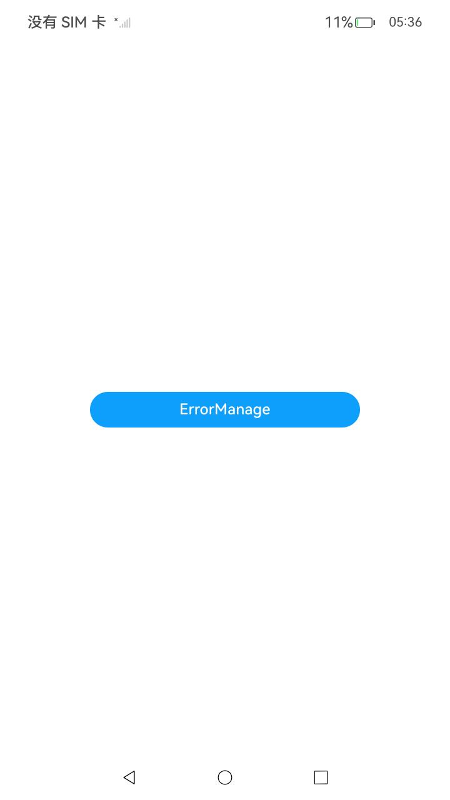

# 错误管理开发指导

###  介绍

本示例主要展示了错误管理相关的功能，当应用的代码存在规范问题或错误时，会在运行中产生异常和错误，如应用未捕获异常、应用生命周期超时等。在错误产生后，应用会异常退出。错误日志通常会保存在用户本地存储上，不方便开发者定位问题。所以，应用开发者可以使用错误管理的接口，在应用退出前，及时将相关错误及日志上报到开发者的服务平台来定位问题。

使用errormanager接口监听异常和错误后，应用不会退出，建议在回调函数执行完后，增加同步退出操作，如果只是为了获取错误日志，建议使用[hiappevent](https://docs.openharmony.cn/pages/v5.0/zh-cn/application-dev/dfx/hiappevent-watcher-crash-events-arkts.md)。

###  效果预览

|                             主页                             |
| :----------------------------------------------------------: |
|  |

使用说明

1. 在主界面，点击按钮引发崩溃，重启应用；切换到"Log"窗口，日志过滤选择"No filters",搜索内容设置为"onException"。此时窗口仅显示符合条件的日志，打印日志结果为：

```
onException, name:  SyntaxError
onException, message:  Unexpected Text in JSON
onException, stack:      at anonymous (entry/src/main/ets/pages/Index.ets:31:34)
```

###  工程目录

```
entry/src/main/ets/
└─entryability
| 	└─---EntryAbility.ets				  //添加回调函数
└─pages
    └─---Index.ets						 //首页
```

###  具体实现

- 在EntryAbility.ets中添加错误回调函数；
- 在Index.ets中添加一个按钮并在其点击事件中引发崩溃事件，进而调用错误管理的回调函数。

###  相关权限

不涉及。

###  依赖

不涉及。

###  约束与限制

1. 本示例仅支持标准系统上运行，支持设备：RK3568;
2. 本示例已适配API14版本SDK,版本号：5.0.2.58,镜像版本号：OpenHarmony5.0.2.58;
3. 本示例需要使用DevEco Studio (5.0.3.910)及以上版本才可编译运行。

### 下载

如需单独下载本工程，执行如下命令：

```
git init
git config core.sparsecheckout true
echo code/DocsSample/PerformanceAnalysisKit/ErrorManage/ErrorManage/ > .git/info/sparse-checkout
git remote add origin https://gitee.com/openharmony/applications_app_samples.git
git pull origin master
```

