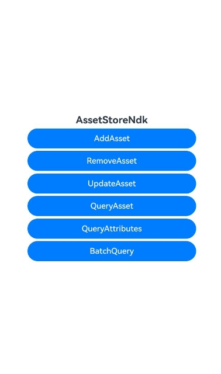
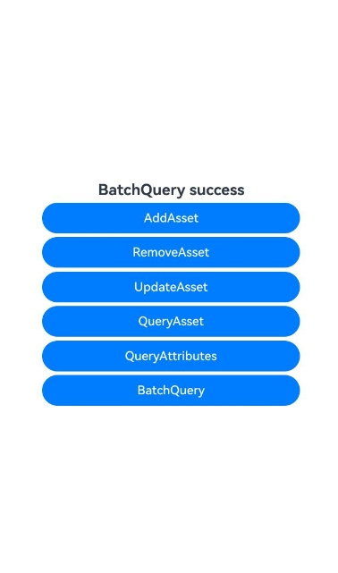

# Asset Store Kit开发指导(C/C++)

### 介绍

Asset Store Kit（关键资产存储开发套件）包含了关键资产存储服务（ASSET）开放的接口能力集合，提供了用户短敏感数据的安全存储及管理能力。其中，短敏感数据可以是密码类（账号/密码）、Token类（应用凭据）、关键明文（如银行卡号）等长度较短的用户敏感数据。

本示例主要展示了Asset Store Kit开发指导(C/C++)中新增关键资产、删除关键资产、更新关键资产、查询关键资产场景。该工程中展示的代码详细描述可查如下链接中业务扩展场景介绍部分。

- [新增关键资产(C/C++)](https://docs.openharmony.cn/pages/v5.0/zh-cn/application-dev/security/AssetStoreKit/asset-native-add.md)
- [删除关键资产(C/C++)](https://docs.openharmony.cn/pages/v5.0/zh-cn/application-dev/security/AssetStoreKit/asset-native-remove.md)
- [更新关键资产(C/C++)](https://docs.openharmony.cn/pages/v5.0/zh-cn/application-dev/security/AssetStoreKit/asset-native-update.md)
- [查询关键资产(C/C++)](https://docs.openharmony.cn/pages/v5.0/zh-cn/application-dev/security/AssetStoreKit/asset-native-query.md)

### 效果预览

| 首页效果图                                                   | 执行结果图                                                   |
| ------------------------------------------------------------ | ------------------------------------------------------------ |
|  |  |

### 使用说明

1. 运行Index主界面。
2. 页面呈现上述执行结果图效果，点击文本为‘AddAsset’的按钮可以新增资产，点击'RemoveAsset'按钮可以删除新增资产，点击'UpdateAsset'、'QueryAsset'、'QueryAttributesAsset'、'BatchQuary'可以依次进行关键资产的更新查询，其中最后一个按钮需要先在添加后直接查询可成功，更新后会导致失败。
3. 运行测试用例AssetStoreNdk.test.ets文件对页面代码进行测试可以全部通过。

### 工程目录

```
entry/src/
 ├── main
 │   ├── cpp
 │   │   ├── types
 │   │       ├── libentry
 │   │       |   ├── index.d.ts
 │   │   ├── CMakeLists.txt
 │   │   ├── napi_init.cpp
 │   ├── ets
 │   │   ├── entryability
 │   │   ├── entrybackupability
 │   │   ├── pages
 │   │       ├── Index.ets               // Asset Store Kit开发指导(C/C++)示例代码
 │   ├── module.json5
 │   └── resources
 ├── ohosTest
 │   ├── ets
 │   │   └── test
 │   │       ├── Ability.test.ets 
 │   │       ├── AssetStoreNdk.test.ets  // 自动化测试代码
 │   │       └── List.test.ets
```

### 相关权限

不涉及。

### 依赖

不涉及。

### 约束与限制

1.本示例仅支持标准系统上运行, 支持设备：RK3568。

2.本示例为Stage模型，支持API14版本SDK，版本号：5.0.2.57，镜像版本号：OpenHarmony_5.0.2.58。

3.本示例需要使用DevEco Studio 5.0.1 Release (Build Version: 5.0.5.306, built on December 6, 2024)及以上版本才可编译运行。

### 下载

如需单独下载本工程，执行如下命令：

````
git init
git config core.sparsecheckout true
echo code/DocsSample/Security/AssetStoreKit/AssetStoreNdk > .git/info/sparse-checkout
git remote add origin https://gitee.com/openharmony/applications_app_samples.git
git pull origin master
````