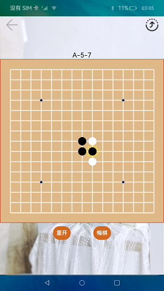

# 分布式五子棋

### 介绍

五子棋是一款比较流行的棋类游戏，此游戏使用分布式数据管理功能开发完成的。

本示例使用[Canvas组件](https://gitee.com/openharmony/docs/blob/master/zh-cn/application-dev/reference/apis-arkui/arkui-ts/ts-components-canvas-canvas.md) 实现棋盘、棋子的绘制，使用[分布式数据管理](https://gitee.com/openharmony/docs/blob/master/zh-cn/application-dev/reference/apis-arkdata/js-apis-distributed-data.md) 实现两台设备间数据的同步。  

本示例使用分布式设备管理能力接口[@ohos.distributedDeviceManager](https://gitee.com/openharmony/docs/blob/master/zh-cn/application-dev/reference/apis-distributedservice-kit/js-apis-distributedDeviceManager.md)。  

分布式数据管理接口[@ohos.data.distributedData](https://gitee.com/openharmony/docs/blob/master/zh-cn/application-dev/reference/apis-arkdata/js-apis-distributed-data.md)。  


### 效果预览
|首页|
|-------|
||

使用说明：

1.启动应用，同一个网络下两台设备都确认权限后，一台设备退出。点击右上角流转按钮，选择需要拉起的远程设备，点击后拉起远程设备，第一次拉起设备时，若未进行认证，输入认证码进行认证，认证成功后拉起远程设备。

2.游戏过程中，本地设备的用户可以重开，悔棋，远程设备无此功能。下子时，在棋盘某位置点击第一次时预下子，若确定下在该位置，继续点击该位置，若不确定，点击其他位置即可。若远程设备因特殊原因退出或者掉线，本地设备可重新拉起远程设备，拉起后，本地设备点击棋盘任意位置，数据会同步到远程设备，继续进行未完成的游戏。

### 工程目录
```
entry/src/main/ets/
|---pages
|   |---index.ets                           // 五子棋首页
|   |---DeviceDialog.ets                    // 选择设备模块
|   |---TitleBar.ets                        // 标题导航栏
|---model                                  
|   |---DistributedDataModel.ts             // 分布式数据模块
|   |---KvStoreModel.ts                     // KvStore数据模块
|   |---RemoteDeviceModel.ts                // 管理分布式设备模块
|---util                                    
|   |---GobangConst.ts                      // 定义游戏用到的初始值                                                          
```

### 具体实现
* 管理分布式设备（节点）  
  1、创建设备管理对象，并指定参数kvstore应用包deviceManager.createDeviceManager("ohos.samples.distributeddatagobang", (error, value) => {}),[源码参考](entry/src/main/ets/Model/RemoteDeviceModel.ts ) 。  
  2、获取可信设备列表"this.deviceManager.getTrustedDeviceListSync()"。  
  3、监听设备状态"this.deviceManager.on('deviceStateChange', (data) => {})"。
* 分布式数据管理  
  1、页面初始化时获取此应用所需能力，引入@ohos.data.distributedData初始化分布式数据库，并使用kvstore.on对数据change进行监听，通过appstorge判断获取相应的key判断是否是分布式节点。  
  2、如果是分布式节点，如果数据发生变化处理数据，使用this.kvManager.getKVStore()通过指定Options和storeId，创建并获取KVStore数据库。以及添加键值对到数据库this.kvStore.put(key, value) ,[源码参考](entry/src/main/ets/Model/KvStoreModel.ts ) 。    
  3、页面通过kvStore对象进行增删改查会触发其他已连接设备的kvStore.on监听。  
* 游戏规则编写  
  1、init()函数初始化游戏规则，通过canvas组件绘制棋盘背景和棋子，游戏状态为开始，共计回合为0，并生成棋盘。[源码参考](entry/src/main/ets/pages/Index.ets )
  2、触发onClick函数，每click一次，清除一次canvas，数组中添加当前棋子，重绘。
  3、当在A盘，且步长是偶数，表示B下的棋子会在A盘显示，绘制确定好的棋子，例如：this.deviceFlag === 'A' && this.distributedData.step % 2 === 0;
  4、当在B盘，且步长是奇数，表示A下的棋子会在B盘显示，绘制确定好的棋子，例如：this.deviceFlag === 'B' && this.distributedData.step % 2 !== 0;
  5、如果A盘重开(isRestart=true)，那B盘就要清空棋子;不重开(isRestart=false)时，B盘正常显示。

### 相关权限

允许不同设备间的数据交换：[ohos.permission.DISTRIBUTED_DATASYNC](https://gitee.com/openharmony/docs/blob/master/zh-cn/application-dev/security/AccessToken/permissions-for-all.md#ohospermissiondistributed_datasync)

允许系统应用获取分布式设备的认证组网能力：[ohos.permission.ACCESS_SERVICE_DM](https://gitee.com/openharmony/docs/blob/master/zh-cn/application-dev/security/AccessToken/permissions-for-system-apps.md#ohospermissionaccess_service_dm)

### 依赖

不涉及。

### 约束与限制

1.本示例仅支持标准系统上运行，支持设备：RK3568。

2.本示例为Stage模型，支持API10版本SDK，SDK版本号(API Version 10 Release),镜像版本号(4.0 Release)。

3.本示例需要使用DevEco Studio 版本号(4.0 Release)及以上版本才可编译运行。

4.本示例需要使用@ohos.distributedDeviceManager系统权限的系统接口。使用Full SDK时需要手动从镜像站点获取，并在DevEco Studio中替换，具体操作可参考[替换指南](https://gitee.com/openharmony/docs/blob/master/zh-cn/application-dev/faqs/full-sdk-switch-guide.md) 。

### 下载

如需单独下载本工程，执行如下命令：

````
git init
git config core.sparsecheckout true
echo code/Solutions/Game/DistributedDataGobang/ > .git/info/sparse-checkout
git remote add origin https://gitee.com/openharmony/applications_app_samples.git
git pull origin master
````