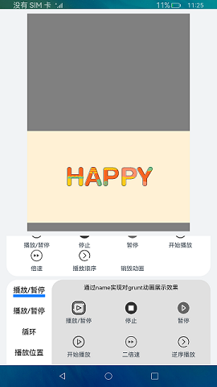

# Lottie动画

### 介绍

本示例展示了lottie对动画的操作功能。引入[Lottie模块](https://gitee.com/openharmony-tpc/lottieArkTS)，实现控制动画的播放、暂停、倍速播放、播放顺序、播放到指定帧停止或从指定帧开始播放、侦听事件等功能，动画资源路径必须是json格式。

### 效果预览

|首页|
|-------|
||

使用说明：
1. 进入页面默认开始2016动画，点击**请选择**进行选择动画资源;
2. 上面部分播放暂停是对两个动画进行控制，下面部分播放暂停功能是对grunt动画控制;
3. 点击销毁动画功能之后需要重新选择动画资源才可以进行其余功能操作。
4. 点击下面部分左侧第一个播放/暂停，右侧出现**通过name实现对grunt动画展示效果**，点击右侧播放/暂停，grunt动画会暂停播放，再次点击播放/暂停，grunt动画恢复播放。
5. 点击停止，grunt动画停止播放，点击播放/暂停或者开始播放，grunt动画恢复播放。
6. 点击暂停，grunt动画暂停播放，点击播放/暂停或者开始播放，grunt动画恢复播放。
7. 点击二倍速，设置grunt动画播放速度为二倍速。
8. 点击逆序播放，设置grunt动画播放方向为反向播放。
9. 点击下面部分左侧第二个播放/暂停，右侧出现**通过this实现对grunt动画展示效果**，点击五倍速，设置grunt动画播放速度为五倍速，可以明显看到播放速度较之上面的二倍速更快。其余按钮操作步骤同上述第4,5,6,7,8条一致。 
10. 点击左侧循环，点击指定片段循环(20,30)帧，限定grunt动画资源播放时的整体帧范围为从20帧开始到30帧结束。 
11. 点击playSegments片段循环，设置grunt动画仅播放指定范围的20-30帧动画。 
12. 点击重置播放片段，选择即时生效播放或延迟到下轮循环播放再生效，可以使grunt动画重新从第一帧开始播放完整动画。 
13. 点击去浮点显示整数，弹出文本提示框，提示框文本内容为:使用AE原始帧率播放动画。 
14. 点击播放位置，点击动画停止，选择250帧时停止，控制grunt动画画面停止在250帧，点击动画播放，选择从250帧开始播放，控制grunt动画从250帧开始播放。 
15. 点击动画停止，选择5000ms时停止，控制grunt动画画面停止在5000ms，点击动画播放，选择从12000ms开始播放，控制grunt动画从12000ms开始播放。 
16. 点击刷新动画布局，可以刷新动画布局。 
17. 点击销毁grunt动画，通过动画名称控制, grunt动画被销毁。 
18. 点击下面部分左侧添加侦听事件，点击右侧添加侦听事件按钮，loopComplete事件完成后会触发指定回调函数，弹出文本提示框，提示框文本内容为:grunt loopComplete 。 
19. 点击删除侦听事件，grunt动画停止播放，点击删除所有侦听事件，grunt动画恢复播放。 
20. 点击触发所有已设置的回调，grunt动画暂停播放，点击删除所有侦听事件，grunt动画恢复播放。
### 工程目录
```
entry/src/main/ets/
|---common
|   |---data.json                           // 2016新年动画
|   |---grunt.json                          // grunt动画
|---pages
|   |---Lottie.ets                          // 首页
|---utils                                  
|   |---Logger.ts                           // 日志工具
```

### 具体实现
* 页面中使用了Lottie对象控制动画的一系列操作，源码参考[Lottie.ets](entry/src/main/ets/pages/Lottie.ets):
    * 初始化动画：在canvas的onReady里使用loadAnimation加载动画，须提前声明Animator(‘__lottie_ets’)对象，并在Canvas完成布局后调用；
    * Lottie动画操作：lottie.play播放动画，lottie.pause暂停播放，lottie.setDirection设置播放顺序
### 相关权限

不涉及。

### 约束与限制

1. 本示例支持标准系统上运行，支持设备：RK3568;
2. 本示例已适配API version 9版本SDK，版本号：3.2.11.9;
3. 本示例需要使用DevEco Studio 3.1 Beta2 (Build Version: 3.1.0.400, built on April 7, 2023)及以上版本才可编译运行。

### 下载
如需单独下载本工程，执行如下命令：
```
git init
git config core.sparsecheckout true
echo code/Solutions/Game/Lottie/ > .git/info/sparse-checkout
git remote add origin https://gitee.com/openharmony/applications_app_samples.git
git pull origin master
```