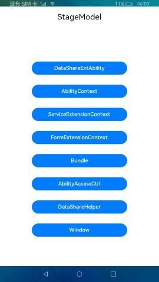

# Stage模型

### 介绍

[Stage模型](https://gitee.com/openharmony/docs/blob/master/zh-cn/application-dev/application-models/stage-model-development-overview.md) 的设计，主要是为了解决FA模型无法解决的开发场景问题，方便开发者更加方便地开发出分布式环境下的复杂应用。

#### Stage和FA模型的区别

1.在Stage模型中主要有module.json5，需要时将对应的ServiceExtAbility等配置在module.json5中的extensionAbilities中，Page页面的Ability在abilites中；对应FA模型中主要配置文件config.json，需要时将对应的Ability配置在config.json中module/abilites。

2.Stage模型中卡片的创建需要的配置文件在resources/base/profile/form_config.json。

3.Stage模型中ability生命周期与FA模型生命周期见[Stage模型生命周期](https://gitee.com/openharmony/docs/blob/master/zh-cn/application-dev/application-models/uiability-lifecycle.md) ，[FA模型生命周期](https://gitee.com/openharmony/docs/blob/master/zh-cn/application-dev/application-models/pageability-lifecycle.md) 。

4.Stage模型中DataShareExtensionAbility对应FA模型中dataAbility，具体实现差异详见方法注释。

5.Stage模型中ServiceExtensionAbility对应FA模型中ServiceAbility，具体实现差异详见方法注释。

6.Stage模型DataShareHelper对应FA模型中DataAbilityHelper 。

7.Stage模型从API Version9开始，通过context获取resourceManager对象的方式，再调用其内部获取资源的接口， 无需再导入 @ohos.resourceManager ；FA模型通过导入@ohos.resourceManager， 获取应用资源信息。

### 效果预览：
|主页|
|--------------------------------|
||

使用说明：

1.点击**DataShareExtAbility**按钮，跳转到DataShareExtAbility页面；

点击**+**，向rdb数据库中添加单个数据，界面显示添加的数据内容；

点击**删除**按钮删除指定数据；

点击数据列表，弹出dialog框，可对数据进行修改，点击**确认**按钮确认修改；

点击返回键，返回首页。

2.点击各个功能按钮测试各个接口。


### 工程目录
```
entry/src/main/ets/
|---Application
|   |---MyAbilityStage.ts                   
|---DataShareExtensionAbility
|   |---DataShareExtAbility.ts
|---feature
|   |---AbilityAccessCtrlController.ts                   
|   |---AbilityContextController.ts                      
|   |---BookModel.ts                         
|   |---BundleController.ts                   
|   |---DataShareHelper.ts                      
|   |---FormExtContextController.ts                         
|   |---ServiceExtContextController.ts                   
|   |---WindowController.ts                      
|---FormAbility
|   |---FormAbility.ts                      
|---JumpAbility
|   |---JumpAbility.ts                      
|---MainAbility
|   |---MainAbility.ts                      
|---pages
|   |---component
|   |   |---BookView.ets                     // 展示组件
|   |   |---IndexTitleBar.ets                // 单个页面标题组件
|   |   |---PublicTitleBar.ets               // 通用的标题组件
|   |   |---TitleBar.ets                     // 标题组件
|   |   |---UpdateDataDialog.ets
|   |---AbilityAccessCtrlPage.ets            // 程序访问控制
|   |---AbilityContextPage.ets               // 提供允许访问特定于ability的资源的能力
|   |---BundlePage.ets                       // 应用信息查询
|   |---DataShareExtAbilityPage.ets          // 数据共享业务
|   |---DataShareHelperPage.ets
|   |---FormExtContextPage.ets               // 提供FormExtension具有的接口和能力
|   |---Index.ets
|   |---ServiceExtContextPage.ets  
|   |---TestPage.ets
|   |---WindowPage.ets                       // 窗口
|---ServiceExtAbility
|   |---ServiceExtAbility.ts                      
|---util
|   |---Logger.ts                                  
```

### 具体实现

Stage模型的设计基于如下三个出发点：

- **应用的能力与系统总体功能和功耗的平衡**

  在系统运行过程中，前台应用的资源占用会被优先保障，与此同时由于应用能力不同而产生的功耗，也需要符合系统整体功耗的要求。Stage模型通过Ability与UI分离、严格的后台管控、基于场景的服务机制及单进程模型来达成这种应用能力与整体系统功耗的平衡。

- **原生支持组件级的迁移和协同**

  OpenHarmony是原生支持分布式的操作系统，应用框架需要从架构设计上使得组件更易于实现迁移和协同。Stage模型通过Ability与UI分离及UI展示与服务能力合一等模型特性，实现这一设计目标。

- **支持多设备和多窗口形态的特点**

  为了支持多种设备形态和更易于实现多种不同的窗口形态，需要组件管理服务和窗口管理服务在架构层面上是解耦的，从而方便裁剪，更有利于定制不同的窗口形态。Stage模型通过重新定义了Ability生命周期定义和设计组件管理服务和窗口管理服务的单向依赖解决这一问题。

  本示例主要展示Stage模型与FA模型的区别，分别从AbilityContext、ServiceExtensionContext、 FormExtensionContext、DataShareExtensionAbility、FormExtension、Bundle、Window、abilityAccessCtrl等模块进行介绍。

  **ServiceExtensionAbility**：生命周期函数onCreate、onRequest、onConnect、onReconnect、onDisconnect、onDestroy。通过AbilityContext中的startAbility启动Service；通过connectAbility连接service；通过disconnectAbility断开service连接；通过rpc进行客户端与服务端通信。

  **FormExtension**：生命周期函数onCreate、onCastToNormal、onUpdate、onVisibilityChange、onEvent、onAcquireFormState、onDestroy，通过formBindingData中的createFormBindingData创建卡片。

  **AbilityContext**：AbilityContext是Ability的上下文环境，继承自Context。AbilityContext模块提供允许访问特定于ability的资源的能力，包括对Ability的启动、停止的设置、获取caller通信接口、拉起弹窗请求用户授权等。在使用AbilityContext的功能前，需要通过Ability子类实例获取。

  **ServiceExtensionContext**：ServiceExtensionContext模块是ServiceExtensionAbility的上下文环境，继承自ExtensionContext。ServiceExtensionContext模块提供ServiceExtensionAbility具有的能力和接口，包括启动、停止、绑定、解绑Ability。 在使用ServiceExtensionContext的功能前，需要通过ServiceExtensionAbility子类实例获取。

  **FormExtensionContext**：FormExtensionContext模块是FormExtension的上下文环境，继承自ExtensionContext。FormExtensionContext模块提供FormExtension具有的接口和能力。 在使用FormExtensionContext的功能前，需要通过FormExtension获取。

  **DataShareExtensionAbility**： DataShareExtensionAbility基于ExtensionAbility框架，提供支持数据共享业务的能力，本模块接口仅可在Stage模型下使用。

  **Bundle**：本模块提供应用信息查询能力，支持BundleInfo、ApplicationInfo、Ability、ExtensionAbility、应用状态等信息的查询 。

  **Window**：窗口提供管理窗口的一些基础能力，包括对当前窗口的创建、销毁、各属性设置，以及对各窗口间的管理调度。

  **abilityAccessCtrl**：程序访问控制提供程序的权限管理能力，包括鉴权、授权和取消授权等。

### 相关权限

不涉及。

### 依赖

不涉及。

### 约束与限制

1.本示例仅支持标准系统上运行，支持设备：RK3568。

2.本示例为Stage模型，支持API10版本SDK，SDK版本号(API Version 10 Release),镜像版本号(4.0 Release)

3.本示例使用了 ServiceExtensionAbility、DataShareExtensionAbility，需要在签名证书UnsgnedReleasedProfileTemplate.json中配置"app-privilege-capabilities": ["AllowAppUsePrivilegeExtension"]，否则安装失败。具体操作指南可参考[应用特权配置指南](https://gitee.com/openharmony/docs/blob/eb73c9e9dcdd421131f33bb8ed6ddc030881d06f/zh-cn/device-dev/subsystems/subsys-app-privilege-config-guide.md)。

4.本示例需要使用DevEco Studio 版本号(4.0 Release)及以上版本才可编译运行。

### 下载

如需单独下载本工程，执行如下命令：

```
git init
git config core.sparsecheckout true
echo code/SystemFeature/ApplicationModels/StageModel/ > .git/info/sparse-checkout
git remote add origin https://gitee.com/openharmony/applications_app_samples.git
git pull origin master
```